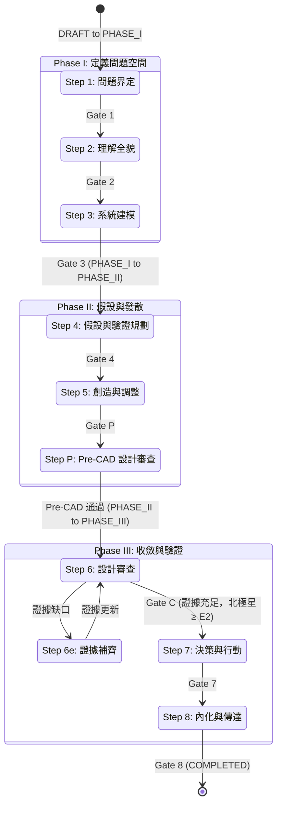
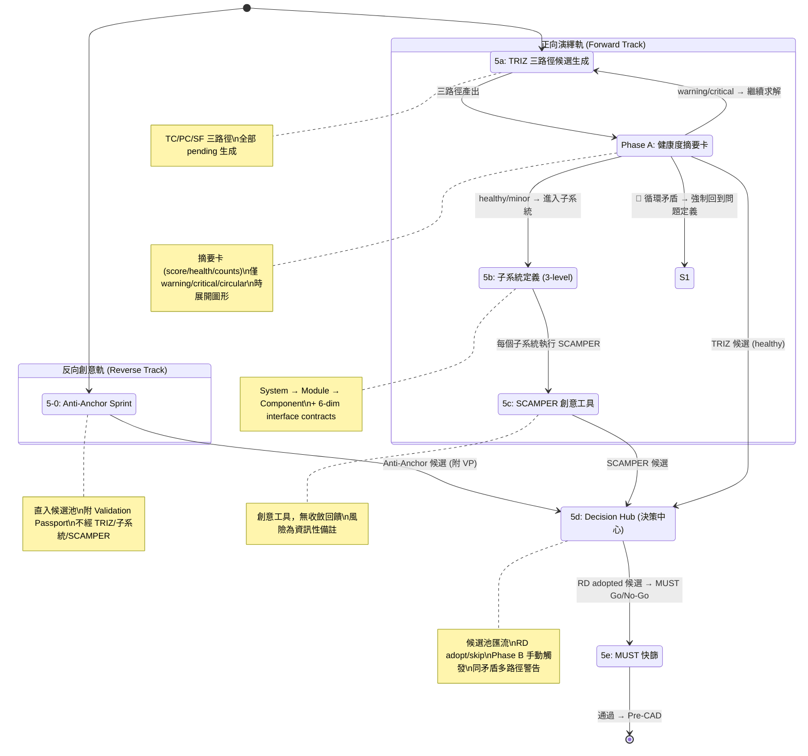
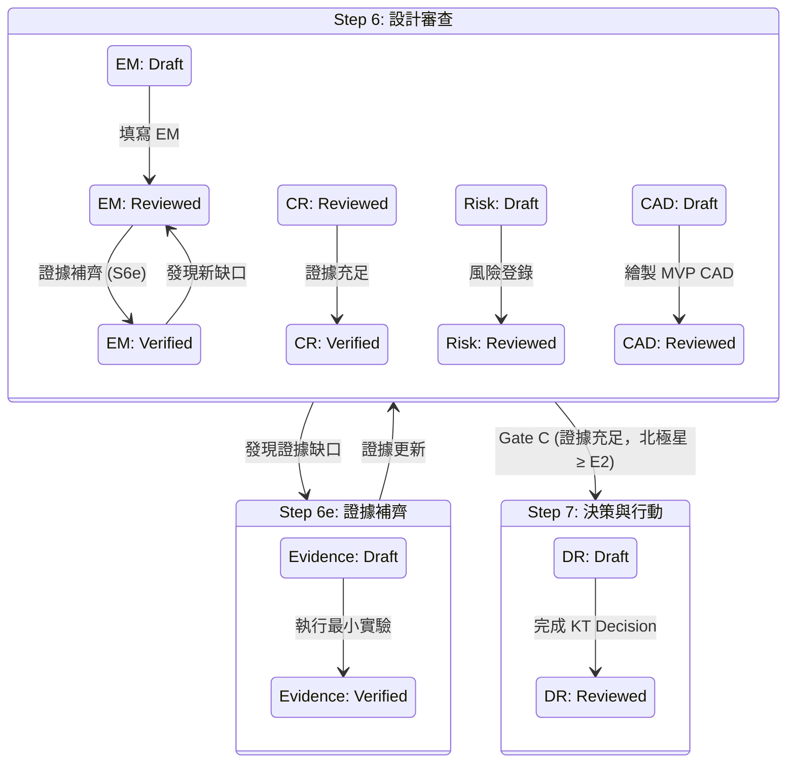
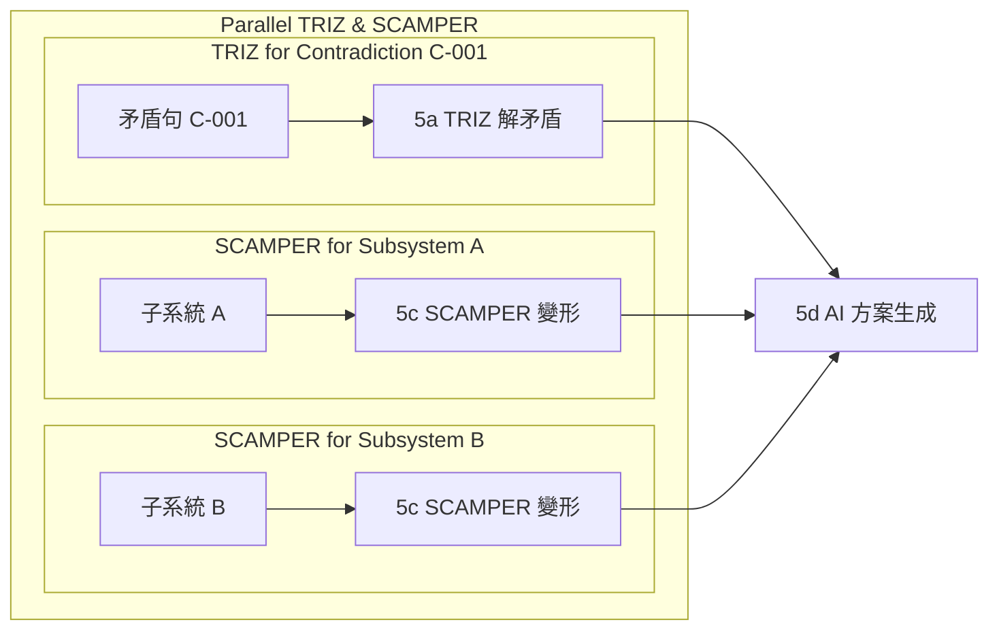

# RD Design Copilot 整合流程狀態機與 R&R (E2E)

本文件以程式設計角度繪製 `RD Design Copilot 整合流程 (E2E)` 的狀態機圖，並說明每個階段的 Roles & Responsibilities (R&R)。
本文件核心概念為 **雙層狀態機 (Dual-Layer State Machine)**，同時管理 **流程狀態 (Process State)** 與 **工件狀態 (Artifact State)**。

> **v1.7 更新**：對齊 triz-to-scamper-flow v9 — 雙軌分析（反向創意/正向演繹）→ 候選池匯流 → 決策中心 → 統一評估。TRIZ 步驟拆為三路徑候選生成 + Phase A 健康度摘要卡。Phase B 由決策中心 RD 手動觸發。BranchExplorationPanel 從 Phase A 移除（Phase A 無分支概念）。ConvergenceGraph 改用 React Flow + Dagre。
> **v1.6 更新**：收斂掃描拆為 Phase A（矛盾空間健康度）/Phase B（方案交叉檢查），Anti-Anchor 可晉升為候選方案，每個方案自帶 Validation Passport。
> **v1.5 更新**：新增三層 AI 主動質疑機制——Gate 1 增加約束可行性驗證、Step 2 索克拉底擴展為七類（增加「重構」提問）、Step 5a-6 增加架構健康度監控（節點 > 5 或循環矛盾 → 強制回到 Step 1）。AI 角色從 solver 升級為 challenger。
> **v1.4 更新**：Step 5 內部子流程新增「5a-6: 矛盾收斂圖 (Contradiction Convergence Graph)」，Fatal/Major 矛盾必須完全收斂（不設次數上限），Minor 矛盾記入 Risk Register。新增 Pre-CAD Confidence Score。
> **v1.3 更新**：統一 Gate C 位置定義（Step 6 完成時判定），修正工件狀態轉換對照表，修正 Baselined 拼寫。
> **v1.2 更新**：Step 編號已按實際執行順序重新編排，引入雙層狀態機概念，並加入 `Step 6e: 證據補齊 (Evidence Closure)` 迴圈。

## Step 編號對照

| 新編號 | 名稱 | Phase | 核心工件類型 |
|--------|------|-------|------------|
| Step 1 | 問題界定 | I | Constraint |
| Step 2 | 理解全貌（索克拉底） | I | Contradiction, Assumption |
| Step 3 | 系統建模（因果迴路+TRIZ矛盾+斷路點） | I | Contradiction, Breakpoint |
| Step 4 | 假設與驗證規劃（HDA+未知集合） | II | Assumption |
| **Step 5** | **創造與調整（TRIZ解矛盾→子系統定義→SCAMPER變形→方案集合→MUST快篩）** | **II** | Concept Route, Interface |
| **Step P** | **Pre-CAD 設計審查 (Pre-CAD Gate)** | **II** | Pre-CAD Review Report |
| **Step 6** | **設計審查 (CAD Gate - MVP CAD Review)** | **III** | Concept Route, Evidence Matrix, Risk |
| Step 6e | 證據補齊 (Evidence Closure) | III | Evidence |
| Step 7 | 決策與行動（KT Decision Analysis+最小實驗） | III | Concept Route, Decision Record, Evidence |
| Step 8 | 內化與傳達（費曼） | III | Asset |

## 核心流程狀態機 (Process State Machine)

> **Note**: Step 5 採雙軌架構：反向創意（Anti-Anchor）直入候選池，正向演繹（TRIZ → 子系統 → SCAMPER）生成候選。所有路徑匯流至決策中心 (Decision Hub)，由 RD 做 adopt/skip，Phase B 手動觸發。最終通過 MUST 快篩進入 Pre-CAD。

#### Step 5 內部子流程

> **矛盾收斂圖 + 架構健康度監控 (Phase A / Phase B)**：收斂掃描分為兩個階段：
>
> - **Phase A（健康度摘要卡，Step 2 起可執行）**：以精簡摘要卡呈現（score / health / counts 內嵌顯示），**僅在 warning / critical / circular 時展開完整圖形**（ConvergenceGraph 使用 React Flow + Dagre 佈局）。分析矛盾空間的 inter-contradiction 衝突、循環依賴、覆蓋缺口。**不需要方案/替代方案**。**Phase A 無分支概念，BranchExplorationPanel 已移除**。
> - **Phase B（方案交叉檢查，由 RD 在 Decision Hub 手動觸發）**：完整的 alternative × contradiction 交叉比對，檢查二次矛盾。收斂分數公式使用 `resolved`、`fatal`、`major`、`clean_alts` 權重。**Phase B 不再自動啟動，改由 RD 在決策中心明確觸發**。
>
> 新矛盾分級為 Fatal/Major/Minor：
> - **Fatal + Major**：必須回到 5a 繼續求解，直到完全收斂。**不設硬性次數上限**。
> - **Minor**：記入 Risk Register，不阻擋流程。
> - **架構健康度監控**（非告警，是強制停止）：
>   - 節點 > 5 → 🛑 **強制回到 Step 1**：「矛盾級聯超過 5 個節點。這不是 TRIZ 問題，是架構問題。回到問題定義重新選擇架構方向。」
>   - 循環矛盾 → 🛑 **強制回到 Step 1**：「架構內在矛盾，無法透過 TRIZ 解決。必須根本重構。」
> - **Pre-CAD Confidence Score**：`已收斂 (Fatal+Major) / 總 (Fatal+Major) × 100%`，Gate P 門檻 = 100%。
>
> **核心洞察**：矛盾數量是架構健康度的診斷信號。健康架構有 1-3 個矛盾；>5 個矛盾意味著在給錯誤架構打補丁。最好的設計流程不是「解矛盾最厲害」，而是「選到矛盾最少的架構」。

## Gate 與 Phase 轉換對照 (更新)

系統有 8 個 Step-level Gate（每步一個），其中 4 個同時觸發 Phase 轉換：

| Gate | 位置 | Gate 類型 | Phase 轉換？ | 關鍵工件狀態轉換 |
|------|------|-----------|-------------|--------------------|
| Gate 1 | Step 1 → Step 2 | 內部 Gate | **DRAFT → PHASE_I** | Constraint: Draft → Reviewed |
| Gate 2 | Step 2 → Step 3 | 內部 Gate | Phase I 內部 | Contradiction, Assumption: Draft → Reviewed |
| Gate 3 | Step 3 → Step 4 | 內部 Gate | **PHASE_I → PHASE_II** | Contradiction: Reviewed → Verified; Breakpoint: Draft → Reviewed |
| Gate 4 | Step 4 → Step 5 | 內部 Gate | Phase II 內部 | Assumption: Reviewed → Verified |
| **Gate P** | Step 5 → Step P | **Pre-CAD Gate** | Phase II 內部 | Concept Route: Draft → Reviewed |
| — | Step P → Step 6 | Phase 轉換 | **PHASE_II → PHASE_III** | Pre-CAD Review Report: Draft → Reviewed |
| Gate 6 | Step 6 → Step 6e | 內部 Gate | Phase III 內部 | Evidence Matrix, Risk: Draft → Reviewed |
| **Gate C** | Step 6 → Step 7 | **CAD Gate** | Phase III 內部 | Concept Route: Reviewed → Verified; MVP CAD Model: Draft → Reviewed; Evidence Matrix: Reviewed → Verified |
| Gate 7 | Step 7 → Step 8 | 內部 Gate | Phase III 內部 | Concept Route: Verified → Baselined; Decision Record: Draft → Reviewed |
| Gate 8 | Step 8 → Done | 內部 Gate | **PHASE_III → COMPLETED** | All Core Artifacts: Baselined → Released |
## 雙層狀態機概念圖 (Process State + Artifact State)

### 平行處理說明

在 Step 5 (創造與調整) 中，針對不同矛盾句或子系統，5a (TRIZ 解矛盾) 和 5c (SCAMPER 模組變形) 可以並行執行：

所有並行產出的解法方向與變形最終匯聚到 5d (AI 方案生成) 做交叉組合，再由 5e (MUST 快篩) 統一淘汰。

## 階段與狀態說明 (R&R)

### Phase I: 定義問題空間

#### Step 1: 問題界定
- **目的**: 將模糊需求轉化為可檢查的約束句，為後續矛盾定義奠定基礎。
- **核心工件** (Artifacts): Constraint (Draft)
- **Human (RD Team) R&R**:
    - 定義 Mission, Hard Constraints, Soft Objectives, Non-Goals。
    - 明確「三個最不能失敗的指標」及其判斷方式。
- **AI (Copilot) R&R**:
    - 協助將需求改寫為約束句。
    - 生成缺口問卷。
    - 列出已知事實與未知缺口。
- **Gate 1**: 「三個最不能失敗指標」被明確說出，且每個指標有「可量測」或「可判斷」的方式。**約束可行性驗證通過**（AI 確認約束組合物理可行或標示高風險邊界）。若約束物理不可能 → **不通過 Gate 1**。**核心工件 Constraint 狀態: Draft → Reviewed**。

#### Step 2: 理解全貌（索克拉底問答）
- **目的**: 挖掘「大家以為理所當然」的前提，為 TRIZ 矛盾識別做準備。
- **核心工件**: Contradiction (Draft), Assumption (Draft)
- **Human (RD Team) R&R**:
    - 參與索克拉底問答，提供見解和證據。
    - 初步識別潛在矛盾。
- **AI (Copilot) R&R**:
    - 固定執行索克拉底七類提問（澄清、假設、證據、觀點、後果、反思、**重構**）。
    - **重構類提問**：質疑問題本身是否被正確框架——前提是否被不當鎖定？約束是否可刪除簡化？真正的問題是否被遮蔽？
    - 匯總問答結果，輸出初步的矛盾列表。
- **Gate 2**: 至少列出 10 條關鍵假設，標出 Top 3 致命假設；至少識別 3 條核心矛盾。**核心工件 Contradiction, Assumption 狀態: Draft → Reviewed**。

#### Step 3: 系統建模（因果迴路 + TRIZ 矛盾 + 斷路點）
- **目的**: 找到耦合點，將矛盾正式化為 TRIZ 句式，識別可介入的斷路點。
- **核心工件**: Contradiction (Verified), Breakpoint (Draft)
- **Human (RD Team) R&R**:
    - 輔助建立因果迴路圖。
    - 將矛盾正式化為 TRIZ 矛盾句。
    - 識別斷路點。
- **AI (Copilot) R&R**:
    - 協助繪製因果迴路圖，分析耦合關係。
    - 提供 TRIZ 矛盾句模板。
    - 根據因果迴路提示可能的斷路點。
- **Gate 3**: 至少 1 個因果迴路 + 3 個斷路點 + 每條核心矛盾有 TRIZ 正式句。**核心工件 Contradiction 狀態: Reviewed → Verified；Breakpoint 狀態: Draft → Reviewed**。

### Phase II: 假設與發散

#### Step 4: 假設與驗證規劃（HDA + 未知集合）
- **目的**: 建立假設台帳與未知集合，完整描述不確定性全貌。
- **核心工件**: Assumption (Verified)
- **Human (RD Team) R&R**:
    - 填寫假設台帳。
    - 定義未知集合 (U)。
- **AI (Copilot) R&R**:
    - 提供假設台帳模板。
    - 協助整理未知因子列表。
- **Gate 4**: Top 3 假設每個都有可在 1-2 週內完成的驗證設計。**核心工件 Assumption 狀態: Reviewed → Verified**。

#### Step 5: 創造與調整（TRIZ → 子系統 → SCAMPER → 方案 → MUST）
- **目的**: 用 TRIZ 解矛盾找方向，用 SCAMPER 做模組級變形，輸出結構化可審查的方案集合，並用 MUST 快篩淘汰不可行方案。此階段產出的候選方案將進入 **Pre-CAD Gate (Step P)** 進行首次收斂。
- **核心工件**: Concept Route (Draft), Interface (Draft)
- **Human (RD Team) R&R**:
    - 定義子系統清單。
    - 審查 AI 生成的解法方向、SCAMPER 變形及完整方案。
    - 定義 MUST 條件並執行 Go/No-Go 判定。
- **AI (Copilot) R&R**:
    - **5-0 Anti-Anchor Sprint（反向創意軌）**: 引導產生非典型架構概念，直接進入候選池（不經 TRIZ / 子系統 / SCAMPER）。保留 `mechanism`、`cross_domain_source`、`validation_passport`。每個概念附帶 Validation Passport，直接匯入 Decision Hub (source: `anti_anchor`)。Prompt 採用第一性原理：物理原則、因果鏈量化預期、邊界條件、邏輯謬誤守衛。
    - **5a TRIZ 三路徑候選生成（正向演繹軌）**: 根據矛盾句生成三路徑候選（TC 技術矛盾 / PC 物理矛盾 / SF 物質場），所有路徑初始狀態為 pending。產出後進入 **Phase A 健康度摘要卡**（score / health / counts 內嵌顯示，僅 warning / critical / circular 時展開完整圖形；ConvergenceGraph 使用 React Flow + Dagre）。Phase A 無分支概念，BranchExplorationPanel 已移除。Fatal + Major 矛盾必須繼續求解直到完全收斂（不設次數上限）；Minor 矛盾記入 Risk Register。循環矛盾 → 強制回到 Step 1。
    - **5b 子系統定義**: 三層階層結構（System → Module → Component）+ 六維介面合約 (6-dim interface contracts)。
    - **5c SCAMPER 創意工具**: 對每個子系統執行 SCAMPER 動作。作為純創意工具使用，無收斂回饋機制，風險標記為資訊性備註 (informational notes)。
    - **5d Decision Hub（決策中心）**: 候選池匯流——聚合 Anti-Anchor 候選、TRIZ 候選、SCAMPER 候選。RD 對每個候選執行 adopt / skip 決策。**Phase B（方案交叉檢查）由 RD 在此手動觸發**（不再自動啟動）。同一矛盾存在多路徑時顯示警告。每個候選方案自帶 Validation Passport（assumptions[]、weak_points[]、required_verifications[]、confidence_level）。
    - **5e MUST 快篩**: 對 RD adopted 候選方案逐項檢查 MUST 條件，不通過者淘汰。
- **平行處理**: 不同矛盾句的 TRIZ 解法、不同子系統的 SCAMPER 變形可並行執行。
- **Gate P (Pre-CAD Gate) 前提**: 至少保留 3 條「架構級」路線，其中包含至少 1 條 Anti-Anchor 路線。每條路線都有完整的方案規格 (機制、假設、風險、最小驗證)，並產出初步的 **Interface Contract**。每條路線的 **MUST Rule** 都經過判斷，並提供對應的初步證據。**核心工件 Concept Route, Interface 狀態: Draft → Reviewed**。

#### Step P: Pre-CAD 設計審查 (Pre-CAD Gate)
- **目的**: 在投入大量 CAD 繪製和詳細模擬之前，利用「可驗證的最小資訊」篩選和縮減候選設計方案，將發想階段的 20+ 個點子收斂到 3–5 條最優架構路線。
- **核心工件**: Concept Route (Verified), Pre-CAD Review Report (Draft)
- **Human (RD Team) R&R**:
    - 依據 `Pre_CAD_Review_Template.md` 進行審查，填寫 Pre-CAD 審查表。
    - 決策保留 3-5 條架構級差異顯著的 Concept Route。
- **AI (Copilot) R&R**:
    - 提供 Pre-CAD 審查表模板。
    - 協助分析和匯總審查結果。
- **Phase 轉換 (PHASE_II → PHASE_III) 前提**: 經 Pre-CAD 審查，候選 Concept Route 已收斂至 3–5 條。每條保留路線的 Interface Contract 已更新。每條保留路線都明確了下一步進行 MVP CAD 的最小幾何範圍。**核心工件 Concept Route 狀態: Reviewed → Verified (通過 Pre-CAD Gate)；Pre-CAD Review Report 狀態: Draft → Reviewed**。

#### Step 6: 設計審查 (CAD Gate - MVP CAD Review)
- **目的**: 針對通過 Pre-CAD Gate 的候選方案，進行 MVP CAD 的初步審查，利用有限的 CAD/模擬成果快速識別潛在的設計缺陷、製造困難或整合問題，並將「證據缺口」轉化為下一步的最小實驗。此階段即為 **CAD Gate (Gate C)**。
- **核心工件**: Concept Route (Verified), Evidence Matrix (Draft), Risk (Reviewed), MVP CAD Model (Draft)
- **Human (RD Team) R&R**:
    - 繪製 MVP CAD 模型。
    - 填寫 **Design Review Evidence Matrix (DR EM)**，並評估證據品質 (E0-E4)。
    - 進行黑帽質疑。
    - 建立風險登錄表，指派 Owner、定義緩解措施和監控指標。
- **AI (Copilot) R&R**:
    - 提供 DR EM 模板，協助追蹤證據狀態。
    - 提供 SWOT 分析框架和黑帽質疑清單。
    - 協助整理風險登錄表，並進行歷史失效案例比對 (Failure Mode Transfer)。
- **Gate C (CAD Gate) 前提 (Step 6 完成時判定)**: 若北極星指標證據等級 < E2 或存在重大證據缺口，進入 Step 6e。若證據充足（北極星 ≥ E2、Top 10 風險均有緩解措施），則通過 Gate C，進入 Step 7。**核心工件 Evidence Matrix 狀態: Reviewed → Verified；MVP CAD Model 狀態: Draft → Reviewed**。

#### Step 6e: 證據補齊 (Evidence Closure)
- **目的**: 針對 Step 6 審查中發現的證據缺口，執行快速的最小實驗、仿真或供應商確認，以將證據等級提升至 Gate 7 的要求。
- **核心工件**: Evidence (Verified)
- **Human (RD Team) R&R**:
    - 設計並執行最小實驗。
    - 收集新的數據和證據。
- **AI (Copilot) R&R**:
    - 協助設計最小實驗。
    - 歸檔新的證據工件。
- **迴圈**: 完成 Step 6e 後，返回 Step 6 重新審查 Evidence Matrix。

#### Step 7: 決策與行動（KT Decision Analysis + 最小實驗）
- **目的**: 運用 KT Decision Analysis 框架進行決策，並設計最小實驗以補足最終決策所需證據。
- **核心工件**: Concept Route (Baselined), Decision Record (Draft)
- **Human (RD Team) R&R**:
    - 執行 KT Decision Analysis (WANT 評分、Adverse Consequences)。
    - 基於證據 (Artifact ID) 為 WANT 條件打分。
    - 完成 KT 決策記錄並簽核。
- **AI (Copilot) R&R**:
    - 提供 KT 決策流程模板 (WANT/AC)。
    - 提供標準 WANT 條件及評分標準模板。
    - 協助整理風險矩陣與風險評估表。
    - 提供最小實驗規格模板。
- **Gate 7**: 所有方案經 Step 5e MUST 篩選。每個 WANT 評分都有證據支撐。所有 H 風險都有緩解措施。KT 決策記錄完整且已簽核。**核心工件 Concept Route 狀態: Verified → Baselined；Decision Record 狀態: Draft → Reviewed**。

#### Step 8: 內化與傳達（費曼）
- **目的**: 將決策結果有效傳達給不同層級的利害關係人，並促進知識內化。
- **核心工件**: Asset
- **Human (RD Team) R&R**:
    - 製作一頁式摘要。
    - 編寫 RD 團隊 FAQ。
    - 更新約束庫、失效路徑庫等知識資產。
- **AI (Copilot) R&R**:
    - 提供一頁式摘要模板和 FAQ 結構建議。
    - 協助將決策過程中的知識沉澱為可重用資產。
- **Gate 8**: 新人看得懂；老闆聽得懂；工程師願意用。**所有核心工件狀態: Baselined → Released**。
