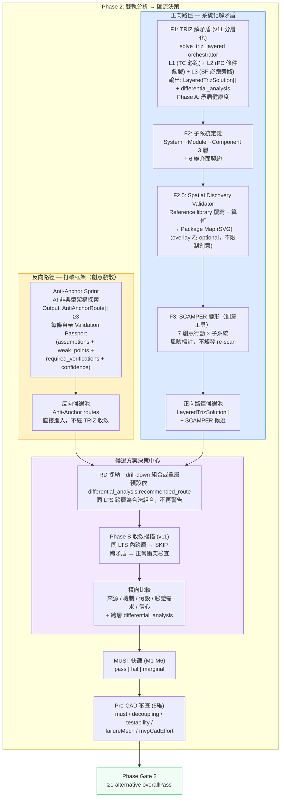
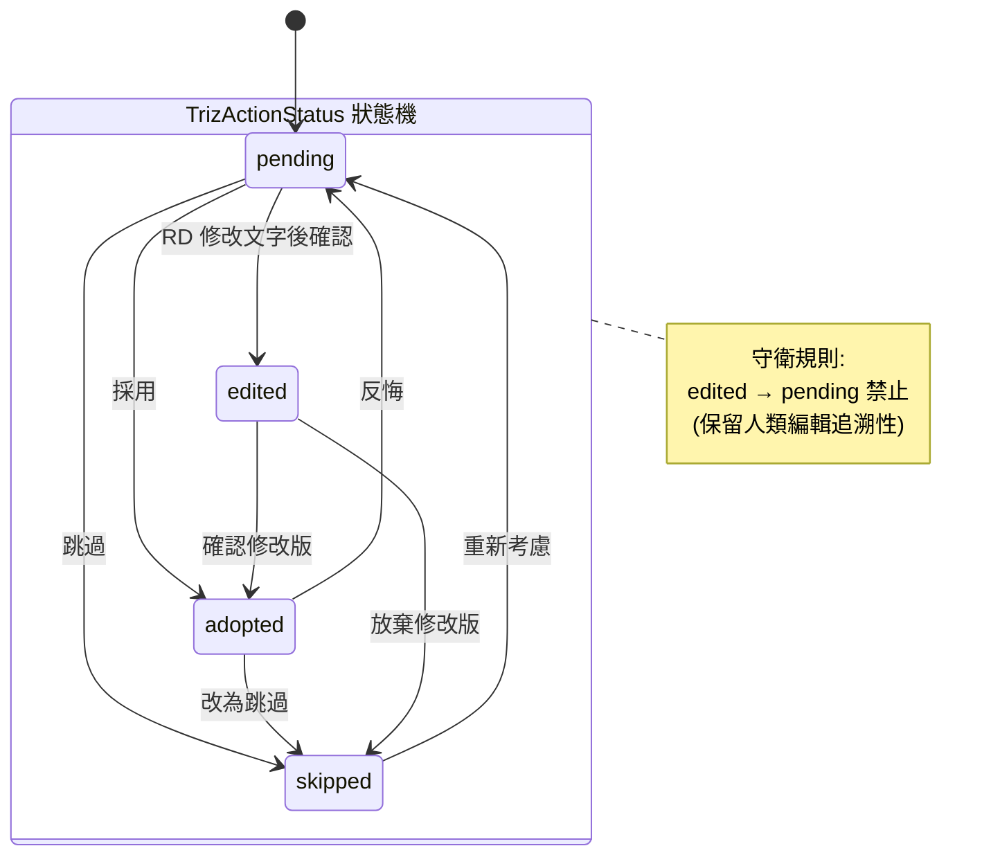
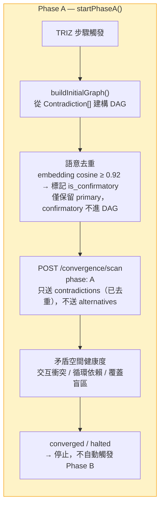
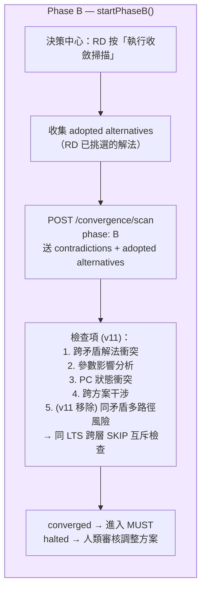
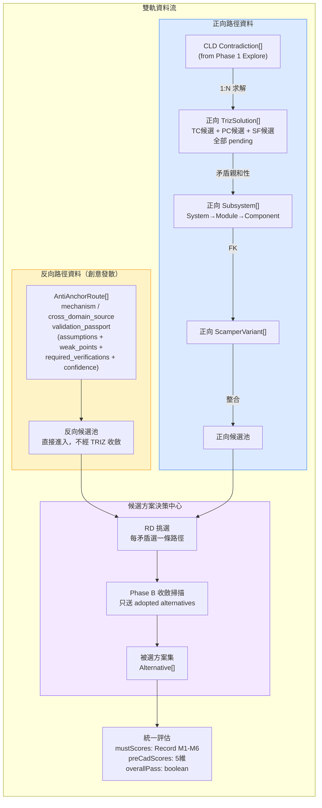
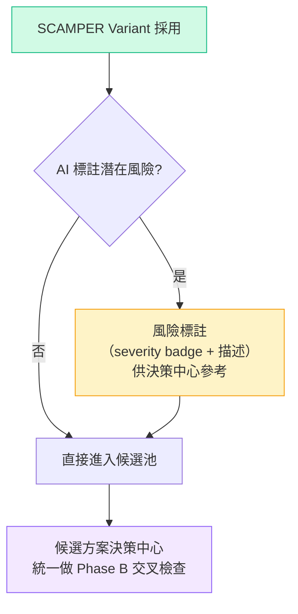

# 雙軌分析 → 候選方案決策中心：設計概念與流程圖

> **v11 (2026-04-08)**: F1 內部分層化 — TC/PC/SF 從「互斥三選一」改為「分層 drill-down」（依 `TRIZ_Layered_DrillDown_Optimization.md`）。
> - **F1 輸出升級**：從散落 TrizSolution[] pending 候選 → `LayeredTrizSolution[]`，每個 LTS 包含 L1 (TC 現象層) / L2 (PC 本質層，有條件) / L3 (SF 結構層，旁路) + `differential_analysis`。
> - **同矛盾多路徑警告下線**：Phase B 的「同矛盾多路徑 → major 風險」改為「同 LTS 內跨層跳過互斥檢查；只有跨矛盾才比對」。drill-down 組合是合法路徑而非缺陷。
> - **§0 第一性原理重寫**：v6→v7 的論證錯把症狀當病因，本版改正。
> - **決策中心 UI**：從「每矛盾選一條路徑」改為「採納 drill-down 組合或單層」。
>
> **v10 (2026-04-07)**: F2 後新增 Spatial Discovery Validator + 可選 What-if Overlay。
> - **Spatial Discovery（discovery 模式）**：6 維介面契約現可附帶結構化 `spatial` 區塊（bbox + mass + reference_source）。LLM 產出後，後處理會用 reference library 真實尺寸覆寫 LLM 數字；Python validator（無 LLM）算出此設計**要求**的最小包絡與總質量，輸出 SVG Package Map 給 RD 指著討論。
> - **不收緊創意自由**：discovery 模式從不要求 RD 事先給空間預算 — validator 是 descriptive 而非 prescriptive。預算僅在 RD 願意做 what-if 時透過 `POST /scamper/spatial-overlay` 套上。
> - **Pre-CAD spatial_score 升級**：當 `POST /pre-cad-reviews/{rid}/ai-analyze` 接收到 subsystems 時，spatial_score 改由 validator 算術產出（clash / mass / envelope），LLM 只負責散文 analysis。
>
> **v9 (2026-03-26)**: 反向路徑簡化 + 四項結構性修復。
> - **反向路徑簡化**：R2-R4（TRIZ/子系統/SCAMPER）移除 — Anti-Anchor 是創意工具，不需要再跑演繹收斂。產出直接帶 Validation Passport 進候選池。
> - P1: SCAMPER 改為純創意工具（不回饋收斂迴圈）
> - P2: Phase A 語意去重（`is_confirmatory` 過濾重複矛盾）
> - P3: 子系統 3 層架構分解（System→Module→Component + 6 維介面契約）
> - P4: 假設可證偽性篩選（`evidence_level` E0-E4 + `falsification_method`）

---

## 0. 第一性原理：TC/PC/SF 是分層 drill-down，不是互斥三路徑

### TRIZ 三層的本質（v11 重寫）

| 層 | 角色 | 問題表述 | 解法方向 |
|------|----------|----------|----------|
| **L1 — TC** | **現象層** | 改善 A 會惡化 B | 40 原理打破 trade-off |
| **L2 — PC** | **本質層** | 同一物理參數同時要 X 和 ¬X | 時間/空間/條件/整體-局部分離 |
| **L3 — SF** | **結構層**（旁路） | 物場交互不完整或有害 | 修改物質-場模型 |

**這三者不是「三個獨立醫生對同一病人開不同處方」，而是「同一份分層診斷報告的三層 — 表象 / 根因 / 結構」。** TC 是現象層、PC 是本質層（對 TC 的深挖）、SF 是結構層（平行的功能鏈旁證）。完整論述見 `docs/e2e/TRIZ_Layered_DrillDown_Optimization.md`。

### 為什麼舊版 v6 → v7 的修復是錯的

```
❌ v6：把 TC/PC/SF 當成互斥獨立候選
       → 全部送 Phase B → TC 解與 PC 解被當成衝突 → re-scan → ∞
       真因：Phase B 比對邏輯把同矛盾的多層解視為對立候選

❌ v7（治標不治本）：每矛盾只能 adopt 一條，多條 → warning
       表面解決了無限 re-scan，但代價是禁止 drill-down — 把 TRIZ 最有力
       的「組合拳」（TC 表象 + PC 本質 + SF 結構三重驗證）當成 bug 迴避

✅ v11（治本）：
矛盾 C1 → solve_triz_layered orchestrator
       → L1 必跑 + L3 必跑（平行）
       → L2 critic 觸發判斷 → 必要時 deepen_link 推導 PC
       → 聚合為 LayeredTrizSolution（含 differential_analysis）
→ 決策中心：RD 採納整個 drill-down 組合 或 單層
→ Phase B 收斂掃描：
       同 LTS 內的跨層 → SKIP（同矛盾的不同層本來就應該協同）
       跨矛盾 → 正常檢查衝突
→ 不再有「同矛盾多路徑警告」
```

**關鍵洞察**：無限 re-scan 的真因不是 TC/PC/SF 本質衝突，而是 Phase B 把它們**當成獨立候選來互相比對**。修對 Phase B 的比對邏輯，三層就可以共存。

---

## 1. 主流程總覽

**設計哲學**：Phase 2 是 **雙軌產出 → 人類選擇 → 交叉檢查 → 統一評估**。



### 設計決策說明

| 決策 | 說明 |
|------|------|
| **方法獨立** | 反向（創意）和正向（演繹）是兩種本質不同的方法，不應讓創意工具再跑演繹收斂 |
| **正向路徑分層** (v11) | F1 內部 TC/PC/SF 是同一矛盾的三層 drill-down，不是互斥三選一。由 `solve_triz_layered` orchestrator 調度 |
| **反向路徑簡化** | Anti-Anchor 自帶 Validation Passport，直接進候選池。不需要 R2-R4（TRIZ/子系統/SCAMPER） |
| **產出與選擇分離** | 正向路徑：TRIZ 步驟產出 `LayeredTrizSolution`（Phase A），採納在決策中心（Phase B） |
| Phase A = 矛盾健康度 | 正向路徑 TRIZ 步驟呼叫 `startPhaseA()`（含語意去重） |
| Phase B = 方案交叉檢查 | 決策中心 RD 採納後手動觸發 `startPhaseB()`，只送 adopted 解法 |
| **同 LTS 跨層 = 合法組合** (v11) | Phase B 對同一 LayeredTrizSolution 內的多層解 SKIP 互斥檢查；只有跨矛盾才比對 |
| ~~同矛盾多路徑警告~~ (v10 規則) | **v11 已下線**。drill-down 是合法路徑而非缺陷 |

---

## 2. TRIZ 狀態機（含轉換守衛）

**設計意圖**：每條 TRIZ 解法有獨立的生命週期。`edited` 狀態保留「人類修正 AI 建議」的追溯性，因此禁止從 `edited` 退回 `pending`。



### 合法轉換矩陣

| from ＼ to | pending | adopted | skipped | edited |
|-----------|---------|---------|---------|--------|
| **pending** | - | V | V | V |
| **adopted** | V | - | V | - |
| **skipped** | V | - | - | - |
| **edited** | **X** | V | V | - |

---

## 3. 收斂迴圈：Phase A / Phase B 分離

### Phase A：矛盾空間健康度（TRIZ 步驟使用）



### Phase B：方案交叉檢查（決策中心使用）



### 收斂判定邏輯

```
converged = iteration > 0
    AND allResolved (fatal + major 全部 resolved)
    AND (confidence >= 80 OR noNewBlocking)

halted = forcePause
    OR health = critical / circular
    OR (noNewInfo AND hasUnresolvedBlocking)
    → 觸發人類審核
```

### 人為介入點

| 動作 | 方法 | 效果 |
|------|------|------|
| 強制停止 | `forceHalt()` | 立即取消 timer + abort flag，status → halted |
| 強制繼續 | `forceContinue()` | health 降級為 warning，排程下一輪 scan |
| 重試分支 | `retryBranch(id)` | 該分支 status → exploring，排程下一輪 |
| 注入新矛盾 | `addContradiction()` | 加入 graph，若 fatal/major 自動觸發 re-scan |
| 覆寫 severity | `confirmSeverity()` | 手動修正 AI 判定的 severity |
| 重新執行 | `startPhaseA()` / `startPhaseB()` | generation counter 防舊回呼污染 |

---

## 4. 資料流向



---

## 5. SCAMPER 定位：創意發散工具（不回饋收斂迴圈）

**設計意圖**：SCAMPER 與 Anti-Anchor 同屬**創意發散工具**。潛在風險以標註方式顯示，不自動觸發 re-scan。所有產出直接進入候選方案池，在決策中心由 RD 統一評估。



**與 v7 的差異**：
| | v7（舊） | v8（現在） |
|---|---|---|
| newContradictions | fatal/major → 自動 addContradiction + Phase A re-scan | 顯示為風險標註，不觸發 re-scan |
| 確認流程 | 有未回饋矛盾 → 警告阻擋 | 無阻擋，所有風險在決策中心統一處理 |
| 定位 | 分析工具（產出需要收斂驗證） | **創意工具**（產出直接進池，與 Anti-Anchor 同級） |

---

## 6. 候選方案追溯六要素

每個進入決策中心的方案必須攜帶：

| # | 要素 | 欄位 | 說明 |
|---|------|------|------|
| 1 | 來源路徑 | `track: 'reverse' \| 'forward'` | 從哪條分析鏈來 |
| 2 | 來源步驟 | `source: triz_tc \| triz_pc \| triz_sf \| scamper \| anti_anchor` | 具體產出步驟 |
| 3 | 解的矛盾 | `contradiction_ids: string[]` | 追溯至原始矛盾 |
| 4 | 涉及子系統 | `subsystem_ids: string[]` | 影響範圍 |
| 5 | 基於假設 | `validation_passport.assumptions[]` | 方案成立的前提。每項含 `evidence_level` (E0-E4)、`is_falsifiable`、`falsification_method` |
| 6 | 缺少驗證 | `validation_passport.required_verifications[]` | 還需要什麼實驗 |

### 假設可證偽性（P4）

每個 assumption 必須攜帶以下欄位，決策中心依此篩選低品質假設：

| 欄位 | 型別 | 說明 |
|------|------|------|
| `evidence_level` | `E0` \| `E1` \| `E2` \| `E3` \| `E4` | E0=純猜測, E1=類比, E2=文獻, E3=模擬, E4=實測 |
| `is_falsifiable` | `boolean` | 此假設是否可被反證 |
| `falsification_method` | `string \| null` | 具體的反證實驗或方法。`is_falsifiable=false` 時為 null |

**篩選規則**：`evidence_level ≤ E1` 且 `is_falsifiable = false` 的假設標記為 `low_quality`，決策中心顯示警告。

---

## 7. 完整狀態轉換表

| 階段 | 輸入 | 處理 | 輸出 | 連鎖效果 |
|------|------|------|------|----------|
| Anti-Anchor 生成 | mission + constraints | AI 產出非典型架構（創意工具，自帶 Validation Passport） | `AntiAnchorRoute[].length ≥ 3` | **直接進反向候選池**，不經 TRIZ/子系統/SCAMPER |
| **TRIZ 分層求解** (v11) | 矛盾集 + severity | `solve_triz_layered`：L1 必跑 + L3 必跑 + L2 critic 觸發 + deepen_link + differential_analyzer | `LayeredTrizSolution[]`（含 L1/L2?/L3 + recommended_route） | 不做 Phase B |
| Phase A 掃描 | `startPhaseA()` | 語意去重（`is_confirmatory` 過濾）→ 矛盾空間健康度 | converged / halted | 不觸發 Phase B |
| 子系統定義 | TRIZ 矛盾親和性 | RD/AI 定義 System→Module→Component 3 層 + 6 維介面契約 | `Subsystem[confirmed]` | 解鎖 SCAMPER |
| SCAMPER 展開 | 已確認子系統 | 7 行動 × N 子系統（創意工具，不觸發 re-scan） | `ScamperVariant[adopted]` + 風險標註 | 直接進候選池 |
| **決策中心採納** (v11) | 所有候選池 | **RD 採納 LTS 推薦組合 / 自訂組合 / 單層** | adopted Alternative[]（標註層級） | — |
| **Phase B 掃描** (v11) | `startPhaseB()` | **跨矛盾衝突檢查；同 LTS 跨層 SKIP 互斥** | converged / halted | 人類審核 |
| MUST 篩選 | adopted Alternative + M1-M6 | AI + RD 評分 | pass / fail / marginal | 淘汰不可行方案 |
| Pre-CAD 審查 | 通過 MUST 的方案 | 五維評分 | overallPass | Phase Gate 2 判定 |

---

## 8. Health 閾值定義

| 狀態 | 條件 | UI 表現 | 流程影響 |
|------|------|---------|----------|
| `healthy` | nodeCount < 4 且無循環 | 綠燈 | 正常通行 |
| `warning` | 4 ≤ nodeCount ≤ 5 且無循環 | 黃燈 | 提示檢視，不阻斷 |
| `critical` | nodeCount > 5 | 紅燈 | 收斂迴圈 halted，建議回退 |
| `circular` | 偵測到循環矛盾依賴 | 紅燈 | 收斂迴圈 halted，需架構重構 |

---

## 9. Gate 條件

### 路徑完成 Gate

| Gate | 條件 |
|------|------|
| **反向路徑** | Anti-Anchor routes.length ≥ 3（完成即可，無後續步驟） |
| 正向: F1 TRIZ | Phase A converged 或 trizSolutions.length > 0 |
| 正向: F2 子系統 | confirmed subsystems > 0 |
| 正向: F3 SCAMPER | SCAMPER adopted > 0 |

### 決策中心 Gate

| Gate | 條件 |
|------|------|
| 進入決策中心 | 任一路徑候選池 > 0 |
| Phase B 可執行 | ≥1 alternative adopted |
| MUST | Phase B converged + 所有候選方案 M1-M6 已評分 |
| Pre-CAD | 通過 MUST 者 5 維全評分 |
| Phase Gate 2 | ≥1 alternative overallPass |

---

## 10. 關鍵元件對照

| 元件 | 職責 | 性質 |
|------|------|------|
| `useConvergenceLoop` | 收斂迴圈 driver。`startPhaseA()` / `startPhaseB()` 分離觸發 | 狀態 hook |
| `/convergence/scan` API | Phase A: 矛盾空間分析；Phase B: 方案交叉（**v11**: 同 LTS 跨層 SKIP 互斥） | 後端 AI |
| `ConvergenceDashboard` | 顯示 confidence %、fatal/major/minor 計數 | 純展示 |
| `BranchExplorationPanel` | 顯示各矛盾分支的探索輪次 | 純展示 |
| `HumanReviewPanel` | converged / halted 時的人類審查介面 | 純展示 |
| `ArchitectureHaltOverlay` | health critical/circular 時的 overlay | 互動 |
| `HealthMonitor` | 渲染 health 燈號 | 純展示 |
| `ConvergenceGraph` | 渲染矛盾 DAG | 純展示 |
| **Decision Hub** | 攤平所有候選、RD 路徑選擇、Phase B 觸發、橫向比較 | **核心互動區** |

---

## 11. 版本差異摘要

### v10 → v11 差異（本版）

依 `docs/e2e/TRIZ_Layered_DrillDown_Optimization.md` 的批判診斷修正：

| 項目 | v10 | v11 |
|------|-----|-----|
| **F1 輸出單元** | 散落的 `TrizSolution[]`（TC/PC/SF 並列 pending） | **`LayeredTrizSolution[]`**（每矛盾一個分層聚合體） |
| **F1 內部入口** | `solve_triz` dispatcher 依 `type` 路由到單一 solver | **`solve_triz_layered` orchestrator** 調度 L1/L2/L3，舊 dispatcher 降為 primitive |
| **TC/PC/SF 關係** | 互斥三選一（依矛盾類型分類） | **分層 drill-down**：L1 現象 + L2 本質（深挖）+ L3 結構（旁路） |
| **L2 觸發** | 沒有觸發概念（被當成獨立路徑） | critic：severity ≥ major / hits ≤ 2 / RD 手動 / LLM 判 trade-off |
| **ARIZ 落地** | 缺席 | `deepen_link` 從 (improving, worsening) 自動推導 PC 候選 |
| **同矛盾多路徑** | warning（major 風險） | **合法 drill-down 組合**，Phase B 跳過互斥檢查 |
| **Phase B 比對** | 跨矛盾衝突 + 同矛盾多路徑風險 | 跨矛盾衝突；同 LTS 內跨層 SKIP |
| **決策中心 UI** | 「每矛盾選一條路徑」 | 「採納推薦路線 / 自訂組合 / 單層」 |
| **跨層差異輸出** | 無 | **`differential_analysis`** 提供 recommended_route + rationale |
| **修復理由** | v6 無限 re-scan → v7 一刀切禁多路徑 | v7 把症狀當病因；v11 修對 Phase B 比對邏輯，drill-down 即可共存 |

### v8 → v9 差異（歷史）

| 項目 | v8 | v9 |
|------|----|----|
| **反向路徑** | R1→R2(TRIZ)→R3(子系統)→R4(SCAMPER)→候選池 | **R1(Anti-Anchor) → 候選池（直接，不經 TRIZ 收斂）** |
| 反向路徑理由 | 假設 AA 引入新矛盾需要 TRIZ 解 | **AA 是創意工具，自帶 Validation Passport，不需演繹收斂** |
| 雙軌對稱性 | 反向 4 步 / 正向 3 步（不對稱） | 反向 1 步 / 正向 3 步（**方法本質不同，不強求步驟對稱**） |
| 設計原則 | 雙軌獨立分析 | **方法獨立**：創意(反向) vs 演繹(正向)，不應混用 |
| Gate 條件 | 反向有 R1-R4 四個 gate | **反向只有一個 gate: routes ≥ 3** |
