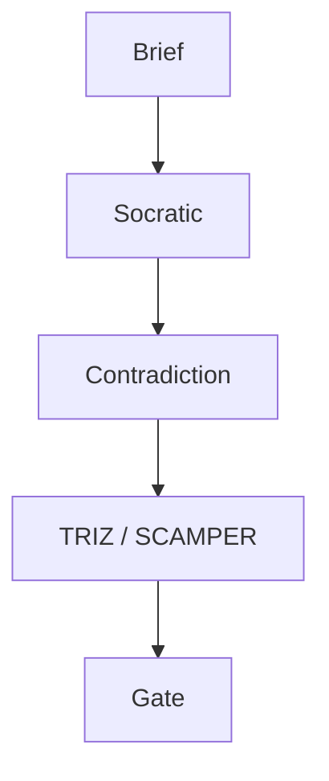

# E9x — Documentation and Maintenance Guide

| 項目 | 內容 |
|------|------|
| **文件版本** | v1.0 |
| **最後更新** | 2026-04-15 |
| **狀態** | Draft |
| **擁有者** | Tech Writer / 技術負責人 TBD by 2026-Q3 TBD |

> 本指南將 VibeCoding 模板 `15_documentation_and_maintenance_guide.md` 對應至 RD Design Copilot 專案的 5D 文件體系（DISCOVER → DELIVER）。

---

## 🎯 Purpose

為 RD Design Copilot 專案提供文件撰寫、維護、版本管理的統一規範，確保：
- 5D 架構（`docs/00-discover` → `docs/04-deliver`）內部一致
- ADR 與 E 系列文件交叉引用正確
- 面向開發者、使用者、利害關係人的三條閱讀路徑（見 `docs/README.md` Reading Paths A/B/C/D）皆可用

---

## 📖 Documentation Types

### 1. API Documentation
- **OpenAPI (FastAPI 自動產生)**：後端 `/docs` 端點，16 個 AI endpoint 自動文件（ADR-004）
- **Endpoint 說明**：request/response Pydantic schema 在 `backend/app/models/schemas.py`
- **Authentication**：Supabase JWT bearer（ADR-001）
- **Rate Limiting**：目前依 Anthropic 上游；專案層 TBD by 2026-Q2 TBD
- **Error Codes**：Pydantic validation error + FastAPI HTTPException

OpenAPI 文件由 FastAPI runtime 自動產出，不再手寫 `openapi.yaml`。

### 2. Technical Architecture Documentation
- **E1 Brief & PRD**：[`docs/00-discover/E1--project-brief-and-prd.md`](../00-discover/E1--project-brief-and-prd.md)
- **E2 SOW + ADRs**：[`docs/01-define/E2--statement-of-work.md`](../01-define/E2--statement-of-work.md) + [`adrs/`](../01-define/adrs/)
- **E3 Architecture & Design**：[`docs/01-define/E3--architecture-and-design.md`](../01-define/E3--architecture-and-design.md)
- **E5 System Design Overview**：[`docs/02-design/E5--system-design-overview.md`](../02-design/E5--system-design-overview.md)
- **ERD / Diagrams**：`docs/01-define/diagrams/`（E4 TBD）

### 3. User Documentation
- **使用者手冊**：[`E9x--user-manual-v0.1.md`](E9x--user-manual-v0.1.md)（v0.1，持續演進）
- **Getting Started / Tutorials**：尚未獨立成篇 — TBD by 2026-Q3 TBD

### 4. Developer Documentation
- **Setup**：`README.md`（專案根）+ `backend/pyproject.toml` + `package.json`
- **Code Review / Style**：[`GR6x Code Review Guide`](../03-develop/GR6x--code-review-guide.md)
- **Contributing**：TBD — Tech Writer TBD by 2026-Q3 TBD
- **Troubleshooting**：分散於 `docs/04-deliver/operations/*.md`

---

## 📝 Documentation Standards

### Writing Guidelines

#### 1. Structure and Organization
- 每份文件開頭 metadata 表：文件版本 / 最後更新 / 狀態 / 擁有者
- H1 為文件主標題（對應檔名），H2 分章節
- 內文使用繁體中文（面向內部）；專有名詞保留英文（TRIZ, SCAMPER, Supabase, RLS）

#### 2. Content Guidelines
- **Be Concise**：E1 / E2 已壓縮至 PRD / SOW 核心；避免重複
- **Evidence-based**：未知處使用 `TBD — <owner TBD> by <YYYY-MM-DD TBD>`，不杜撰
- **Update Regularly**：每次 PR 檢查相關 _MOC.md
- **Version Everything**：metadata 的「文件版本」為手動維護；git 為真實來源

#### 3. Visual Elements
- 架構圖：Mermaid（優先）或 draw.io（若複雜）
- Screenshot：放 `docs/<phase>/images/` 並相對連結

### Documentation as Code

#### Version Control

本專案文件結構（5D）：

```
docs/
├── README.md                    # Hub：TR Gate View + Reading Paths
├── 00-discover/                 # WHY — E1, E1x（journey, privacy, risk...）
├── 01-define/                   # HOW — E2 SOW, E3 Architecture, ADRs
├── 02-design/                   # WHAT TO BUILD — E5, E6x, E7x
├── 03-develop/                  # DOES CODE WORK — GR6x, migrations
├── 04-deliver/                  # SHIP & OPERATE — E8, E9, E9x, operations
├── _domain-knowledge/           # SCAMPER / TRIZ / KT 方法論
├── _gap-analysis/
├── _meeting-minutes/
└── _superseded/
```

每個 Phase 資料夾含 `_MOC.md`（Map of Content）作為入口。

#### Automated Generation
- FastAPI `/docs` 自動產生 OpenAPI UI
- GitHub Pages / MkDocs 靜態站 — TBD by 2026-Q4 TBD

---

## 🔄 Documentation Maintenance

### Regular Maintenance Tasks

#### Monthly Reviews
- [ ] 檢查所有文件 metadata 的「最後更新」是否過時（>3 個月 flag）
- [ ] 更新 `docs/README.md` 的 TR Gate 進度標記（`*` / `~` / `.`）
- [ ] 檢查外部連結有效性（Anthropic / Supabase / GitHub）
- [ ] 回應 PR review 中的 documentation 標註

#### Quarterly Updates
- [ ] 審視 ADR 是否仍然反映實況；不符則寫新 ADR supersede
- [ ] 更新架構圖（E3 / E5）
- [ ] Refresh 使用者手冊（E9x user manual）
- [ ] 檢視 _gap-analysis/ 的待辦項
- [ ] 分析文件使用度（若已上 GitHub Pages / 類似平台）

### Documentation Metrics

尚未導入分析平台。待 GitHub Pages / MkDocs 建置後追蹤：
- 頁面瀏覽量
- 用戶回饋（helpful / not helpful）
- 搜尋關鍵字
- 停留時間
- 跳出率

Owner：TBD by 2026-Q4 TBD。

---

## 🛠️ Tools and Platforms

### 本專案採用

| 工具 | 用途 | 備註 |
|------|------|------|
| **Git + Markdown** | 所有文件（docs/**/*.md） | 主要真實來源 |
| **FastAPI /docs** | API 互動文件 | 自動產生 |
| **Mermaid** | 架構圖 / 流程圖 | 內嵌於 `.md` |
| **ADR（Markdown）** | 決策紀錄 | `docs/01-define/adrs/ADR-*.md` |
| **_MOC.md** | 各資料夾入口 | 對齊 Zettelkasten 風格 |

### 評估中
- **GitBook / MkDocs / Docusaurus**：靜態站 — TBD by 2026-Q4 TBD
- **Confluence**：若需對接企業客戶 — TBD

### Diagram Tools

**Mermaid（優先）** — 內嵌範例：



**draw.io** — 複雜架構圖存於 `docs/01-define/diagrams/`。

---

## 📋 Documentation Templates

### README Template（專案根 README.md）

範例見專案根 `README.md`。每份子模組若需 README，採：

```markdown
# Module Name

## Description
一段話描述目的。

## Installation / Setup
安裝或啟動步驟。

## Usage
典型使用方式。

## Reference
連結至 `docs/` 內相關 E / ADR 文件。
```

### CHANGELOG Template

目前無集中 `CHANGELOG.md`。變更經由 git commit history 追蹤（commits 遵循 conventional commits 風格：`feat:`, `fix:`, `docs:`, `refactor:`）。

集中化 CHANGELOG — TBD by 2026-Q3 TBD。

### ADR Template
見 [`docs/01-define/adrs/ADR-001-baas-first-architecture.md`](../01-define/adrs/ADR-001-baas-first-architecture.md) 作為參考格式：Status / Date / Deciders / Context / Decision / Consequences / Related。

---

## 🎯 Best Practices

### Documentation Strategy（本專案紀律）

1. **Start Early**：E1 Brief 先於 code；ADR 與實作同時提交
2. **Keep It Updated**：每個 PR 檢查 `_MOC.md` 與 `README.md` 是否需同步
3. **Make It Searchable**：善用 H1/H2 hierarchy；關鍵字置於標題
4. **Get Feedback**：在 _meeting-minutes/ 記錄討論；ADR 可被 supersede
5. **Measure Success**：TR Gate 進度（0-10）為交付里程碑

### Team Practices
- **Documentation Reviews**：code review 同時 review 相關文件變更（見 GR6x）
- **Shared Responsibility**：每位 engineer 皆為 doc owner
- **Templates**：5D metadata 表 + ADR 格式一致
- **Continuous Improvement**：每季 retrospective 檢討文件流程

---

## 附錄 — 文件治理責任矩陣（RACI 摘要）

| 文件類型 | Responsible | Accountable | Consulted | Informed |
|----------|-------------|-------------|-----------|----------|
| E1 Brief / PRD | Product | Tech Lead | RD / Legal | All |
| E2 SOW / ADR | Tech Lead | Tech Lead | RD | All |
| E3 / E5 Architecture | Tech Lead | Tech Lead | Backend / Frontend | All |
| GR6x Code Review | Tech Lead | Tech Lead | RD | All |
| E8 Security | Security Lead TBD | Tech Lead | Legal | All |
| E9 Deployment | DevOps TBD | Tech Lead | Backend | All |
| E9x User Manual | Tech Writer TBD | Product | RD / Support | Customers |
| Operations Runbook | On-call / Feature Owner | Tech Lead | DevOps | All |

Owner 欄位中 TBD 皆 by 2026-Q3 TBD。

---

**Remember**：好文件是對專案未來的投資。本專案以 5D + ADR + _MOC 三層結構確保可追溯性。
