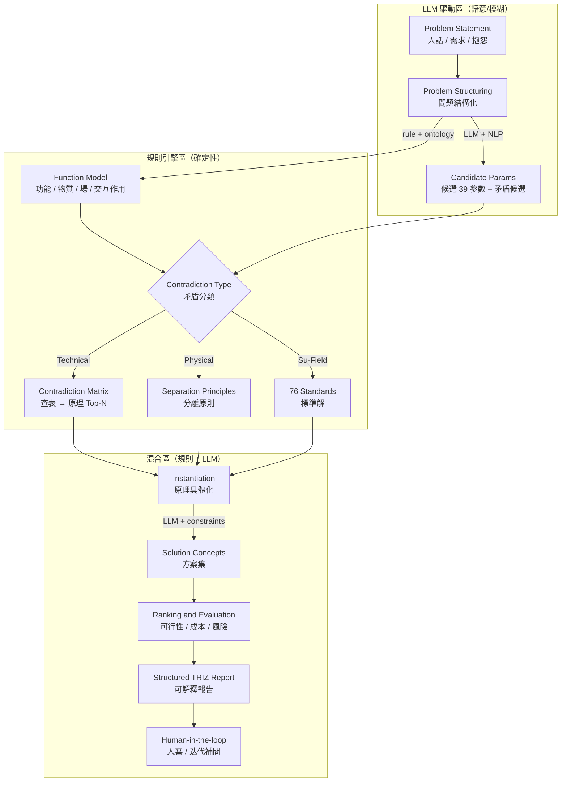
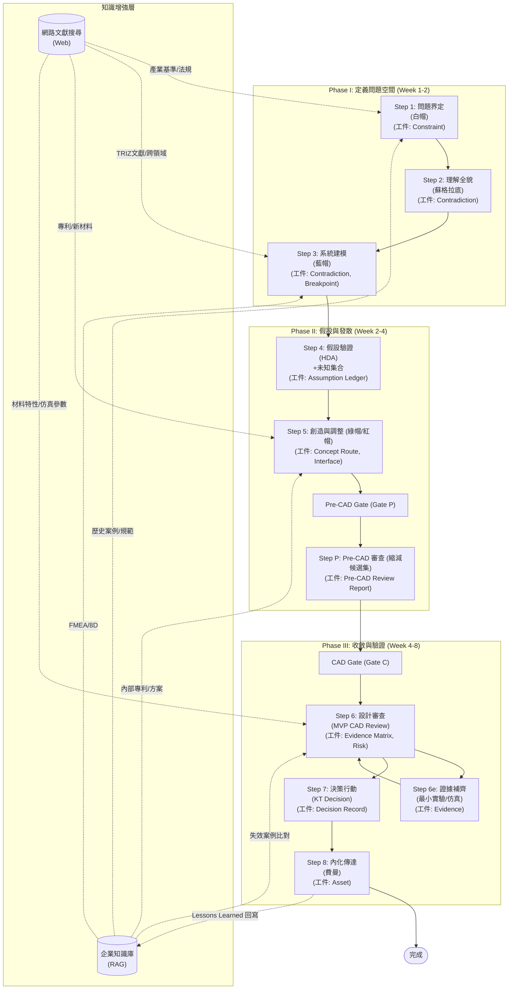
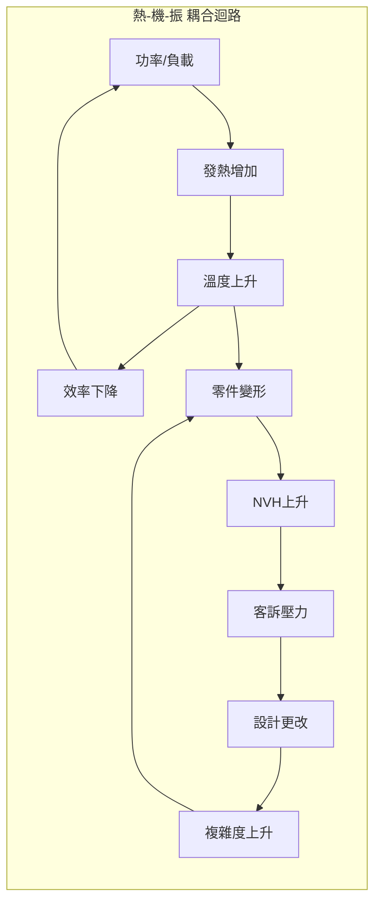
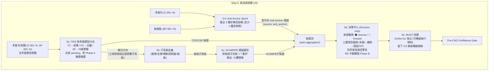

# RD Design Copilot 整合方法論 (E2E)

**一句話定位**：把「系統性決策流程」的治理骨架與「SCAMPER/TRIZ」的發散引擎深度耦合，形成一套 **「結構化發散 → 嚴格收斂 → 最小驗證」** 的早期設計流程。並透過 **「數位線索 (Digital Thread)」** 連結所有設計工件及其證據，建立 **「可驗證的 Gate (Evidence-driven Gate)」** 以驅動決策。TRIZ 推理採用 **AutoTRIZ 混合架構**（規則骨架 + LLM 生成補足），搭配 **企業知識庫 RAG + 網路文獻搜尋** 作為知識增強層。

---

## 核心哲學

```
混沌 → 結構 → 證據 → 決策 → 資產
      ↑              ↓
   SCAMPER/TRIZ    Robust篩選
   (擴大可能性)    (殺掉脆弱)
```

**四個不變原則**：

1.  **先把未知寫下來**（假設台帳）
2.  **先留多條路**（Set-Based + SCAMPER/TRIZ 變體）
3.  **先切斷連鎖死法**（失效路徑 + 最小實驗）
4.  **產出與選擇分離**（TRIZ/SCAMPER/Anti-Anchor 負責產出候選方案，選擇統一在決策中心由 RD 執行）

---

## 0) E2E 流程對齊：PPT 與 Copilot 語言 Mapping

為了確保 RD 團隊能清楚了解每個工程階段與 Copilot 的產出及證據要求，我們將外部（高階）與內部（詳細）的流程語言進行對齊。

**高階流程 (PPT/NPI):**

*   **設計發想 (Design Ideation)** → Copilot Phase I & II
*   **CAD / 模擬驗證 (CAD / Simulation Verification)** → Copilot Phase II & III (特別是 Evidence Closure)
*   **打樣 / 測試驗證 (Prototyping / Test Verification)** → Copilot Phase III (特別是 Evidence Closure)
*   **設計審查 (Design Review)** → Copilot Phase III (Step 6 & 7)
*   **NPI (New Product Introduction)** → Copilot Phase III (Decision & Assetization)

---

## 1) 核心概念：雙層狀態機與數位線索 (Digital Thread)

為了實現 E2E 落地，我們需要同時管理「活動步驟」與「工件生命週期」。

### 1.1 雙層狀態機

*   **上層：流程狀態機** (即目前的 Step 1~8) - 描述團隊活動的推進。
*   **下層：工件狀態機** - 描述每個設計工件 (Artifact) 的生命週期流轉。
    *   **工件狀態流轉範例**：Draft → Reviewed → Verified (with Evidence) → Baseline → Released

### 1.2 數位線索 (Digital Thread)

所有設計工件及其相關數據、版本、證據都將被系統性連結，確保可追溯、可驗證。

### 1.3 核心工件物件 (Copilot Minimal Data Model Schema)

Copilot 最小資料模型將圍繞以下 7 個核心物件，實現專家知識數位化與可複用流程：

1.  **Constraint**：需求、硬限制、軟目標、非目標。
2.  **Contradiction (TRIZ)**：矛盾類型（TC/PC/SF）、改善參數、惡化參數、工程描述、物理矛盾、Su-Field 模型。
3.  **FunctionModel**：物質-場模型：S1（工具）、S2（產品）、F（場）、交互作用類型、Su-Field 完整性。
4.  **Breakpoint**：斷路點：介入位置、可操作參數。
5.  **Concept Route**：架構路線：機制、介面契約、預估 BOM、風險、Evidence Matrix、**Validation Passport**、**source**（`triz` | `scamper` | `anti_anchor` | `manual`）。
6.  **Evidence**：仿真報告、計算書、測試報告、供應商回覆、量測數據。
7.  **Risk**：風險登錄 (FMEA-like)，包含失效模式、機率、嚴重度、緩解措施。

### 1.4 知識增強層：企業知識庫 RAG + 網路文獻搜尋

Copilot 在流程各階段透過兩條知識通道，自動注入佐證與補述資料：

```
┌─────────────────────────────────────────────────────────────┐
│                  知識增強層 (Knowledge Augmentation)          │
│                                                              │
│  ┌─────────────────────┐    ┌─────────────────────────┐     │
│  │  企業知識庫 (RAG)     │    │  網路文獻搜尋 (Web)      │     │
│  │                      │    │                          │     │
│  │  • 歷史失效案例       │    │  • 學術論文 / 期刊        │     │
│  │  • 過往設計決策       │    │  • 專利檢索              │     │
│  │  • 內部規範 / SOP     │    │  • 產業標準 / 法規        │     │
│  │  • 測試報告           │    │  • 競品分析 / 拆解報告    │     │
│  │  • 供應商評鑑紀錄     │    │  • 材料 / 製程資料庫      │     │
│  │  • FMEA / 8D 報告    │    │  • 技術白皮書             │     │
│  └──────────┬───────────┘    └────────────┬──────────────┘     │
│             │                              │                  │
│             └──────────┬───────────────────┘                  │
│                        ▼                                      │
│            Copilot 各步驟自動檢索與注入                         │
└─────────────────────────────────────────────────────────────┘
```

#### 各步驟知識注入對照表

| Step | 企業知識庫 RAG 用途 | 網路文獻搜尋用途 |
|------|-------------------|----------------|
| **Step 1** 問題界定 | 過往類似案例約束、歷史 KPI 數據 | 產業基準 (benchmark)、法規更新 |
| **Step 2** 理解全貌 | 歷史假設與驗證結果、內部 know-how | 學術文獻中的失效機制研究 |
| **Step 3** 系統建模 | FMEA/8D 歷史失效模式、因果數據 | TRIZ 矛盾矩陣參考文獻、跨領域案例 |
| **Step 4** 假設驗證 | 過往驗證方法與成本紀錄 | 最新測試方法論、量測技術 |
| **Step 5** 創造調整 | 內部專利庫、過往方案評分紀錄 | 外部專利檢索、新材料/新製程文獻 |
| **Step P** Pre-CAD | 歷史 DFM 評估報告 | 製程能力參考資料 |
| **Step 6** 設計審查 | 歷史失效案例比對 (同產品/同模組/同機制) | 材料特性資料庫、仿真參數參考 |
| **Step 7** 決策行動 | 過往決策記錄與教訓學習 (Lessons Learned) | 競品/產業趨勢佐證 |
| **Step 8** 內化傳達 | 知識庫回寫 (新增 Lessons Learned) | — |

#### 知識引用規範

所有從 RAG 或 Web 檢索注入的資料，必須附帶來源標記以確保可追溯性：

```yaml
知識引用格式:
  RAG來源:
    引用ID: "KB-{領域}-{序號}"     # e.g., KB-FMEA-042, KB-DEC-017
    來源文件: "{文件名稱/編號}"
    相關性: "High / Medium / Low"
    摘要: "{簡述引用內容}"

  Web來源:
    引用ID: "WEB-{類型}-{序號}"    # e.g., WEB-PAT-003, WEB-STD-012
    URL: "{來源網址}"
    類型: "論文 / 專利 / 標準 / 白皮書 / 其他"
    發佈日期: "{yyyy-mm-dd}"
    相關性: "High / Medium / Low"
    摘要: "{簡述引用內容}"
```

### 1.5 AutoTRIZ 混合架構：規則骨架 + LLM 生成補足

> **設計原則**：TRIZ 推理骨架高度規則化（矛盾矩陣、分離原則、76 標準解、ARIZ），但「把人話翻成 TRIZ 結構」與「把抽象原理落地成具體設計」這兩端永遠需要語意理解。Copilot 採用 **AutoTRIZ 混合式架構**：規則引擎管流程，LLM 負責模糊地帶。
>
> 參考：Jiang et al. (2025) AutoTRIZ — Automating engineering innovation with TRIZ and large language models.



#### TRIZ Prompt Markdown 參照表

規則引擎區的知識以結構化 Markdown 存放，供 Prompt 注入或 RAG 檢索：

```
rd_assistant_design_system/triz_knowledge_base/
├── 01_39_parameters.md          # 39 工程參數 + LLM 語意映射提示
├── 02_contradiction_matrix.md   # 39×39 矛盾矩陣 (row-based lookup)
├── 03_40_principles.md          # 40 發明原理 + 子原理 + 工程提示
├── 04_separation_principles.md  # 物理矛盾 4 大分離原則
└── 05_76_standard_solutions.md  # Su-Field 76 標準解 (5 大類)
```

> **注入策略**：39 參數 + 分離原則 + 40 原理 → 全量注入（~6,500 token）；矛盾矩陣 + 76 標準解 → RAG 按需檢索相關行。

#### 模組分工：規則 vs LLM

| 模組 | 執行方式 | 說明 |
|------|---------|------|
| **矛盾類型分類** (技術/物理/Su-Field) | 規則引擎 | 基於功能模型結構判斷，確定性高 |
| **矛盾矩陣查表 → 原理推薦** | 規則引擎 | 39×39 矩陣查表 + Top-N 推薦 |
| **分離原則映射** (時間/空間/條件/整體局部) | 規則引擎 | 規則分類後套策略 |
| **76 標準解選取** | 規則引擎 | Su-Field 模型 → 標準解匹配 |
| **報告結構模板** | 規則引擎 | 固定章節與欄位 |
| **自然語言 → 功能模型/參數/矛盾** | **LLM** | 語意歧義、領域隱含知識、未明確說出的真問題 |
| **39 參數映射** | **LLM** | 同一句話可能對應多個參數，需語意消歧 |
| **原理具體化** (抽象→工程設計) | **LLM + RAG** | 把「原理 #15 動態化」變成領域可執行的設計改動 |
| **方案品質控管** | **LLM + 規則** | 避免幻覺、確保符合約束條件 |

#### Copilot 流程對映

| AutoTRIZ 階段 | 對應 Copilot Step | 主要執行方式 |
|--------------|-------------------|-------------|
| Problem Structuring | **Step 1-2** (問題界定 + 理解全貌) | LLM 抽取 + 人校準 |
| Function Model + 矛盾定義 + **矛盾類型分類** | **Step 3** (系統建模 + Function Model + TRIZ 矛盾正式化 + 矛盾類型分類) | LLM 輔助翻譯 + 規則驗證 + **規則引擎分類 (TC/PC/SF)** |
| 矛盾矩陣/分離/標準解 | **Step 5a** (TRIZ 依矛盾類型分派解法) | 規則引擎查表。**依 Step 3 矛盾類型分派路徑：TC→矩陣、PC→分離、SF→76標準解。Phase A only（矛盾健康度），Phase B 移至決策中心（Step 5d）由 RD 選定路徑後觸發** |
| Instantiation + Solution | **Step 5b-5d** (子系統 + SCAMPER + 方案生成) | LLM 生成 + RAG 佐證。**每條矛盾依其類型走對應路徑產出候選，非三路全跑——RD 在決策中心 per-contradiction 審核** |
| Ranking & Evaluation | **Step 5e / Step 7** (MUST 快篩 / KT 決策) | 規則引擎 + 人審 |

---

## Gate 與 Phase 轉換 (更新)

系統有 8 個 Step-level Gate（每步一個），其中 4 個同時觸發 Phase 轉換：

| Gate | 位置 | Gate 類型 | Phase 轉換 |
|------|------|-----------|-----------|
| Gate 1 | Step 1 完成 | 內部 Gate | **DRAFT → PHASE_I** |
| Gate 2 | Step 2 完成 | 內部 Gate | Phase I 內部 |
| Gate 3 | Step 3 完成 | 內部 Gate | **PHASE_I → PHASE_II** |
| Gate 4 | Step 4 完成 | 內部 Gate | Phase II 內部 |
| **Gate P** | Step 5 完成 | **Pre-CAD Gate** | **PHASE_II → PHASE_III** (候選集收斂，進入 MVP CAD)。**Pre-CAD Confidence Score = 100%**（所有 Fatal + Major 矛盾完全收斂） |
| Gate 6 | Step 6 審查中 | 內部 Gate | Phase III 內部 (觸發 Step 6e 證據補齊迴圈) |
| **Gate C** | Step 6 完成 (證據充足) | **CAD Gate** | Phase III 內部 (北極星 ≥ E2，進入 KT 決策) |
| Gate 7 | Step 7 完成 | 內部 Gate | Phase III 內部 |
| Gate 8 | Step 8 完成 | 內部 Gate | **PHASE_III → COMPLETED** |

---

## 流程總覽 (8 步驟 × 六帽 × SCAMPER/TRIZ)

> **v1.3 更新**：引入 Pre-CAD Gate (Gate P) 與 CAD Gate (Gate C)，將設計審查分層。



---

# Phase I: 定義問題空間

## Step 1: 問題界定 (白帽 + 5W1H)

### 1.1 目的
把模糊需求變成「可檢查句」，為後續 TRIZ 矛盾定義打基礎。
**核心工件**：Constraint (Draft)

### 1.2 輸入
- 客戶/PM 需求描述
- 過往類似案例（如有）
- 空間/成本/製程約束
- **[素材上傳]** 用戶上傳的多模態素材（PDF / 圖片 / Excel / 規格書 / 測試報告 / 競品拆解報告 / 供應商回覆），類似 NotebookLM 的 Sources 模式
- **[RAG]** 企業知識庫中過往類似專案的約束定義、歷史 KPI 達成數據
- **[Web]** 產業基準 (benchmark) 數據、最新法規與標準要求

### 1.3 AI 協助任務

```yaml
任務清單:
  - 將需求改寫成約束句
  - 生成缺口問卷
  - 列出已知事實 vs 未知缺口
  - 從上傳素材中自動提取約束、假設、歷史數據、矛盾線索:
      約束提取: 規格書中的硬限制（空間、電壓、溫度範圍等）
      假設提取: 報告中隱含的前提（如「假設環境溫度 25°C」）
      歷史數據提取: 測試報告中的數值（作為 Evidence Matrix 初始證據）
      矛盾線索提取: 競品拆解中發現的 trade-off
  - 預填 Constraint 表、Assumption Ledger、矛盾初步列表，供用戶審核確認
  - "**約束可行性驗證 (Constraint Feasibility Check)**":
      - 所有硬約束是否在物理上可以同時滿足？（量綱分析、功率密度、散熱極限）
      - 歷史上是否有產品在相似約束下成功？（RAG + Web 搜尋）
      - 判定結果:
          約束可行: 正常進入流程
          約束邊界可行: ⚠️ 高風險約束組合，繼續但預警
          約束物理不可能: 🛑 打住，要求重新定義問題或放寬約束
```

### 1.4 輸出模板

**任務定義表 v1.1 (工件: Constraint)**

| 欄位 | 內容 | 證據來源 (Artifact ID) |
|------|------|--------------------|
| **Mission** | 在【使用情境】下，系統必須【達成行為】，且【三個最不能失敗的指標】不得超標 | PRD-001 |
| **Hard Constraints** | 絕對不能違反的限制（空間、法規、成本上限） | REG-001, COST-001 |
| **Soft Objectives** | 可 trade-off 的目標（效率、重量、噪音） | MRD-002 |
| **Non-Goals** | 這版明確不追求的東西 | STRATEGY-003 |
| **三個最不能失敗指標** | 1. [指標名稱] (判斷方式: [方法]) 2. [指標名稱] (...) 3. [指標名稱] (...) | KPI-001 |

**Gate 1 檢查點**
> ✅ 「三個最不能失敗指標」被明確說出，且每個指標有「可量測」或「可判斷」的方式。
> ✅ **約束可行性驗證通過**：AI 已確認約束組合在物理上可行（或標示為高風險邊界組合）。若約束物理不可能 → **不通過 Gate 1**，要求重新定義。
> ✅ 核心工件 Constraint 狀態: Draft -> Reviewed。

---

## Step 2: 理解全貌 (蘇格拉底問答)

### 2.1 目的
把「大家以為理所當然」的前提翻出來，為 TRIZ 矛盾識別做準備。
**核心工件**：Contradiction (Draft), Assumption (Draft)

### 2.2 知識增強輸入
- **[RAG]** 歷史假設台帳中「被推翻的假設」清單，避免重複犯錯
- **[RAG]** 類似產品的內部 know-how 文件、設計規範
- **[Web]** 學術文獻中的失效機制研究、產業趨勢報告

### 2.3 蘇格拉底七類提問 (AI 固定執行)

| 類型 | 問題範例 |
|------|---------|
| **澄清** | 你說的「小空間」是體積還是外形約束？ |
| **假設** | 你假設熱可以靠外殼散掉，證據是什麼？ |
| **證據** | 過去類似產品在相同功率下的溫升記錄？ |
| **觀點** | 若把控制器外置，誰會反對？原因？ |
| **後果** | 若 NVH 超標，最壞代價是什麼？ |
| **反思** | 我們現在最可能「自欺欺人」的是哪一條？ |
| **重構** | 你確定問題是「散熱不足」而不是「損耗太高」嗎？如果把損耗降 30%，散熱問題是否自動消失？你把哪些前提當作不可變？如果拿掉，問題空間會怎麼改變？三個指標中刪掉哪一個會讓問題容易 10 倍？ |

> **重構類提問的目的**：不是「理解問題」，而是**質疑問題本身是否被正確框架**。人類可能鎖定了一個錯誤的架構方向，或設了物理上不可能同時滿足的約束。AI 在這裡的角色是 **challenger（質疑者）**，不只是 solver（求解者）。

### 2.4 假設提取增強欄位

> **v8 更新**：蘇格拉底問答階段提取的假設新增以下欄位，以強化假設品質管理：
>
> | 欄位 | 說明 |
> |------|------|
> | `is_falsifiable` | 此假設是否可被證偽（Boolean）。不可證偽的假設需重新表述或標記為 axiom。 |
> | `evidence_level` | 目前證據等級 (E0-E4)，與 Evidence Matrix 對齊。 |
> | `falsification_method` | 若假設為錯，用什麼最小實驗可以推翻它。 |

### 2.5 輸出：矛盾初步識別 (工件: Contradiction)

**矛盾列表 v1.1** (為 Step 3 TRIZ 準備)

| 編號 | 我想改善 | 但會惡化 | 來源 (假設/情境/數據) |
|------|---------|---------|--------------------|
| C1 | 體積更小 | 散熱能力 | A001 |
| C2 | 轉速更高 | NVH | R002 (風險) |
| C3 | 成本更低 | 可靠性 | Constraint-001 |

**Gate 2 檢查點**
> ✅ 至少列出 10 條關鍵假設，標出 Top 3「錯了就翻車」的假設。
> ✅ 至少識別 3 條核心矛盾。
> ✅ 核心工件 Contradiction, Assumption 狀態: Draft -> Reviewed。

---

## Step 3: 系統建模 (因果迴路 + Function Model + TRIZ 矛盾定義)

### 3.1 目的
找到耦合點（未知會放大的地方），建構 Function Model（物質-場模型）以識別系統交互作用類型，並將矛盾正式化為 TRIZ 句式，完成**矛盾類型分類（Technical / Physical / Su-Field）**——此分類決定 Step 5a 的解法路徑。
**核心工件**：Contradiction (Verified), FunctionModel (Reviewed), Breakpoint (Draft)

### 3.2 知識增強輸入
- **[RAG]** FMEA/8D 歷史報告中的失效因果鏈，直接匯入因果迴路圖
- **[RAG]** 過往專案的耦合點分析結果
- **[Web]** TRIZ 矛盾矩陣參考文獻、跨領域類比案例 (e.g., 汽車/航太的類似耦合問題)

### 3.3 因果迴路圖建立



### 3.4 Function Model 建構 (工件: FunctionModel)

> **AutoTRIZ 標註**：Function Model 是 TRIZ 三路徑分類的前置條件。只有建構出物質-場模型，才能區分哪些問題屬於 Su-Field 類型（不完整/有害/不足的場-物質交互），哪些是 Technical/Physical Contradiction。此步驟由**規則引擎 + 本體論 (Ontology)** 驅動，LLM 輔助識別隱含的場與物質。

#### 3.4.1 物質-場分析 (Su-Field Analysis)

從因果迴路圖（3.3）中提取系統的物質（Substance）與場（Field）交互關係：

```
Function Model [編號]:
  系統功能: [系統要達成的主要功能]
  物質1 (S1): [工具物質 — 施加作用的物件]
  物質2 (S2): [產品物質 — 被作用的物件]
  場 (F): [場類型: 機械場/熱場/電場/磁場/化學場/...]
  交互作用類型: [有用/有害/不足/缺失]
  Su-Field 完整性: [完整 / 不完整 / 有害完整]
```

**範例**

```yaml
Function Model FM-01:
  系統功能: 馬達軸承支撐轉子
  物質1 (S1): 軸承
  物質2 (S2): 轉子
  場 (F): 機械場 (徑向支撐力)
  交互作用類型: 有用但不足 (高轉速下支撐剛度不夠)
  Su-Field 完整性: 不完整 → Su-Field 問題候選

Function Model FM-02:
  系統功能: 外殼散熱
  物質1 (S1): 外殼
  物質2 (S2): 繞組 (熱源)
  場 (F): 熱場 (傳導 + 對流)
  交互作用類型: 不足 (熱阻過大)
  Su-Field 完整性: 不完整 → Su-Field 問題候選
```

#### 3.4.2 矛盾類型分類規則 (規則引擎)

基於 Function Model 與矛盾初步識別（Step 2），規則引擎進行分類：

| 判定條件 | 矛盾類型 | Step 5a 路徑 |
|---------|---------|-------------|
| 兩個不同參數改善/惡化衝突 | **Technical Contradiction (TC)** | 矛盾矩陣 → 40 原理 |
| 同一物件需同時具備矛盾屬性 | **Physical Contradiction (PC)** | 分離原則 (時間/空間/條件/整體局部) |
| Su-Field 交互不完整/有害/不足 | **Su-Field Problem (SF)** | 76 標準解 |

> **注意**：同一工程問題可能同時被歸為多種類型（例如既有 TC 也有 SF 面向）。此時保留所有適用的分類，但每種類型走各自對應的路徑——**不是每條矛盾都跑三路**。

### 3.5 TRIZ 矛盾正式化 (工件: Contradiction)

> **AutoTRIZ 標註**：此步驟是 TRIZ 流程中「最難規則化」的環節——把口語化的工程問題翻譯成 TRIZ 結構（39 參數、矛盾類型、物理矛盾、Su-Field 模型）。Copilot 使用 **LLM 輔助翻譯 + 規則驗證** 的混合模式：
> - **LLM 負責**：從 Step 1-2 的自然語言描述中抽取候選改善/惡化參數、判斷矛盾類型
> - **規則引擎負責**：驗證參數是否為合法的 39 參數、矛盾句式是否完整、是否有重複/遺漏；**基於 3.4 Function Model 分類矛盾類型**
> - **人校準**：RD 確認 LLM 產出的矛盾句是否反映真正的工程矛盾，並確認矛盾類型分類正確

**TRIZ 問題正式化模板（依類型分列）**

**Technical Contradiction (TC) 模板**
```
矛盾 [編號]:
  矛盾類型: Technical Contradiction
  改善參數: [TRIZ 39參數之一]
  惡化參數: [TRIZ 39參數之一]
  工程表述: 當 [動作] 時，[指標A] 改善，但 [指標B] 惡化
  Step 5a 路徑: 矛盾矩陣 → 40 原理
```

**Physical Contradiction (PC) 模板**
```
矛盾 [編號]:
  矛盾類型: Physical Contradiction
  物理矛盾: [同一物件] 需要同時具備 [屬性X] 和 [非屬性X]
  工程表述: [物件] 在 [情境A] 下需要 [屬性X]，在 [情境B] 下需要 [非屬性X]
  Step 5a 路徑: 分離原則 (時間/空間/條件/整體局部)
```

**Su-Field Problem (SF) 模板**
```
問題 [編號]:
  矛盾類型: Su-Field Problem
  關聯 Function Model: [FM-xxx]
  S1 (工具): [物質1]
  S2 (產品): [物質2]
  F (場): [場類型]
  問題描述: [交互作用不完整/有害/不足的具體描述]
  Su-Field 問題類別: [不完整系統 / 有害效應 / 效應不足]
  Step 5a 路徑: 76 標準解
```

**範例**

```yaml
矛盾 C1:
  矛盾類型: Technical Contradiction
  改善參數: 9-速度
  惡化參數: 31-有害副作用(噪音)
  工程表述: 當轉速提高時，輸出功率密度改善，但 NVH 惡化
  Step 5a 路徑: 矛盾矩陣 → 40 原理

矛盾 C1-PC:
  矛盾類型: Physical Contradiction
  物理矛盾: 轉子需要同時「高轉速」和「低振動」
  工程表述: 轉子在輸出功率時需要高轉速，在 NVH 控制時需要低振動
  Step 5a 路徑: 分離原則

問題 SF-01:
  矛盾類型: Su-Field Problem
  關聯 Function Model: FM-01
  S1 (工具): 軸承
  S2 (產品): 轉子
  F (場): 機械場 (徑向支撐力)
  問題描述: 高轉速下軸承支撐剛度不足，轉子偏擺增大
  Su-Field 問題類別: 效應不足
  Step 5a 路徑: 76 標準解
```

### 3.6 輸出：斷路點識別 (工件: Breakpoint)

| 斷路點編號 | 位置 | 可能解法方向 | TRIZ 原理提示 |
|--------|------|-------------|--------------|
| BP001 | 馬達-減速機界面 | 隔熱隔振分區 | #1分割, #2分離 |
| BP002 | 控制器 | 雙路徑散熱 | #40複合材料 |
| BP003 | 裝配界面 | 浮動支撐 | #15動態化 |

**Gate 3 檢查點**
> ✅ 明確點名 3 個斷路點，每個斷路點有對應 TRIZ 原理提示。
> ✅ 每條核心矛盾/問題都有 TRIZ 正式句，且標註矛盾類型（TC / PC / SF）與對應的 Step 5a 路徑。
> ✅ Function Model 已建構，Su-Field 交互作用已識別。
> ✅ 核心工件 Contradiction 狀態: Reviewed -> Verified。
> ✅ 核心工件 FunctionModel 狀態: Draft -> Reviewed。
> ✅ 核心工件 Breakpoint 狀態: Draft -> Reviewed。

---

# Phase II: 假設與發散

## Step 4: 假設與驗證規劃 (HDA)

### 4.1 假設台帳 (Assumption Ledger) (工件: Assumption)

**必填 6 欄**

| 假設編號 | 假設內容 | 依據來源 (Artifact ID) | 若錯了最壞後果 | 最小驗證方法 | 驗證成本/週期 |
|---------|---------|--------------------|--------------|-------------|--------------|
| A001 | 外殼可帶走 80% 熱量 | Data-HT001 (歷史數據) | 溫升超標 30°C | 熱阻測試 | 1週/$500 |
| A002 | 裝配偏心 < 0.1mm | Spec-SUP002 (供應商規格) | 共振提前 | CMM 抽檢 | 3天/$200 |
| A003 | 阻尼器壽命 > 5000hr | Report-LT001 (類似產品報告) | 早期失效 | 加速壽命 | 2週/$1000 |

### 4.2 未知集合 (U) 表達

```yaml
未知因子:
  u1_負載變化: [低, 中, 高]
  u2_環境溫度: [常溫, 高溫]
  u3_裝配偏心: [小, 中, 大]
  u4_摩擦係數: [低, 高]
  u5_供應公差: [穩定, 不穩定]
```

**Gate 4 檢查點**
> ✅ Top 3 假設每個都有「可在 1-2 週內完成」的驗證設計，包含明確的最小驗證方法、成本與週期。
> ✅ 核心工件 Assumption 狀態: Reviewed -> Verified。

---

## Step 5: 創造與調整 (TRIZ → 子系統 → SCAMPER → 方案 → MUST)

> **這是整合流程的核心步驟**：用 TRIZ 解矛盾找方向，用 SCAMPER 做模組級變形，輸出結構化可審查的方案集合。此階段結束後，產出的候選方案將進入 **Pre-CAD Gate (Step P)** 進行首次收斂。
> **核心工件**：Concept Route (Draft), Interface (Draft)

### 5.0 知識增強輸入
- **[RAG]** 內部專利庫、過往方案的 SCAMPER 變形紀錄與評分結果
- **[RAG]** 歷史 Concept Route 的成功/失敗原因分析
- **[Web]** 外部專利檢索 (e.g., Google Patents, Espacenet)，識別可用的解法方向
- **[Web]** 新材料/新製程文獻、學術期刊中的創新機構設計

### 5.1 Anti-Anchor Sprint (反路徑依賴機制)

**目的**：刻意打破資深 RD 的路徑依賴和對標思維，主動探索非典型架構。Anti-Anchor **不再是孤島**——每個概念保留 `mechanism`、`cross_domain_source`、`validation_passport`，可被「晉升」為 Step 5 候選方案 (source: `anti_anchor`)。

*   **Prompt 設計（第一性原理）**：
    - 要求物理原則：每個概念必須聲明其依賴的物理定律/原理
    - 因果鏈量化預期：預期效果需量化（數量級即可）
    - 邊界條件：明確在什麼條件下此概念會失效
    - 邏輯謬誤守衛：AI 自我檢查是否有循環論證、訴諸權威、類比過度等
*   **產出 3 種「非典型架構」概念**：
    1.  不同能量傳遞/減速概念 (e.g., 非齒輪傳動, 磁力傳動)
    2.  不同感測/控制閉環概念 (e.g., 無感測器控制, 基於視覺的動態調整)
    3.  不同模組拆分/維修策略概念 (e.g., 模組化快拆, 耗材一體化設計)
*   **規則**：**至少 1 條必須是「跟競品在物理介面或核心機制上不相容」的路線**。
*   **保留欄位**：每條概念保留 `mechanism`、`cross_domain_source`、`validation_passport`（含 assumptions[]、weak_points[]、required_verifications[]、confidence_level）。
*   **晉升機制**：通過 Anti-Anchor Gate 的概念可被 RD 或 AI 標記為「晉升」，直接進入 Step 5d 的候選池 (source: `anti_anchor`)。

**Anti-Anchor Gate 檢查點 (Step 5-0 → Step 5a)**
> ✅ 三條概念路線中，至少有一條是「非對標」且初步判斷能通過 MUST 的 **M1 (空間約束)** 和 **M4 (解耦程度)**。
> ✅ 每條概念包含 `mechanism`、`cross_domain_source`、`validation_passport`。

### 5.2 流程架構 (更新)



### 5a TRIZ 解矛盾 (每條矛盾執行)

> **v10 更新**：Step 5a 依據 **Step 3 的矛盾類型分類**分派解法路徑——每條矛盾/問題只走其對應路徑，而非三路全跑。同時完成兩件事：**(1) 依類型分派候選生成** — TC 類走矛盾矩陣（`trizSolve`）、PC 類走分離原則、SF 類走 76 標準解（`suFieldAnalyze`），全部標記為 `pending`，直接進入候選池；**(2) Phase A 健康摘要卡** — 以一行摘要（score / health / counts）顯示矛盾空間健康度，僅在 warning / critical / circular 時自動展開 ConvergenceGraph（React Flow + Dagre auto-DAG layout）。
>
> Phase B（方案交叉檢查）**不再自動觸發**——由 RD 在 Step 5d 決策中心手動啟動。BranchExplorationPanel 已從 Phase A 移除（Phase A 無分支概念）。
>
> **AutoTRIZ 執行模式**：此步驟依 Step 3 標註的矛盾類型分派路徑，分為「規則引擎查表」和「LLM 具體化」兩階段，並在具體化後執行**二次矛盾掃描**。
>
> | 子步驟 | 適用矛盾類型 | 執行方式 | 動作 |
> |--------|------------|---------|------|
> | 5a-1 矛盾矩陣查表 | **TC (Technical Contradiction)** | **規則引擎 `trizSolve`** | 改善參數 × 惡化參數 → Top-N 推薦原理 |
> | 5a-2 分離原則映射 | **PC (Physical Contradiction)** | **規則引擎** | 物理矛盾 → 時間/空間/條件/整體局部分離策略 |
> | 5a-3 Su-Field 標準解 | **SF (Su-Field Problem)** | **規則引擎 `suFieldAnalyze`** | 基於 Function Model → 76 標準解匹配（5 大類） |
> | 5a-4 原理具體化 | TC / PC / SF 各自的產出 | **LLM + RAG** | 把抽象原理翻譯成本領域可執行的工程手段 |
> | 5a-5 品質校驗 | 所有候選 | **規則 + 人審** | 檢查工程對映是否違反已知約束 |
> | **5a-6 二次矛盾掃描** | 所有候選 | **LLM + 規則** | 每個解法與 CLD/Interface Contract 交叉比對，識別受影響模組，檢查是否產生新矛盾 |
>
> **路徑分派邏輯**：每條矛盾/問題依 Step 3 標註的 `矛盾類型` 進入對應的 5a-1 / 5a-2 / 5a-3。若同一工程問題同時被標註多種類型（如既有 TC 也有 SF 面向），則各走各的路徑分別產出候選，但**不是每條矛盾都跑三路**。所有候選皆為 `pending` 狀態，直接進入候選池等待 RD 在決策中心選擇。
>
> **矛盾收斂圖 (Contradiction Convergence Graph) — Phase A / Phase B**
>
> 收斂掃描分為兩個階段：
>
> **Phase A（矛盾空間健康度，Step 2 起可執行）**：
> - 分析矛盾空間的 inter-contradiction 衝突、循環依賴、覆蓋缺口
> - **不需要方案/替代方案**，從 Step 2 識別出矛盾後即可運行
> - **顯示為一行摘要卡**（score / health / counts），僅在 warning / critical / circular 時自動展開完整 DAG 圖
> - ConvergenceGraph 使用 **React Flow + Dagre** 自動 DAG 佈局
> - 收斂分數公式使用 `well_formed`、`non_circular`、`no_fatal`、`coverage` 權重
> - API: `POST /convergence/scan` (phase=A)
>
> **Phase B（方案交叉檢查，RD 在決策中心手動觸發）**：
> - 完整的 alternative × contradiction 交叉比對，檢查二次矛盾
> - 收斂分數公式使用 `resolved`、`fatal`、`major`、`clean_alts` 權重
> - API: `POST /convergence/scan` (phase=B)
>
> TRIZ 解法本身是新的設計決策，會改變模組間的交互作用，可能產生二次矛盾。**所有致命和重大矛盾都必須被解決**——目標是在 Pre-CAD 階段就達成高信心。
>
> **Phase B 掃描邏輯**：
>
> 1. 每個 TRIZ 工程對映產出後，自動比對 CLD 中的耦合迴路和 Interface Contract 的 6 個維度
> 2. 識別解法改變了哪些介面的物理特性（例如：液冷方案新增了密封介面）
> 3. 檢查是否產生新矛盾：改善了 C1 的同時，是否惡化了另一個指標？
> 4. 對新矛盾進行**分級**：
>    - **Fatal（致命）**：若不解決，MUST 條件無法通過 → **必須求解到收斂**
>    - **Major（重大）**：影響 WANT 評分 > 20% → **強烈建議求解**
>    - **Minor（輕微）**：影響 WANT ≤ 20%，有已知緩解 → 記入 Risk Register
> 5. Fatal + Major 矛盾 → 加入矛盾收斂圖，回到 5a-1 繼續 TRIZ 求解
> 6. Minor 矛盾 → 記入 Risk Register，不阻擋流程
>
> **收斂條件**：矛盾收斂圖中所有 Fatal 和 Major 葉節點都是「無新矛盾」。**不設硬性次數上限**。
>
> **架構健康度監控 (Architecture Health Monitor)**：
> 矛盾收斂圖不只是解法追蹤器，更是**架構診斷儀器**：
>
> | 信號 | 含義 | AI 行為 |
> |------|------|---------|
> | 節點 ≤ 3 | 架構健康 | 正常求解 |
> | 節點 4-5 | 架構有壓力 | 告警：建議檢視是否有更簡潔的架構 |
> | 節點 > 5 | **架構根本性問題** | **強制暫停**：「矛盾級聯超過 5 個節點，這是架構問題不是 TRIZ 問題。回到 Step 1 重新定義，或考慮根本不同的架構。」 |
> | 循環矛盾 | 架構內在矛盾 | **強制暫停**：「A 的解法導致 B，B 的解法導致 A。此架構有內在矛盾，無法透過 TRIZ 解決，必須重構。」 |
>
> **核心洞察**：最好的設計流程不是「解矛盾的能力最強」，而是「選到矛盾最少的架構」。
>
> **Pre-CAD Confidence Score**：
> `Confidence = 已收斂的 (Fatal + Major) 矛盾數 / 總識別的 (Fatal + Major) 矛盾數 × 100%`
> Gate P 門檻：Confidence = 100%（所有 Fatal 和 Major 矛盾完全收斂）。
>
> ```
> Phase A (Step 2 起, 不需方案):
>   矛盾空間 → 健康度掃描
>     ├─ 一行摘要卡: score / health / counts
>     ├─ well_formed ✓, non_circular ✓, no_fatal ✓, coverage ✓ → Phase A 收斂 (摘要保持收合)
>     └─ warning / critical / circular → 自動展開 ConvergenceGraph (React Flow + Dagre)
>
> Phase B (RD 在決策中心手動觸發):
>   TRIZ 解法 → 5a-6 方案×矛盾交叉掃描 + 分級
>     ├─ 無新矛盾 → 進入 5b ✓
>     ├─ Minor 矛盾 → 記入 Risk Register → 進入 5b ✓
>     ├─ Major 矛盾 → 加入矛盾收斂圖 → 回到 5a-1 求解
>     └─ Fatal 矛盾 → 加入矛盾收斂圖 → 回到 5a-1 求解
>
>   安全閥:
>     ├─ 深度 > 3 → 告警: 人類審核架構合理性
>     └─ 循環矛盾 → 告警: 考慮根本重構
> ```

**TRIZ 輸出規格 (固定欄位) (工件: Concept Route 的一部分)**

```yaml
TRIZ_解法_[編號]:
  矛盾句: 改善 [X] 惡化 [Y]
  矛盾類型: [Technical Contradiction / Physical Contradiction / Su-Field Problem]   # Step 3 規則引擎分類
  來源矛盾/問題: [C-xxx / SF-xxx]                 # 追溯至 Step 3 問題定義
  採用原理: [TRIZ 40原理編號 / 分離原則 / 76標準解編號]   # 依矛盾類型對應
  推薦來源: [矛盾矩陣 / 分離原則 / 76標準解]     # 標註規則來源
  抽象策略: [原理的抽象描述]
  工程對映:                                        # LLM + RAG 具體化
    - 手段1: [具體機構/材料/佈局]
    - 手段2: [具體機構/材料/佈局]
    - 手段3: [具體機構/材料/佈局]
  具體化佐證:                                      # RAG/Web 來源
    - [KB-xxx / WEB-xxx 引用ID]
  代價: [重量/成本/複雜度/維修性]
  robust評分預估: [Margin/Decoupling/Recoverability]
  最小實驗: [驗證哪個假設]
```

### 5b 子系統定義

> **v8 更新**：子系統採用 **3 層階層結構（System → Module → Component）**，每層之間以 **6 維介面契約（Envelope / Load / Signal / Thermal / Datum / Service）** 定義邊界。這確保 TRIZ 解法落地時，受影響的模組與介面能被精確追蹤。

子系統清單（依專案調整）：
- 散熱系統
- 支撐結構
- 傳動機構
- 控制器
- 隔振系統

### 5c SCAMPER 模組級變形

> **v8 更新**：SCAMPER 定位為**創意發散工具**（與 Anti-Anchor 同級），不再提供收斂回饋。SCAMPER 產出的風險僅作為資訊性備註顯示，不阻擋流程。所有 SCAMPER 變形候選直接進入候選池，由 Step 5d 決策中心統一篩選。

**對每個子系統執行 SCAMPER**

**SCAMPER 輸出規格 (固定 7 欄) (工件: Concept Route 的一部分)**

| 欄位 | 說明 |
|------|------|
| **1. 變形動作** | S/C/A/M/P/E/R |
| **2. 變形對象** | 哪個模組/界面/參數 |
| **3. 物理機制** | 為什麼可改善某指標（工程語言） |
| **4. 新增失效模式** | 會怎麼死 |
| **5. 製程/供應風險** | 是否可量產 |
| **6. 假設台帳** | 需要哪些前提成立 |
| **7. 最小驗證** | 用什麼測試打掉不確定 |

### 5d 方案整合 / 決策中心 (工件: Concept Route, Interface)

> **v9 更新**：Step 5d 是**決策中心 (Decision Hub)**——候選池自動匯聚三類來源的候選方案，RD 在此做最終選擇與觸發 Phase B。
>
> **自動匯聚 (Auto-Aggregation)**：候選池自動收集來自三個來源的所有候選：
> - **(1) Anti-Anchor 晉升路線** (source: `anti_anchor`)
> - **(2) TRIZ 三路徑候選** (source: `triz`, sub-type: TC / PC / SF)
> - **(3) SCAMPER 變形候選** (source: `scamper`)
>
> **來源徽章 (Source Badges)**：每個候選顯示來源徽章——amber (🟠) = reverse track (Anti-Anchor)，blue (🔵) = forward track (TRIZ / SCAMPER)。
>
> **三層資訊展開 (Three-Layer Info Expand)**：
> - **第 1 層 (預設)**：名稱 / 來源徽章 / confidence level
> - **第 2 層 (第一次展開)**：物理機制說明
> - **第 3 層 (第二次展開)**：assumptions 清單 / Validation Passport 完整內容
>
> **同矛盾多路徑警告 (Same-Contradiction Multi-Path Warning)**：當同一條矛盾有多條 TRIZ 路徑（TC + PC + SF）同時存在候選池中，系統顯示警告提示 RD 需擇一。
>
> **Phase B 手動觸發**：RD 在決策中心選定每條矛盾的路徑後，**手動觸發 Phase B 收斂掃描**（方案交叉檢查）。Phase B 不再自動啟動。
>
> 每個候選方案由 AI 生成 Validation Passport。
> **API**: `POST /alternatives/validation-passport`

**每個方案必須附帶**

```yaml
方案_[編號]:
  名稱: [簡短描述]
  來源: [TRIZ原理#X + SCAMPER動作Y | anti_anchor]

  機制說明:
    物理原理: [為什麼有效]
    結構描述: [用工程語言，不要形容詞]
    關鍵尺寸: [如有]

  **Interface Contract (介面契約):**
    幾何包絡 (Envelope): [CAD Model ID / Description]
    主要載荷/扭矩路徑 (Load path): [Description / Diagram ID]
    感測/控制訊號 (Signal path): [Description / Protocol]
    熱路徑 (Thermal path): [Description / Diagram ID]
    製造裝配基準 (Datum / tolerance intent): [Description]
    服務維修拆解路徑 (Serviceability path): [Description]

  假設清單:
    - A_xx: [前提假設1] (Artifact ID)
    - A_yy: [前提假設2] (Artifact ID)

  風險評估:
    新增失效模式: [會怎麼死] (Link to Risk-001)
    製程風險: [量產可行性]
    供應風險: [材料/零件可得性]

  robust預評分:
    Margin: [1-5]
    Decoupling: [1-5]
    Recoverability: [1-5]
    Complexity: [1-5] (越低越好)
    Sensitivity: [1-5] (越低越好)

  最小驗證:
    驗證目標: [打掉哪個假設]
    方法: [測試/計算/樣品]
    週期: [預估]
    成本: [預估]

  **validation_passport:**
    assumptions:
      - content: [假設內容]
        category: [structural | thermal | manufacturing | ...]
        evidence_level: [E0-E4]
        worst_consequence: [若假設錯誤的最壞後果]
        worst_severity: [critical | major | minor]
        suggested_experiment: [建議驗證實驗]
    weak_points:
      - [已知弱點/限制]
    required_verifications:  # 優先排序
      - [最高優先驗證項目]
      - [次優先驗證項目]
    confidence_level: [0-1]

  source: [triz | scamper | anti_anchor | manual]  # AlternativeSource
```

### 5e MUST 快篩 (黑帽篩選) (可機器執行規則)

> **注意**：此階段使用 KT MUST 條件做「快速淘汰」，完整的 WANT 評分在 Step 7 執行。

**MUST Rulebook (可機器執行)**：每條 MUST 規則都將包含 Input 欄位、判定公式、證據類型和 Fail 處置。詳見附錄 A.1。

**快篩 MUST 條件清單** (詳情參考 `附錄 A.1: MUST Rulebook 模板`)

| MUST | 條件 | 判斷方式 | 證據類型 |
|------|------|---------|---------|
| M1 | 空間約束：可塞進目標空間 | 3D 模型干涉檢查 | CAD Model |
| M2 | 成本預估：BOM ≤ 目標上限 | BOM 粗估計算 | Spreadsheet (BOM-001) |
| M3 | 安全餘裕：三指標有合理 margin | 工程判斷/粗估 | Calculation / Expert Judgement |
| M4 | 解耦程度：無致命耦合迴路 | 因果迴路圖分析 | Diagram (CLD-001) |
| M5 | 可行性：製程/供應基本可行 | 經驗判斷/供應鏈初步確認 | SC-Response-001 |
| **M6** | **製造路徑可行性** | 關鍵製程初步評估 | DFM-001 (初步) |

**快篩表 (工件: Concept Route 的一部分)**

| 方案 | M1 | M2 | M3 | M4 | M5 | M6 | 結果 | 證據 (Artifact ID) |
|------|----|----|----|----|----|----|----|--------------------|
| A | ✓ | ✓ | ✓ | ✓ | ✓ | ✓ | → Step 6 | CAD-A001, BOM-A001 |
| B | ✓ | ✗ | ✓ | ✓ | ✓ | ✓ | **淘汰** | BOM-B001 |

**篩選規則**
1.  任一 MUST 不通過 = 直接淘汰。
2.  通過者進入 Set-Based 集合（建議 3-5 條，包含至少 1 條 Anti-Anchor 路線）。
3.  完整 KT Decision Analysis（MUST+WANT+AC）在 Step 7 執行。

**Gate 5 檢查點 (進入 Pre-CAD Gate)**
> ✅ 至少保留 3 條「架構級」路線，其中包含至少 1 條 Anti-Anchor 路線。
> ✅ 每條路線都有完整的方案規格 (機制、假設、風險、最小驗證)。
> ✅ 每條路線都產出初步的 **Interface Contract**。
> ✅ 每條路線的 **MUST Rule** 都經過判斷，並提供對應的初步證據 (哪怕是 E1/E2 等級)。
> ✅ 核心工件 Concept Route 狀態: Draft -> Reviewed。

---

## Step P: Pre-CAD 設計審查 (Pre-CAD Gate)

> **目的**：在投入大量 CAD 繪製和詳細模擬之前，利用「可驗證的最小資訊」篩選和縮減候選設計方案，將發想階段的 20+ 個點子收斂到 3–5 條最優架構路線，避免資源浪費。
> **核心工件**：Concept Route (Verified), Pre-CAD Review Report (Draft)

### P.1 Pre-CAD 審查內容 (不需要 CAD 的審查)

審查主要基於每條 Concept Route 提供的：
*   **方案規格** (機制、假設、風險、最小驗證)
*   **Interface Contract (介面契約草案)**
*   **MUST 快篩結果** (Step 5e)

### P.2 Pre-CAD 審查表 (工件: Pre-CAD Review Report)

詳情參考 `附錄 A.4: Pre-CAD Review Report 模板`。此模板將引導團隊從以下維度進行審查：

1.  **MUST (硬限制)**：確認方案在空間、重量、成本、供應、法規等硬性約束下的可行性。
2.  **解耦程度 (Decoupling)**：方案是否有效降低了系統耦合點，提升了模組獨立性。
3.  **可驗證性 (Testability)**：方案的核心假設能否透過 1-2 週的最小實驗快速驗證。
4.  **主要風險機制 (Failure Mechanism)**：識別方案最可能導致失效的物理機制 (e.g., 污染、磨耗、共振、熱衰退)。
5.  **最小 CAD 工作量 (MVP CAD Effort)**：評估為進行第一輪粗仿真/干涉檢查，需要繪製哪些最少的幾何模型。

### P.3 Pre-CAD Gate 輸出

*   保留 3–5 條「架構級差異顯著」的 Concept Route。
*   每條保留路線都需更新其「介面契約草案」並提供「最小驗證計畫」。

**Gate P 檢查點**
> ✅ 經 Pre-CAD 審查，候選 Concept Route 已收斂至 3–5 條。
> ✅ 每條保留路線的 Interface Contract 已更新。
> ✅ 每條保留路線都明確了下一步進行 MVP CAD 的最小幾何範圍。
> ✅ 核心工件 Concept Route 狀態: Reviewed -> Verified (通過 Pre-CAD Gate)。
> ✅ 核心工件 Pre-CAD Review Report 狀態: Draft -> Reviewed。

---

# Phase III: 收斂與驗證

## Step 6: 設計審查 (CAD Gate - MVP CAD Review)

> **核心思想**：針對通過 Gate P 的候選方案，進行 MVP CAD 的初步審查，利用有限的 CAD/模擬成果快速識別潛在的設計缺陷、製造困難或整合問題，並將「證據缺口」轉化為下一步的最小實驗。此階段即為 **CAD Gate (Gate C)**。
> **核心工件**：Concept Route (Verified), Evidence Matrix (Draft), Risk (Reviewed), MVP CAD Model (Draft)

### 6.1 Design Review Evidence Matrix (DR EM) (工件: Evidence Matrix)

每條方案路線 (3~5 條) 都將對應一張矩陣，其為 Step 6 的主要產出。詳情參考 `附錄 A.2: Evidence Matrix 模板`。

| 類別 | 要求/規格 | 目前證據 (Artifact ID) | 證據品質 (E0-E4) | 證據缺口 (Gap Description) | 下一步最小實驗 (Artifact ID) | Owner | Due |
| -- | ----- | ---- | ---- | -- | ------- | ----- | --- |
| KPI001 | 騎乘體驗: 起步扭矩建立時間 ≤ 200ms | Sim-Torque001 | E1 | 實際馬達響應未驗證 | Exp-Motor001 (台架測試) | 張三 | 2026/03/15 |
| NVH002 | 低速爬坡噪音 ≤ 60dB | - | E0 | 無任何數據 | Exp-NVH001 (樣品測量) | 李四 | 2026/03/20 |
| DFM003 | 關鍵件裝配時間 ≤ 5min | DFM-Review001 | E1 | 組裝工藝未實際驗證 | Exp-ASM001 (手工組裝測試) | 王五 | 2026/03/22 |

**證據品質定義 (E0-E4):**

*   **E0: 只有推論** (Only inference)
*   **E1: 有計算/估算** (Calculation/Estimation available)
*   **E2: 有仿真或 Bench Test** (Simulation or Bench Test available)
*   **E3: 有實測 (接近真實情境)** (Field Test/Near-real-world measurement)
*   **E4: 量產條件下證據** (Evidence under Mass Production conditions)

### 6.2 知識增強輸入
- **[RAG]** 歷史失效案例庫 (FMEA、8D、Warranty Claim)，自動比對當前方案的失效風險
- **[RAG]** 過往 Evidence Matrix 填寫紀錄，加速證據分類與缺口識別
- **[Web]** 材料特性資料庫 (e.g., MatWeb, CES EduPack 公開數據)、仿真參數參考文獻
- **[Web]** 產業標準中的測試方法與合格基準 (e.g., ISO, IEC, SAE)

### 6.3 歷史失效案例比對 (Failure Mode Transfer)

Copilot 的比對策略將分為三層，確保從歷史失效案例中獲取最大洞察：

1.  **同產品/同平台**：直接相關的失效。
2.  **同模組 (齒輪/軸承/油封/感測器)**：模組層級的失效模式。
3.  **同機制 (磨耗、污染、疲勞、共振、熱衰退、黏滑)**：物理失效機制層級的失效，能提供跨領域的創新洞察。

輸出結果將直接與「風險登錄表 (Risk Register)」連結。

### 6.4 生產技術配對 (DFM/DFA Early Assessment)

*   **M6 (製造路徑可行性)** 已在 Step 5 的 MUST Rulebook 中進行初步篩選。
*   在 Step 6，將進行更細緻的 DFM/DFA 評估，例如：Process Window, Cycle Time, 良率風險。

### 6.5 公式驗證升級為 Model Card / Assumption Card

針對關鍵模型 (公式/仿真)，產出以下「卡片」以管理其假設與風險：

*   **Model Card**: 適用範圍 (validity range)、關鍵假設 (assumptions)、敏感度 (sensitivity)、驗證方式 (validation plan)、失效模式 (model risk)。
*   **Assumption Card**: (與 Assumption Ledger 連結)

**Gate C 檢查點 (Step 6 完成時判定，通過後進入 Step 7)**
> ✅ 每條方案路線都具備一份經過初步填寫的 **Evidence Matrix** (DR EM) 並隨附 MVP CAD 模型。
> ✅ **北極星指標** (定義於 Step 1) 的目前證據等級 **≥ E2** (仿真或 Bench Test)。若未達 E2，需先進入 Step 6e 補齊。
> ✅ Evidence Matrix 中所有 row 的 `Evidence_Quality >= Target_Evidence_Quality`。
> ✅ **Top 10 風險** 都對應到「證據缺口」與「下一步最小實驗」，並指定 Owner 和 Due Date。
> ✅ 核心工件 Evidence Matrix 狀態: Reviewed -> Verified。
> ✅ 核心工件 Risk 狀態: Draft -> Reviewed。
> ✅ 核心工件 MVP CAD Model 狀態: Draft -> Reviewed。

---

## Step 6e: 證據補齊 (Evidence Closure)

**目的**：針對 Step 6 審查中發現的證據缺口，執行快速的最小實驗、仿真或供應商確認，以將證據等級提升至 Gate 7 的要求。這是一個獨立的迴圈，允許設計團隊在不影響主流程推進的情況下，專注於補足關鍵證據。

*   **觸發條件**：在 Step 6 審查中發現證據缺口，且該缺口屬於「可透過最小實驗在 1-2 週內補足」。
*   **活動**：執行最小實驗、快速仿真、供應商數據收集、文獻回顧等。
*   **輸出**：新的 Evidence (Verified) 工件，更新至 Evidence Matrix。
*   **迴圈**：完成 Step 6e 後，返回 Step 6 重新審查 Evidence Matrix。

---

## Step 7: 決策與行動 (KT Decision Analysis + 最小實驗)

> **重要更新**：本步驟整合 Kepner-Tregoe 決策分析框架，取代原本模糊的 Robust 評分。
> 完整框架詳見：`KT_Robust_決策框架.md`
> **核心工件**：Concept Route (Baselined), Decision Record (Draft), Evidence (Verified)

### 7.1 決策原則

**選 Robust，不選最優**

> 在早期，你要的不是「算出來最好」的設計，而是「最不怕未知」的設計。

**KT 如何實現這個原則**：
- MUST 條件：確保「不能壞的」不會壞（硬約束淘汰）
- WANT 條件：量化「抗未知能力」（加權評分）
- Adverse Consequences：確保「風險可控」（風險調整）

### 7.2 KT 決策流程 (四階段)

```
┌─────────────────────────────────────────────────────────────────┐
│  Stage 1: MUST 篩選                                              │
│  ┌─────────────────────────────────────────────────────────────┐│
│  │ 不滿足任一 MUST → 直接淘汰 (已在 Step 5e 執行)                ││
│  └─────────────────────────────────────────────────────────────┘│
│                              ↓                                   │
│  Stage 2: WANT 評分                                              │
│  ┌─────────────────────────────────────────────────────────────┐│
│  │ 權重(團隊共識) × 滿足程度(基於 EVIDENCE) = 加權分數         ││
│  └─────────────────────────────────────────────────────────────┘│
│                              ↓                                   │
│  Stage 3: Adverse Consequences (工件: Risk 評估)                 │
│  ┌─────────────────────────────────────────────────────────────┐│
│  │ 機率 × 嚴重度 = 風險等級 → 調整或淘汰                       ││
│  └─────────────────────────────────────────────────────────────┘│
│                              ↓                                   │
│  Stage 4: 決策記錄 (工件: Decision Record)                       │
│  ┌─────────────────────────────────────────────────────────────┐│
│  │ 主路線 + 備援 + 行動項目 + 簽核                             ││
│  └─────────────────────────────────────────────────────────────┘│
└─────────────────────────────────────────────────────────────────┘
```

### 7.3 MUST 條件 (Go/No-Go) (已在 Step 5e 完成)

**核心原則**：MUST 是「不可妥協」的硬約束，不滿足 = 直接淘汰。

### 7.4 WANT 條件 (加權評分)

**核心原則**：WANT 是「希望有但可妥協」的目標，用 權重×滿足程度 計算。

**關鍵改進**：每個評分必須有「可觀察的工程條件」和「證據 (Artifact ID)」，不是 AI 主觀判斷。

**標準 WANT 條件 (含評分標準) (工件: Constraint 的一部分)**

| WANT | 權重 | 10分條件 | 6分條件 | 2分條件 | 證據要求 (Artifact ID) |
|------|------|---------|---------|---------|--------------------|
| W1 餘裕深度 | 10 | 餘裕 ≥50% | 餘裕 ≥20% | 餘裕 <10% | Calc-SafetyFactor001 |
| W2 解耦程度 | 9 | 完全獨立 | 耦合點=2 | 耦合點≥4 | CLD-001 |
| W3 可恢復性 | 7 | 可熱插拔 | 可現場調整 | 需返廠 | Service-Doc001 |
| W4 簡潔度 | 8 | 零件 -30% | 零件 ±10% | 零件 +30% | BOM-Final001 |
| W5 公差鈍感 | 9 | 無敏感公差 | 敏感公差≤2 | 敏感公差≥5 | Sim-Tolerance001 |
| W6 供應韌性 | 6 | 全通用件 | 關鍵件≥2家 | 多獨家 | SC-Audit-001 |
| W7 驗證可行性 | 10 | 1週內驗證 | 4週內驗證 | 無法早期驗證 | TestPlan-001 |

### 7.5 Adverse Consequences (風險評估) (工件: Risk)

**風險矩陣 (與 Risk Register 連結)**

```
            嚴重度
            Low    Medium    High
機    High    M       H        H*
率    Medium  L       M        H
      Low     L       L        M

H* = 極高風險（考慮淘汰）
H  = 需顯著緩解
M  = 需緩解措施
L  = 可接受
```

### 7.6 KT 決策記錄模板 (工件: Decision Record)

```yaml
KT_決策記錄:
  決策聲明: "選擇一個 [目標]，滿足 [約束]，以達成 [結果]"
  日期: [yyyy-mm-dd]
  決策者: [姓名/角色]

  MUST_結果:
    通過: [方案列表]
    淘汰:
      - 方案X: [淘汰原因]

  WANT_結果:
    方案A: [總分] 分 (證據連結: EM-A001)
    方案C: [總分] 分 (證據連結: EM-C001)
    證據清單:
      - W1: [證據描述] (Artifact ID)
      - W2: [證據描述] (Artifact ID)

  風險評估:
    方案A:
      - [風險]: [等級] → [緩解措施] (Link to Risk-A001)

  決策:
    主路線: [方案] (Concept Route ID)
    理由: [為何選擇]
    備援: [方案] (Concept Route ID)
    理由: [為何作為備援]

  行動項目:
    - [ ] [任務] - Owner: [人] - Due: [日期] (Link to Action-001)

  簽核:
    決策者: _______________
    審核者: _______________
```

### 7.7 最小實驗設計 (已在 Step 6e 閉環)

本階段的最小實驗設計主要用於補足決策所需的最終證據，或確認主路線的關鍵假設。

### 7.8 行動計畫 (三階段) (更新)

**Phase 1 (Week 1-2): 把混沌變結構**
- [ ] 需求/限制模板完成
- [ ] 問題樹 + 矛盾列表 v0
- [ ] 假設台帳 v0
- [ ] **Anti-Anchor Sprint 完成，產出至少 1 條非對標路線**
- [ ] 方案集合 v0（至少 3 條，含 Interface Contract）
- [ ] MUST/WANT 條件定義 + 權重共識
- [ ] 風險登錄表 + Top 3 最小實驗設計

**Phase 2 (Week 3-6): 把結構變證據**
- [ ] 完成 Top 3 最小實驗
- [ ] **完成 Step 6 Evidence-based Design Review，Evidence Matrix 狀態: Reviewed**
- [ ] **完成所有 Step 6e 的證據補齊迴圈，北極星指標證據等級 ≥ E2**
- [ ] 執行 KT Decision Analysis（MUST→WANT→AC）
- [ ] 更新假設台帳（推翻也要記）
- [ ] 方案縮到 1-2 條，保留備援
- [ ] KT 決策記錄完成並簽核

**Phase 3 (Week 7-8): 把證據變資產**
- [ ] 約束庫沉澱（MUST/WANT 條件模板）
- [ ] 失效路徑庫沉澱
- [ ] 形成「下一案可重用」的 playbook
- [ ] **所有 Baseline 工件狀態: Baseline -> Released**

**Gate 7 檢查點**
> ✅ 所有方案都經過 Step 5e MUST 篩選。
> ✅ 每個 WANT 評分都有證據 (Artifact ID) 支撐 (不可為 E0)。
> ✅ 所有 H 風險都有緩解措施，且該措施的證據等級 ≥ E1。
> ✅ KT 決策記錄完整且已簽核 (Decision Record 狀態: Draft -> Reviewed)。
> ✅ 決策能被解釋：為何選「最穩」不是「最強」。
> ✅ 核心工件 Concept Route 狀態: Verified -> Baselined。

---

## Step 8: 內化與傳達 (費曼)

### 8.0 知識回寫 (Knowledge Writeback)

流程完成後，以下資產自動回寫至企業知識庫，供未來專案 RAG 檢索使用：

| 回寫內容 | 知識庫分類 | 用途 |
|---------|-----------|------|
| 最終 Decision Record | 決策紀錄庫 | 未來類似專案的決策參考 |
| 被推翻的假設 (Assumption Ledger) | Lessons Learned 庫 | 避免後續專案重複犯錯 |
| Evidence Matrix (含證據等級) | 證據範本庫 | 加速未來審查的證據收集 |
| Risk Register + 緩解措施 | FMEA/風險庫 | 歷史失效案例比對 |
| MUST/WANT 條件模板 | 約束庫 | 可複用的篩選條件 |
| Interface Contract (定版) | 介面規範庫 | 標準化介面定義 |

### 8.1 一頁式 (給老闆/跨部門)

```
┌─────────────────────────────────────────────────────────────┐
│                    [專案名稱] 設計決策摘要                    │
├─────────────────────────────────────────────────────────────┤
│ 我們選了什麼？                                               │
│   → [主路線簡述] (Link to Concept Route ID)                  │
│                                                              │
│ 為何它最 Robust？                                            │
│   → [三點關鍵理由] (Link to Decision Record ID)              │
│                                                              │
│ 未知有哪些？怎麼管理？                                       │
│   → [Top 3 風險 + 緩解措施] (Link to Risk Register ID)       │
│                                                              │
│ 下一步？                                                     │
│   → [最小實驗計畫 + 時程] (Link to Test Plan ID)             │
│                                                              │
│ 需要的支援？                                                 │
│   → [資源/決策/資訊]                                         │
└─────────────────────────────────────────────────────────────┘
```

### 8.2 RD 團隊 FAQ

| 問題 | 答案 |
|------|------|
| AI 會不會取代我？ | 不會。AI 是副駕，擴大可能性空間；工程師做最終判斷。 |
| AI 錯了誰負責？ | 人負責。AI 要有證據鏈，每個建議都可追溯假設。 |
| 我為什麼要填假設台帳？ | 因為返工最貴。台帳讓未知可見、可管理。 |
| SCAMPER/TRIZ 不就是喊創意？ | 不是。它們有固定輸出格式，必須附機制、風險、驗證。SCAMPER 風險以資訊性備註呈現（不阻擋流程），收斂篩選統一在決策中心執行。 |
| **我為什麼要填 Evidence Matrix？** | 審查不是看你說了什麼，是看你有沒有證據。它幫你追蹤證據缺口與下一步。 |

**Gate 8 檢查點**
> ✅ 新人看得懂。
> ✅ 老闆聽得懂。
> ✅ 工程師願意用。
> ✅ 所有核心工件狀態: Baselined -> Released。
> ✅ 核心工件 Decision Record 狀態: Reviewed -> Released。

---

# 附錄 A: 模板與規範

## 附錄 A.1: MUST Rulebook 模板 (可機器執行，分層證據要求)

> **分層原則**：Step 5e 允許 E0-E1 證據做粗篩；Step 6 / Gate C 要求 E2+ 證據做精篩。詳見 `MUST_Rulebook_Template.md`。

| MUST ID | 條件描述 | Input 欄位 | 判定公式 / 邏輯 | Step 5e 證據 (E0-E1) | Step 6 / Gate C 證據 (E2+) | Fail 處置 |
|---------|----------|-----------|-----------------|---------------------|--------------------------|-----------|
| M1 | 空間約束 | Concept Route.Interface.Envelope | 幾何包絡估算 (5e) / CAD 干涉檢查 (6) | Envelope Description + Expert Judgement | CAD Model (Verified) + 干涉報告 | 淘汰 |
| M2 | 成本預估 | Concept Route.BOM.Estimated_Cost | BOM ≤ Cost_Upper_Limit | Spreadsheet (Draft) — 粗估 | Spreadsheet (Reviewed) — 報價 | 淘汰 |
| M3 | 安全餘裕 | Concept Route.Safety_Margin.KPI_ID | KPI >= Min_Safety_Margin_Factor | Expert Judgement / Calculation (Draft) | Simulation Report (Verified) | 淘汰 |
| M4 | 解耦程度 | Concept Route.Coupling_Points | 關鍵耦合點 ≤ Max_Coupling_Points | CLD (Draft) / Expert Judgement | CLD (Verified) + 模組測試 | 淘汰 |
| M5 | 供應可行性 | Concept Route.Key_Components | Approved_Suppliers ≥ 2 (Gate C) | SC Initial Inquiry / Expert Judgement | Supplier Audit Report (Reviewed) | 淘汰 |
| **M6** | **製造路徑可行性** | Concept Route.Manufacturing | Process_Complexity 匹配度 | Mfg Expert Judgement | DFM Pre-Assessment Report (Reviewed) | 淘汰 |

## 附錄 A.2: Evidence Matrix 模板

此矩陣作為 Step 6 的主要產出，在 Step 6e 更新，在 Step 7 引用。詳見 `Evidence_Matrix_Risk_Register_Template.md`。

| 欄位 ID | 欄位名稱 | 數據類型 | 說明 |
|---------|----------|----------|------|
| CR_ID | 概念路線 ID | String | 連結到 Concept Route 工件 |
| Category | 類別 | String | (e.g., KPI001, NVH002, DFM003) 連結到 Constraint 或 Risk |
| Requirement_Spec | 要求/規格 | String | 該類別的具體要求或目標數值 |
| Current_Evidence_ID | 目前證據 (Artifact ID) | String | 指向 Evidence 工件的 ID (e.g., Sim-Torque001, Exp-Motor001) |
| Evidence_Quality | 目前證據品質 (E0-E4) | Enum | 評估證據的可靠性等級 (E0: 推論, E1: 計算, E2: 仿真/Bench, E3: 實測, E4: 量產) |
| Target_Evidence_Quality | 目標證據品質 (E0-E4) | Enum | Gate C 通過所需的最低等級。北極星 KPI → E2；非關鍵 → E1。定義 Step 6e 迴圈退出條件。 |
| Evidence_Gap | 證據缺口 | String | 若 Evidence_Quality < Target，描述缺口為何 |
| Next_Min_Experiment_ID | 下一步最小實驗 (Artifact ID) | String | 指向用於補足證據缺口的最小實驗計畫 ID (e.g., Exp-Motor001) |
| Owner | Owner | String | 負責補足該證據缺口的團隊成員 |
| Due_Date | Due | Date | 補足證據的預計完成日期 |
| Status | 狀態 | Enum | (Open, In Progress, Completed, Blocked) |

## 附錄 A.3: Risk Register 模板

此表格用於記錄和追蹤方案級別的風險，連結到證據和緩解措施。

| 風險 ID | 描述 | 來源 (工件 ID, e.g., A001, C002) | 失效模式 | 機率 (Low/Medium/High) | 嚴重度 (Low/Medium/High) | 等級 (L/M/H/H*) | 緩解措施 (Artifact ID) | 監控指標 (Artifact ID) | Owner | Due Date |
|---------|------|--------------------------|----------|---------------------|----------------------|----------------|--------------------------|--------------------------|-------|----------|
| Risk-A001 | 新材料熱膨脹 | A001 | 結構變形導致功能失效 | Medium | High | H | Sim-Thermal001 (仿真驗證) | Sensor-Temp001 (溫升監控) | 張三 | 2026/03/15 |
| Risk-B001 | 獨家供應商 | SC-Audit-001 | 供應鏈中斷 | Medium | High | H | SC-Plan-001 (開發替代供應商) | SC-Report-001 (供應商審核報告) | 李四 | 2026/04/01 |

---

## 附錄 A.4: Pre-CAD Review Report 模板

此模板用於引導團隊在 Pre-CAD Gate (Step P) 進行審查，詳情參考 `Pre_CAD_Review_Template.md` 文件。

---

**版本**: v1.9
**最後更新**: 2026-03-26
**適用範圍**: 早期概念設計階段 (從概念發散到主路線決策)
**重要更新**: 整合 AutoTRIZ 混合架構（規則骨架 + LLM 生成補足），TRIZ 各步驟標註規則引擎 vs LLM 執行模式；搭配企業知識庫 RAG + 網路文獻搜尋知識增強層。v1.6 新增：多模態素材輸入（Step 1）、二次矛盾掃描（Step 5a-6）。v1.7 更新：矛盾級聯從「限 2 次迴圈」升級為「矛盾收斂圖 + 分級處理 (Fatal/Major/Minor)」，新增 Pre-CAD Confidence Score。v1.8 更新：新增三層 AI 主動質疑機制——約束可行性驗證 (Gate 1)、問題框架挑戰 (蘇格拉底第七類「重構」提問)、架構健康度監控 (矛盾收斂圖節點 > 5 強制暫停)。AI 角色從 solver 升級為 challenger。v1.9 更新 (v8 methodology)：新增「產出與選擇分離」原則；Step 5a 僅執行 Phase A（矛盾健康度），Phase B 移至 Step 5d 決策中心；TC/PC/SF 平行產出但 RD per-contradiction 選擇；子系統採 3 層階層 + 6 維介面契約；SCAMPER 定位為創意工具（無收斂回饋），輸出直接進候選池；Step 2 假設新增 is_falsifiable / evidence_level / falsification_method 欄位。
