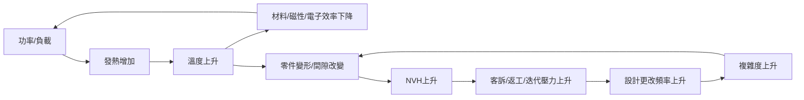

**一句話 insight：**在「什麼都還不確定」的早期，AI 最可行、最有價值的用法，是把混沌變成「可追蹤的假設＋可比較的方案集合＋可驗證的最小實驗」，用流程逼出**最不怕未知**的設計，而不是用模型假裝自己算得很準。

---

# 0) 先給可行性結論（你要的 robust 視角）

在你設定的前提（ **沒有量測資料、不到模擬階段、模擬也無法 100% cover、AI 主要來自 LLM + 文獻 + 企業知識庫** ）下：

## 可行的部分（高可行）

* **需求與限制的「審訊」** ：把模糊想法變成可檢查的硬/軟約束（誰要、為什麼、哪個不能壞）
* **設計空間的「集合式探索」** ：產出多條架構路線（Set-Based），避免早鎖死
* **失效路徑與風險排序（FFIP/FMEA）** ：先找怎麼死、怎麼連鎖，先切斷最脆弱的路徑
* **假設台帳與證據鏈（Assumption Ledger）** ：每個結論都能追溯「我為何這樣說」
* **最小實驗設計（MVP Experiments / DoE-lite）** ：用最少試做換最大資訊量，快速縮小未知集合 (U)

## 不可行 / 必須誠實設限的部分（低可行）

* 在沒有數據、沒有高保真模擬時，AI **不能**可靠輸出：
  * 精準噪音分貝、壽命、共振頻率、熱阻數值等「可簽名的工程數字」
  * 「最優解」的唯一答案（因為目標函數、約束、未知集合都未定型）

> 所以你的策略要成功，關鍵不是「AI 變更強」，而是把 AI 鎖在它擅長的地方： **結構化推理 + 風險治理 + 迭代設計** 。

---

# 1) 用你給的「系統性決策流程」檢視可行性（總覽表）

下面把 8 步驟對應到「AI 在早期可交付什麼、怎麼驗證可行、產出長什麼樣」。

| 流程步驟                      | 你要做的事（人）       | AI 可做的事（在限制條件下）        | 主要產出（可交付件）               | 可行性 Gate（過/不過的判準）                        |
| ----------------------------- | ---------------------- | ---------------------------------- | ---------------------------------- | --------------------------------------------------- |
| 1 問題界定（5W1H/白帽）       | 定義任務、涉眾、硬限制 | 追問缺口、把需求改寫成約束         | 需求-限制清單、Hard/Soft/Non-goals | 需求能落到「可檢查句」：可量測/可判斷（即使是區間） |
| 2 理解全貌（索問/系統初探）   | 挑戰假設、找矛盾       | 生成「澄清/證據/後果」問題樹       | 問題樹、假設初版、矛盾列表         | 主要矛盾是否被明確命名（空間 vs 熱 vs NVH…）       |
| 3 建立系統模型（CLD/藍帽）    | 設定邊界、元件互動     | 協助畫因果迴路、標示耦合點         | 系統邊界圖、因果迴路圖、耦合熱點   | 能指出 3 個以上「最可能連鎖翻車」的迴路             |
| 4 假設與驗證（HDA）           | 提假設、設計測試       | 假設拆解、建證據鏈、提最小實驗     | 假設台帳、驗證計畫、資料需求       | 每個關鍵假設都有「驗證方法＋失敗代價」              |
| 5 全方位檢視（SWOT/黑黃帽）   | 評估導入與風險         | 自動彙整 S/W/O/T、列反對論點       | SWOT、風險登錄表、對策             | 風險有 owner、有緩解、有監控指標                    |
| 6 創造與調整（綠紅帽/深反思） | 擴增方案、顧及人性     | 產生替代架構、對方案做蘇格拉底反詰 | 方案集合（Set-Based）、方案變體    | 至少保留 3 條「架構級」路線，不過早收斂             |
| 7 決策與行動（藍帽）          | 做取捨、排程           | 做 robust 評分草案、產出行動計畫   | 決策紀錄、路線圖、KPI/指標         | 決策能被解釋：為何選「最穩」不是「最強」            |
| 8 內化與傳達（費曼）          | 對齊團隊、說服老闆     | 生成一頁式說明與 Q&A               | 一頁式、簡報稿、FAQ                | 新人聽得懂、跨部門不誤解、可重複執行                |

---

# 2) 詳細策略規劃（按 8 步驟逐步落地）

以下把每一步做成「教科書式 SOP」，你可以直接拿去當 RD Copilot 的方法論骨架。

---

## Step 1：問題界定（5W1H + 白帽）

### 1.1 你要完成的「定義」長相

把問題寫成「可檢查句」：

* **任務句（Mission）** ：
  在【使用情境】下，系統必須【達成行為】，且【三個最不能失敗的指標】不得超標，受限於【空間/成本/製程/供應】。
* **硬限制（Hard constraints）** ：一定要滿足（否則不做）
* **軟目標（Soft objectives）** ：可 trade-off
* **非目標（Non-goals）** ：這版先不追求

### 1.2 AI 協助方式（可行且有效）

* 以白帽形式列出「已知事實」與「未知缺口」
* 自動把需求改寫成約束句（例如：「要很安靜」→「噪音必須低於 X，或至少相對前代降低 Y%」）
* 生成一份「缺口問卷」給 RD：一次補齊

### 1.3 產出模板（你可以直接用）

**5W1H 快問快答（版本 v0）**

* Who：決策人/使用者/被影響部門？
* What：最小可行產品是什麼？不做什麼？
* When：這決策何時需要凍結（freeze）？
* Where：使用環境（溫度/濕度/震動/安裝空間）？
* Why：為何現在非做不可？最怕的失敗是什麼？
* How：目前有哪些候選方向？禁止項目有哪些？

**Gate 1（過關條件）**

> 「三個最不能失敗的指標」被明確說出來，且每個指標有 **判斷方式** （即使是區間/等級）。

---

## Step 2：理解全貌（索克拉底問答 + 系統初探）

### 2.1 目的

把「大家以為理所當然」的前提逐一翻出來，避免早期幻想。

### 2.2 索克拉底問題樹（AI 很擅長）

六類提問你可以固定化成清單：

1. 澄清：你說的「小空間」是體積還是外形約束？
2. 假設：你假設熱可以靠外殼散掉，證據是什麼？
3. 證據：過去類似產品在相同功率下的溫升記錄？
4. 觀點：若把控制器外置，誰會反對？原因？
5. 後果：若 NVH 超標，最壞代價是什麼？（退貨/品牌/法規）
6. 反思：我們現在最可能「自欺欺人」的是哪一條？

**Gate 2**

> 至少列出 10 條「關鍵假設」，並標出 Top 3「錯了就翻車」的假設。

---

## Step 3：建立系統模型（系統思維 + 因果迴路 + 藍帽）

這一步是 robustness 的心臟： **你要找到耦合點** ，因為耦合點就是未知會放大的地方。

### 3.1 系統邊界（Boundary）

* 系統內：馬達/減速/控制器/散熱路徑/支撐結構/線束
* 系統外：環境溫度、安裝方式、使用者負載、供應製程能力

### 3.2 因果迴路圖（示意）

你可以用這種語意（不用精準數值也能成立）：

你要抓的不是圖好不好看，而是：

* 哪些迴路是 **正回饋（越來越糟）**
* 哪些是你能插針的 **斷路點（design levers）**

**Gate 3**

> 明確點名 3 個「斷路點」（例如：隔熱隔振分區、冗餘散熱路徑、裝配自校正機構…）。

---

## Step 4：假設與驗證（HDA）

### 4.1 把未知集合 (U) 寫出來（就算是區間）

你可以把不確定因子用「區間＋等級」表達，不需要數據也能開始：

* (u_1)：負載變化（低/中/高）
* (u_2)：環境溫度（常溫/高溫）
* (u_3)：裝配偏心（小/中/大）
* (u_4)：摩擦係數（低/高）
* (u_5)：供應公差能力（穩/不穩）

### 4.2 假設台帳（Assumption Ledger）

每個假設必填 5 欄：

1. 假設內容
2. 依據來源（文獻/內部案例/工程常識/推測）
3. 若假設錯了，最壞後果
4. 最小驗證方法（試做/量測/簡化計算）
5. 驗證成本與週期

### 4.3 最小實驗（MVP Experiments）策略

早期你不求精準，你求「資訊增益最大」。做法是：

* 只挑 **Top 3 致命假設** 各設計 1 個最小實驗
* 每個實驗只回答一個問題（不要混在一起）

**Gate 4**

> Top 3 假設每個都有「可在 1–2 週內完成」的驗證設計（不必精準，但要能縮小不確定）。

---

## Step 5：全方位檢視（SWOT + 黑帽/黃帽）

這一步不是在評估設計本身，而是在評估「導入 AI 輔助設計」這套策略是否能活下來。

### 5.1 SWOT（建議你用“導入計畫”做 SWOT）

* S：你們已有案例/文檔/資深工程經驗可被結構化
* W：資料髒、流程散、工程師不信任 AI
* O：早期風險管理可大幅降返工；跨域知識可重用
* T：AI 幻覺、責任歸屬不清、導入變成形式主義

### 5.2 黑帽（必做的質疑）

* AI 給的建議錯了誰扛？
* 知識庫過時怎麼辦？
* 工程師會不會覺得被管控、反彈？

### 5.3 黃帽（務實收益）

* 減少「早期腦補」導致的晚期大返工
* 把資深經驗沉澱成可複用的約束庫與台帳
* 讓跨部門對齊速度上升（費曼一頁式）

**Gate 5**

> 風險有 owner、有緩解方案、有監控指標（例如：AI 建議採納率、返工次數、假設驗證覆蓋率）。

---

## Step 6：創造與調整（綠帽/紅帽 + 深度反思）

### 6.1 綠帽：Set-Based 方案集合（至少 3 條架構級路線）

規則： **不要只做微調版本** ，要做「架構級差異」。

例：

* 控制器內置 vs 外置
* 同軸 vs 偏軸
* 單散熱路徑 vs 冗餘散熱路徑
* 固定式支撐 vs 自校正支撐

### 6.2 紅帽：把人放回來

這裡你要很現實：

* 工程師真正怕的是「被 AI 指揮」與「責任不清」
* 所以你要設計制度： **AI 是副駕** ，決策是人；每個建議都要有證據鏈與假設台帳

**Gate 6**

> 團隊接受的“使用規範”被寫下來：何時用、用到哪裡、哪些不准用。

---

## Step 7：決策與行動（藍帽）

### 7.1 決策原則：選 robust，不選最優

你要有一個固定可討論的「穩健評分」框架（半定量即可）：

[
R(x)=
w_1\cdot \text{Margin}
+w_2\cdot \text{Decoupling}
+w_3\cdot \text{Recoverability}
-w_4\cdot \text{Complexity}
-w_5\cdot \text{Sensitivity}
]

* Margin：安全邊際厚不厚
* Decoupling：耦合拆得乾不乾淨
* Recoverability：出事能不能隔離、能不能快速修
* Complexity：越複雜越脆弱（早期尤其）
* Sensitivity：對公差/摩擦/偏心/環境變動敏感度

### 7.2 行動計畫（建議切 3 階段）

**Phase 1（2–4 週）：把混沌變結構**

* 需求/限制模板 + 問題樹 + 假設台帳 v0
* 方案集合 v0（至少 3 條）
* 風險登錄表 + Top 3 最小實驗

**Phase 2（4–8 週）：把結構變證據**

* 完成 Top 3 最小實驗
* 更新假設台帳（推翻也要記）
* 方案集合縮到 1–2 條路線，保留備援

**Phase 3（8–12 週）：把證據變流程資產**

* 約束庫/失效路徑庫沉澱
* 形成「下一案可重用」的 playbook

**Gate 7**

> 不是「做出最好的設計」，而是：
>
> 1. 假設被驗證；2) 風險被切斷；3) 方案能被解釋與複用。

---

## Step 8：知識內化與傳達（費曼）

你要做兩份文件就夠狠：

1. **一頁式（給老闆/跨部門）**
   * 我們選哪條路線
   * 為何它最 robust
   * 未知有哪些、怎麼被管理
   * 下一步驗證計畫
2. **FAQ（給 RD 團隊）**
   * AI 會不會取代我？（不會）
   * AI 錯了誰負責？（人負責，AI 要有證據鏈）
   * 我為什麼要填假設台帳？（因為返工最貴）

**Gate 8**

> 新人看得懂、老闆聽得懂、工程師願意用。

---

# 3) 「六頂思考帽」快速覆核（像開評審會那樣）

你可以把這段當成評審會議 agenda：

* 白帽：我們有什麼事實？缺什麼資料？
* 紅帽：團隊哪裡不舒服？最怕什麼？
* 黑帽：這套導入最可能死在哪？（責任、信任、過時知識、幻覺）
* 黃帽：最大收益在哪？（減返工、加速對齊、經驗沉澱）
* 綠帽：還有沒有第三條路線？能不能更解耦？
* 藍帽：今天結論是什麼？誰做什麼？下週拿什麼回來？

---

# 4) 你可以直接採用的「可行性評分」清單（務實版）

把可行性拆成 5 類，每類 0–2 分（總分 10）：

1. **輸入可得性** ：需求/限制/過往案例拿得到嗎？
2. **可追溯性** ：結論能連到假設台帳與來源嗎？
3. **可驗證性** ：Top 3 假設能在 1–2 週內被驗證嗎？
4. **可採納性** ：工程師願意把它當副駕嗎？制度有寫嗎？
5. **可沉澱性** ：做完一案能留下可重用資產嗎？

> 你要的 robust 解法，本質上是「治理未知」的能力。這五項就是未知治理的可行性。

---

# 心法內化（五歲小孩版）

你現在不是在造一台完美的機器，你是在走一條很暗的路。
AI 不能替你看清終點，但它可以替你拿手電筒：
把地上哪裡有坑、哪裡會滑、哪裡最危險，先標出來。
你每走一步，就把「不知道」變少一點。這樣最穩。

---

# 口訣（3 個重點）

1. **先把未知寫下來** （假設台帳）
2. **先留多條路** （Set-Based）
3. **先切斷連鎖死法** （失效路徑 + 最小實驗）

---

如果你想把它變成「可執行的專案計畫」，我下一步會直接給你一份  **PRD/SDD 級的落地包** ：

* 文件模板（需求、假設台帳、風險登錄、決策紀錄）
* Agent 分工與輸入輸出格式（JSON schema）
* 兩週一迭代的里程碑與 KPI（採納率、返工次數、假設驗證覆蓋率）

你不用再補資料，我可以直接按你現在的前提做出 v0。
