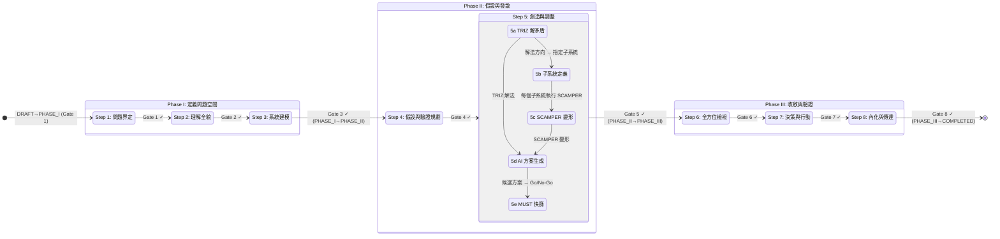
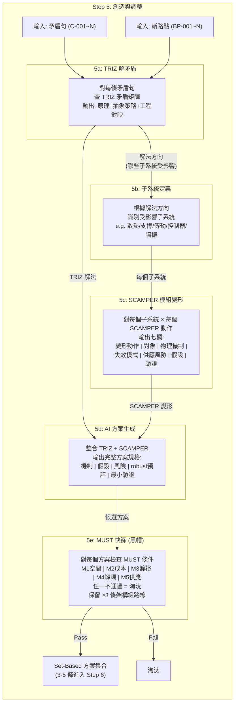

# RD Design Copilot 整合流程狀態機與 R&R

本文件以程式設計角度繪製 `RD Design Copilot 整合流程` 的狀態機圖，並說明每個階段的 Roles & Responsibilities (R&R)。

> **v1.1 更新**：Step 編號已按實際執行順序重新編排（原 Step 6→Step 5、原 Step 5→Step 6），確保與 `系統規格定義書.md` 及 `整合流程.md` 一致。

## Step 編號對照

| 新編號 | 名稱 | 舊編號 | Phase |
|--------|------|--------|-------|
| Step 1 | 問題界定 | Step 1 | I |
| Step 2 | 理解全貌（索克拉底） | Step 2 | I |
| Step 3 | 系統建模（因果迴路+TRIZ矛盾+斷路點） | Step 3 | I |
| Step 4 | 假設與驗證規劃（HDA+未知集合） | Step 4 | II |
| **Step 5** | **創造與調整（TRIZ解矛盾→子系統定義→SCAMPER變形→方案集合→MUST快篩）** | 原 Step 6 | **II** |
| **Step 6** | **全方位檢視（SWOT+黑帽+風險登錄）** | 原 Step 5 | **III** |
| Step 7 | 決策與行動（KT Decision Analysis+最小實驗） | Step 7 | III |
| Step 8 | 內化與傳達（費曼） | Step 8 | III |

## 核心流程狀態機



### Gate 與 Phase 轉換對照

系統有 8 個 Step-level Gate（每步一個），其中 4 個同時觸發 Phase 轉換：

| Gate | 位置 | Phase 轉換？ |
|------|------|-------------|
| Gate 1 | Step 1 → Step 2 | **DRAFT → PHASE_I** |
| Gate 2 | Step 2 → Step 3 | Phase I 內部 |
| Gate 3 | Step 3 → Step 4 | **PHASE_I → PHASE_II** |
| Gate 4 | Step 4 → Step 5 | Phase II 內部 |
| Gate 5 | Step 5 → Step 6 | **PHASE_II → PHASE_III** |
| Gate 6 | Step 6 → Step 7 | Phase III 內部 |
| Gate 7 | Step 7 → Step 8 | Phase III 內部 |
| Gate 8 | Step 8 → Done | **PHASE_III → COMPLETED** |

## Step 5 內部流程（TRIZ → 子系統 → SCAMPER → 方案）



### 平行處理說明

在 Step 5 中，針對不同矛盾句或子系統，5a (TRIZ) 和 5c (SCAMPER) 可以並行執行：

```
矛盾 C-001 ──→ TRIZ 解法 ──┐
矛盾 C-002 ──→ TRIZ 解法 ──┤──→ 匯聚到 5d 方案生成
矛盾 C-003 ──→ TRIZ 解法 ──┘

子系統: 散熱 ──→ SCAMPER ──┐
子系統: 傳動 ──→ SCAMPER ──┤──→ 匯聚到 5d 方案生成
子系統: 隔振 ──→ SCAMPER ──┘
```

所有並行產出的解法方向與變形最終匯聚到 5d (AI 方案生成) 做交叉組合，再由 5e (MUST 快篩) 統一淘汰。

---

## 階段與狀態說明 (R&R)

### Phase I: 定義問題空間

#### Step 1: 問題界定
- **目的**: 將模糊需求轉化為可檢查的約束句，為後續矛盾定義奠定基礎。
- **Human (RD Team) R&R**:
    - 定義 Mission, Hard Constraints, Soft Objectives, Non-Goals。
    - 明確「三個最不能失敗的指標」及其判斷方式。
- **AI (Copilot) R&R**:
    - 協助將需求改寫為約束句。
    - 生成缺口問卷。
    - 列出已知事實與未知缺口。
- **Gate 1**: 三個最不能失敗指標被明確說出，且每個指標有判斷方式。

#### Step 2: 理解全貌（索克拉底問答）
- **目的**: 挖掘「大家以為理所當然」的前提，為 TRIZ 矛盾識別做準備。
- **Human (RD Team) R&R**:
    - 參與索克拉底問答，提供見解和證據。
    - 初步識別潛在矛盾。
- **AI (Copilot) R&R**:
    - 固定執行索克拉底六類提問（澄清、假設、證據、觀點、後果、反思）。
    - 匯總問答結果，輸出初步的矛盾列表。
- **Gate 2**: 至少列出 10 條關鍵假設，標出 Top 3 致命假設；至少識別 3 條核心矛盾。

#### Step 3: 系統建模（因果迴路 + TRIZ 矛盾 + 斷路點）
- **目的**: 找到系統耦合點，將矛盾正式化為 TRIZ 句式，識別可介入的斷路點。
- **Human (RD Team) R&R**:
    - 輔助建立因果迴路圖（節點 + 因果邊 + 極性）。
    - 將矛盾正式化為 TRIZ 矛盾句（改善參數/惡化參數/工程表述/物理矛盾）。
    - 識別斷路點（位置、解法方向、TRIZ 原理提示）。
- **AI (Copilot) R&R**:
    - 協助繪製因果迴路圖，分析耦合關係。
    - 提供 TRIZ 矛盾句模板，輔助正式化。
    - 根據因果迴路提示可能的斷路點。
- **Gate 3**: 至少 1 個因果迴路 + 3 個斷路點 + 每條核心矛盾有 TRIZ 正式句。

### Phase II: 假設與發散

#### Step 4: 假設與驗證規劃（HDA + 未知集合）
- **目的**: 建立假設台帳與未知集合，完整描述不確定性全貌。
- **Human (RD Team) R&R**:
    - 填寫假設台帳（內容、類型、來源、最壞後果、驗證方法、驗收標準、Owner、期限）。
    - 定義未知集合 (U)：識別會變動的因子、水準、影響指標。
- **AI (Copilot) R&R**:
    - 提供假設台帳模板。
    - 協助整理未知因子列表。
- **Gate 4**: Top 3 假設每個都有可在 1-2 週內完成的驗證設計。

#### Step 5: 創造與調整（TRIZ → 子系統 → SCAMPER → 方案 → MUST）
- **目的**: 用 TRIZ 解矛盾找方向，用 SCAMPER 做模組級變形，輸出結構化可審查的方案集合，並用 MUST 快篩淘汰不可行方案。
- **Human (RD Team) R&R**:
    - 定義子系統清單（受解法方向影響的模組）。
    - 審查 AI 生成的解法方向、SCAMPER 變形及完整方案。
    - 定義 MUST 條件並執行 Go/No-Go 判定。
- **AI (Copilot) R&R**:
    - **5a TRIZ 解矛盾**: 根據矛盾句查 TRIZ 矛盾矩陣，生成原理+抽象策略+工程對映+代價+robust 預估。
    - **5b 子系統定義**: 根據解法方向識別受影響子系統。
    - **5c SCAMPER 模組變形**: 對每個子系統執行 SCAMPER 7 動作，輸出七欄（變形動作/對象/物理機制/失效模式/供應風險/假設/驗證）。
    - **5d AI 方案生成**: 整合 TRIZ 解法 + SCAMPER 變形，生成完整方案規格（機制+假設+風險+robust 預評+最小驗證）。
    - **5e MUST 快篩**: 對候選方案逐項檢查 MUST 條件，不通過者淘汰。
- **平行處理**: 不同矛盾句的 TRIZ 解法、不同子系統的 SCAMPER 變形可並行執行，最終匯聚到方案生成。
- **Gate 5**: 至少保留 3 條架構級差異路線；每條路線都有完整方案規格（機制+假設+風險+驗證）。

### Phase III: 收斂與驗證

#### Step 6: 全方位檢視（SWOT + 黑帽 + 風險登錄）
- **目的**: 對方案集合進行 SWOT 分析，並建立風險登錄表。
- **Human (RD Team) R&R**:
    - 對方案集合執行 SWOT 分析。
    - 進行黑帽質疑，找出潛在弱點。
    - 建立風險登錄表，指派 Owner、定義緩解措施和監控指標。
- **AI (Copilot) R&R**:
    - 提供 SWOT 分析框架和黑帽質疑清單。
    - 協助整理風險登錄表。
- **Gate 6**: 每個風險都有 Owner + 緩解方案 + 監控指標。

#### Step 7: 決策與行動（KT Decision Analysis + 最小實驗）
- **目的**: 運用 KT Decision Analysis 框架進行決策，並設計最小實驗。
- **Human (RD Team) R&R**:
    - 執行 KT Decision Analysis (MUST 篩選、WANT 評分、Adverse Consequences)。
    - 基於證據（計算書、BOM 等）為 WANT 條件打分。
    - 設計 Top 3 假設的最小實驗。
    - 完成 KT 決策記錄並簽核。
- **AI (Copilot) R&R**:
    - 提供 KT 決策流程模板 (MUST/WANT/AC)。
    - 提供標準 WANT 條件及評分標準模板。
    - 協助整理風險矩陣與風險評估表。
    - 提供最小實驗規格模板。
- **Gate 7**: 所有方案經 MUST 篩選 + WANT 有證據 + H 風險有緩解 + KT 已簽核。

#### Step 8: 內化與傳達（費曼）
- **目的**: 將決策結果有效傳達給不同層級的利害關係人，並促進知識內化。
- **Human (RD Team) R&R**:
    - 製作一頁式摘要 (給老闆/跨部門)。
    - 編寫 RD 團隊 FAQ。
    - 更新約束庫、失效路徑庫等知識資產。
- **AI (Copilot) R&R**:
    - 提供一頁式摘要模板和 FAQ 結構建議。
    - 協助將決策過程中的知識沉澱為可重用資產。
- **Gate 8**: 新人看得懂；老闆聽得懂；工程師願意用。
