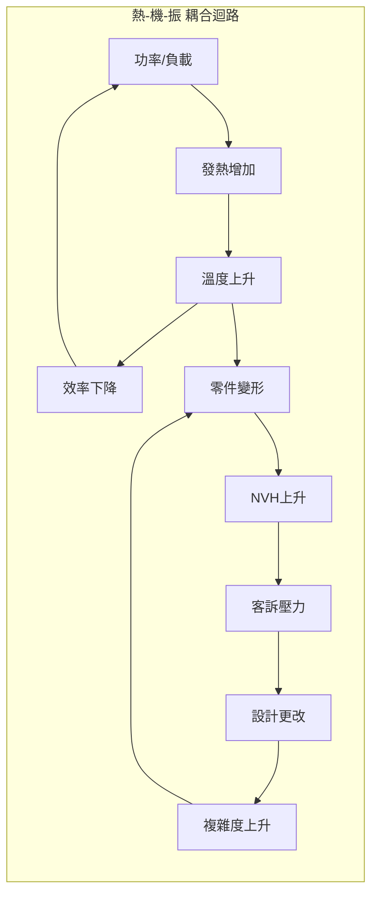

# RD Design Copilot 整合方法論

**一句話定位**：把「系統性決策流程」的治理骨架與「SCAMPER/TRIZ」的發散引擎深度耦合，形成一套 **「結構化發散 → 嚴格收斂 → 最小驗證」** 的早期設計流程。

---

## 核心哲學

```
混沌 → 結構 → 證據 → 決策 → 資產
      ↑              ↓
   SCAMPER/TRIZ    Robust篩選
   (擴大可能性)    (殺掉脆弱)
```

**三個不變原則**：

1. **先把未知寫下來**（假設台帳）
2. **先留多條路**（Set-Based + SCAMPER/TRIZ 變體）
3. **先切斷連鎖死法**（失效路徑 + 最小實驗）

---

## Gate 與 Phase 轉換

系統有 8 個 Step-level Gate（每步一個），其中 4 個同時觸發 Phase 轉換：

| Gate | 位置 | Phase 轉換 |
|------|------|-----------|
| **Gate 1** | Step 1 完成 | **DRAFT → PHASE_I** |
| Gate 2 | Step 2 完成 | Phase I 內部 |
| **Gate 3** | Step 3 完成 | **PHASE_I → PHASE_II** |
| Gate 4 | Step 4 完成 | Phase II 內部 |
| **Gate 5** | Step 5 完成 | **PHASE_II → PHASE_III** |
| Gate 6 | Step 6 完成 | Phase III 內部 |
| Gate 7 | Step 7 完成 | Phase III 內部 |
| **Gate 8** | Step 8 完成 | **PHASE_III → COMPLETED** |

---

## 流程總覽（8 步驟 × 六帽 × SCAMPER/TRIZ）

> **v1.1 正名**：Step 編號按實際執行順序重新編排。原 Step 6(創造與調整)→**Step 5**，原 Step 5(SWOT)→**Step 6**。

```
┌─────────────────────────────────────────────────────────────────────────┐
│                        RD Design Copilot 整合流程                        │
├─────────────────────────────────────────────────────────────────────────┤
│                                                                          │
│  Phase I: 定義問題空間 (Week 1-2)                                        │
│  ┌─────────────┐    ┌─────────────┐    ┌─────────────┐                  │
│  │ Step 1      │ →  │ Step 2      │ →  │ Step 3      │                  │
│  │ 問題界定    │    │ 理解全貌    │    │ 系統建模    │                  │
│  │ (白帽)      │    │ (索克拉底)  │    │ (藍帽)      │                  │
│  │             │    │             │    │ ↓           │                  │
│  └─────────────┘    └─────────────┘    │ 因果迴路    │                  │
│                                        │ TRIZ矛盾句  │                  │
│                                        │ 斷路點       │                  │
│                                        └─────────────┘                  │
│                                                                          │
│  Phase II: 假設與發散 (Week 2-4)                                         │
│  ┌─────────────┐    ┌─────────────────────────────────────┐              │
│  │ Step 4      │ →  │ Step 5: 創造與調整 (綠帽/紅帽)     │              │
│  │ 假設驗證    │    │                                      │              │
│  │ (HDA)       │    │  矛盾句 → 5a TRIZ 解矛盾            │              │
│  │ +未知集合   │    │              ↓                       │              │
│  │             │    │         5b 子系統定義                │              │
│  └─────────────┘    │              ↓                       │              │
│                      │         5c SCAMPER 模組變形         │              │
│                      │              ↓                       │              │
│                      │    TRIZ ──→ 5d AI 方案生成 ←── SCAMPER │           │
│                      │              ↓                       │              │
│                      │         5e MUST 快篩                │              │
│                      │           ↓       ↓                 │              │
│                      │         Pass    Fail(淘汰)          │              │
│                      │           ↓                          │              │
│                      │    Set-Based 方案集合 (3-5條)       │              │
│                      └─────────────────────────────────────┘              │
│                                                                          │
│  Phase III: 收斂與驗證 (Week 4-8)                                        │
│  ┌─────────────┐    ┌─────────────┐    ┌─────────────┐                  │
│  │ Step 6      │ →  │ Step 7      │ →  │ Step 8      │                  │
│  │ SWOT檢視    │    │ 決策行動    │    │ 內化傳達    │                  │
│  │ 黑帽質疑    │    │ (藍帽)      │    │ (費曼)      │                  │
│  │ 風險登錄    │    │ ↓           │    │             │                  │
│  └─────────────┘    │ KT Decision │    └─────────────┘                  │
│                      │ 最小實驗    │                                     │
│                      └─────────────┘                                     │
│                                                                          │
└─────────────────────────────────────────────────────────────────────────┘
```

---

# Phase I: 定義問題空間

## Step 1: 問題界定（白帽 + 5W1H）

### 1.1 目的
把模糊需求變成「可檢查句」，為後續 TRIZ 矛盾定義打基礎。

### 1.2 輸入
- 客戶/PM 需求描述
- 過往類似案例（如有）
- 空間/成本/製程約束

### 1.3 AI 協助任務

```yaml
任務清單:
  - 將需求改寫成約束句
  - 生成缺口問卷
  - 列出已知事實 vs 未知缺口
```

### 1.4 輸出模板

**任務定義表 v0**

| 欄位 | 內容 |
|------|------|
| **Mission** | 在【使用情境】下，系統必須【達成行為】，且【三個最不能失敗的指標】不得超標 |
| **Hard Constraints** | 絕對不能違反的限制（空間、法規、成本上限） |
| **Soft Objectives** | 可 trade-off 的目標（效率、重量、噪音） |
| **Non-Goals** | 這版明確不追求的東西 |
| **三個最不能失敗指標** | 1. ___ 2. ___ 3. ___ |

**Gate 1 檢查點**
> ✅ 三個最不能失敗指標被明確說出，且每個指標有判斷方式（即使是區間）

---

## Step 2: 理解全貌（索克拉底問答）

### 2.1 目的
把「大家以為理所當然」的前提翻出來，為 TRIZ 矛盾識別做準備。

### 2.2 索克拉底六類提問（AI 固定執行）

| 類型 | 問題範例 |
|------|---------|
| **澄清** | 你說的「小空間」是體積還是外形約束？ |
| **假設** | 你假設熱可以靠外殼散掉，證據是什麼？ |
| **證據** | 過去類似產品在相同功率下的溫升記錄？ |
| **觀點** | 若把控制器外置，誰會反對？原因？ |
| **後果** | 若 NVH 超標，最壞代價是什麼？ |
| **反思** | 我們現在最可能「自欺欺人」的是哪一條？ |

### 2.3 輸出：矛盾初步識別

**矛盾列表 v0**（為 Step 3 TRIZ 準備）

| 編號 | 我想改善 | 但會惡化 | 來源 |
|------|---------|---------|------|
| C1 | 體積更小 | 散熱能力 | 索克拉底-假設 |
| C2 | 轉速更高 | NVH | 索克拉底-後果 |
| C3 | 成本更低 | 可靠性 | 索克拉底-觀點 |

**Gate 2 檢查點**
> ✅ 至少列出 10 條關鍵假設，標出 Top 3「錯了就翻車」的假設
> ✅ 至少識別 3 條核心矛盾

---

## Step 3: 系統建模（因果迴路 + TRIZ 矛盾定義）

### 3.1 目的
找到耦合點（未知會放大的地方），並將矛盾正式化為 TRIZ 句式。

### 3.2 因果迴路圖建立



### 3.3 TRIZ 矛盾正式化

**TRIZ 矛盾句模板**

```
矛盾 [編號]:
  改善參數: [TRIZ 39參數之一]
  惡化參數: [TRIZ 39參數之一]
  工程表述: 當 [動作] 時，[指標A] 改善，但 [指標B] 惡化
  物理矛盾: [同一物件] 需要同時具備 [屬性X] 和 [非屬性X]
```

**範例**

```yaml
矛盾 C1:
  改善參數: 9-速度
  惡化參數: 31-有害副作用(噪音)
  工程表述: 當轉速提高時，輸出功率密度改善，但 NVH 惡化
  物理矛盾: 轉子需要同時「高轉速」和「低振動」
```

### 3.4 輸出：斷路點識別

| 斷路點 | 位置 | 可能解法方向 | TRIZ 原理提示 |
|--------|------|-------------|--------------|
| 熱-振解耦 | 馬達-減速機界面 | 隔熱隔振分區 | #1分割, #2分離 |
| 冗餘散熱 | 控制器 | 雙路徑散熱 | #40複合材料 |
| 自校正 | 裝配界面 | 浮動支撐 | #15動態化 |

**Gate 3 檢查點**
> ✅ 明確點名 3 個斷路點
> ✅ 每條核心矛盾都有 TRIZ 正式句

---

# Phase II: 假設與發散

## Step 4: 假設與驗證規劃（HDA）

### 4.1 假設台帳（Assumption Ledger）

**必填 6 欄**

| 假設編號 | 假設內容 | 依據來源 | 若錯了最壞後果 | 最小驗證方法 | 驗證成本/週期 |
|---------|---------|---------|--------------|-------------|--------------|
| A1 | 外殼可帶走 80% 熱量 | 工程常識 | 溫升超標 30°C | 熱阻測試 | 1週/$500 |
| A2 | 裝配偏心 < 0.1mm | 供應商規格 | 共振提前 | CMM 抽檢 | 3天/$200 |
| A3 | 阻尼器壽命 > 5000hr | 類似案例 | 早期失效 | 加速壽命 | 2週/$1000 |

### 4.2 未知集合 (U) 表達

```yaml
未知因子:
  u1_負載變化: [低, 中, 高]
  u2_環境溫度: [常溫, 高溫]
  u3_裝配偏心: [小, 中, 大]
  u4_摩擦係數: [低, 高]
  u5_供應公差: [穩定, 不穩定]
```

**Gate 4 檢查點**
> ✅ Top 3 假設每個都有「可在 1-2 週內完成」的驗證設計

---

## Step 5: 創造與調整（TRIZ → 子系統 → SCAMPER → 方案 → MUST）

> **這是整合流程的核心步驟**：用 TRIZ 解矛盾找方向，用 SCAMPER 做模組級變形，輸出結構化可審查的方案集合。

### 5.0 流程架構

```
┌─────────────────────────────────────────────────────────────────┐
│                    Step 5: 創造與調整                            │
├─────────────────────────────────────────────────────────────────┤
│                                                                  │
│  矛盾句 (C-001~N)                                               │
│  斷路點 (BP-001~N)                                               │
│           ↓                                                      │
│  ┌──────────────────┐                                           │
│  │ 5a TRIZ 解矛盾   │                                           │
│  │ 輸入: 矛盾句     │                                           │
│  │ 輸出: 原理+策略  │                                           │
│  │       +工程對映   │                                           │
│  └────────┬─────────┘                                           │
│           ↓ (工程對映指出受影響子系統)                            │
│  ┌──────────────────┐                                           │
│  │ 5b 子系統定義    │                                           │
│  │ (散熱/支撐/傳動  │                                           │
│  │  /控制器/隔振)   │                                           │
│  └────────┬─────────┘                                           │
│           ↓ (每個子系統)                                         │
│  ┌──────────────────┐                                           │
│  │ 5c SCAMPER 變形  │ ← 對每個子系統 × 7 動作                   │
│  │ 輸出: 七欄規格   │                                           │
│  └────────┬─────────┘                                           │
│           ↓                                                      │
│  ┌──────────────────┐                                           │
│  │ 5d AI 方案生成   │ ← 整合 TRIZ + SCAMPER                     │
│  │ 附帶: 機制+假設  │                                           │
│  │    +風險+robust  │                                           │
│  │    +最小驗證     │                                           │
│  └────────┬─────────┘                                           │
│           ↓                                                      │
│  ┌──────────────────┐                                           │
│  │ 5e MUST 快篩     │ ← Go/No-Go 淘汰                           │
│  │ 留下 3-5 條      │                                           │
│  │ 架構級路線       │                                           │
│  └──────────────────┘                                           │
│                                                                  │
└─────────────────────────────────────────────────────────────────┘
```

### 5a TRIZ 解矛盾（每條矛盾執行）

**TRIZ 輸出規格（固定欄位）**

```yaml
TRIZ_解法_[編號]:
  矛盾句: 改善 [X] 惡化 [Y]
  採用原理: [TRIZ 40原理編號與名稱]
  抽象策略: [原理的抽象描述]
  工程對映:
    - 手段1: [具體機構/材料/佈局]
    - 手段2: [具體機構/材料/佈局]
    - 手段3: [具體機構/材料/佈局]
  代價: [重量/成本/複雜度/維修性]
  robust評分預估: [Margin/Decoupling/Recoverability]
  最小實驗: [驗證哪個假設]
```

**TRIZ 常用原理速查（工程對映版）**

| 原理 | 名稱 | 工程手段範例 |
|------|------|-------------|
| #1 | 分割 | 模組化、分區散熱、分段組裝 |
| #2 | 分離/提取 | 熱源隔離、振源外置 |
| #15 | 動態化 | 浮動支撐、主動阻尼、自校正 |
| #17 | 維度轉換 | 2D→3D、平面→曲面 |
| #35 | 參數變化 | 變剛度、變阻尼、熱管 |
| #40 | 複合材料 | 多功能材料、梯度結構 |

### 5b/5c 子系統定義 + SCAMPER 模組級變形

**對每個子系統執行 SCAMPER**

子系統清單（依專案調整）：
- 散熱系統
- 支撐結構
- 傳動機構
- 控制器
- 隔振系統

**SCAMPER 輸出規格（固定 7 欄）**

| 欄位 | 說明 |
|------|------|
| **1. 變形動作** | S/C/A/M/P/E/R |
| **2. 變形對象** | 哪個模組/界面/參數 |
| **3. 物理機制** | 為什麼可改善某指標（工程語言） |
| **4. 新增失效模式** | 會怎麼死 |
| **5. 製程/供應風險** | 是否可量產 |
| **6. 假設台帳** | 需要哪些前提成立 |
| **7. 最小驗證** | 用什麼測試打掉不確定 |

**SCAMPER 動作定義**

| 動作 | 問題 | 工程導向範例 |
|------|------|-------------|
| **S**ubstitute | 什麼可以被替換？ | 鋁→鎂、螺絲→卡扣、有線→無線 |
| **C**ombine | 什麼可以合併？ | 散熱+結構一體、馬達+減速同軸 |
| **A**dapt | 什麼可以借用？ | 汽車 NVH 技術→工業設備 |
| **M**odify | 什麼可以放大/縮小/改形？ | 加厚肋、變截面、非對稱 |
| **P**ut to other uses | 什麼可以多用途？ | 外殼兼散熱、線槽兼加強筋 |
| **E**liminate | 什麼可以刪除？ | 減少零件、取消中間層 |
| **R**earrange | 什麼可以重排？ | 控制器外置、熱源移位 |

### 5d AI 方案生成規格

**每個方案必須附帶**

```yaml
方案_[編號]:
  名稱: [簡短描述]
  來源: [TRIZ原理#X + SCAMPER動作Y]

  機制說明:
    物理原理: [為什麼有效]
    結構描述: [用工程語言，不要形容詞]
    關鍵尺寸: [如有]

  假設清單:
    - A_xx: [前提假設1]
    - A_yy: [前提假設2]

  風險評估:
    新增失效模式: [會怎麼死]
    製程風險: [量產可行性]
    供應風險: [材料/零件可得性]

  robust預評分:
    Margin: [1-5]
    Decoupling: [1-5]
    Recoverability: [1-5]
    Complexity: [1-5] (越低越好)
    Sensitivity: [1-5] (越低越好)

  最小驗證:
    驗證目標: [打掉哪個假設]
    方法: [測試/計算/樣品]
    週期: [預估]
    成本: [預估]
```

### 5e MUST 快篩（黑帽篩選）

> **注意**：此階段使用 KT MUST 條件做「快速淘汰」，完整的 WANT 評分在 Step 7 執行。

**快篩 MUST 條件**（不通過 = 直接淘汰）

| MUST | 條件 | 判斷方式 |
|------|------|---------|
| M1 | 空間約束：可塞進目標空間 | 概念佈局估算 |
| M2 | 成本預估：BOM ≤ 目標上限 | 粗估 |
| M3 | 安全餘裕：三指標有合理 margin | 工程判斷 |
| M4 | 解耦程度：無致命耦合迴路 | 因果迴路圖 |
| M5 | 可行性：製程/供應基本可行 | 經驗判斷 |

**快篩表**

| 方案 | M1 | M2 | M3 | M4 | M5 | 結果 |
|------|----|----|----|----|----|----|
| A | ✓ | ✓ | ✓ | ✓ | ✓ | → Step 6 |
| B | ✓ | ✗ | ✓ | ✓ | ✓ | **淘汰** |

**篩選規則**
1. 任一 MUST 不通過 = 直接淘汰
2. 通過者進入 Set-Based 集合（建議 3-5 條）
3. 完整 KT Decision Analysis（MUST+WANT+AC）在 Step 7 執行

**Gate 5 檢查點**
> ✅ 至少保留 3 條「架構級差異」的路線
> ✅ 每條路線都有完整的方案規格（機制+假設+風險+驗證）
> ✅ 團隊接受的「使用規範」被寫下：何時用、用到哪、哪些不准用

---

# Phase III: 收斂與驗證

## Step 6: 全方位檢視（SWOT + 黑/黃帽 + 風險登錄）

### 6.1 對方案集合做 SWOT

| | 正面 | 負面 |
|---|------|------|
| **內部** | S: 技術強項、經驗支撐 | W: 資源限制、能力缺口 |
| **外部** | O: 市場機會、技術趨勢 | T: 競爭、法規、供應風險 |

### 6.2 黑帽質疑清單（必做）

- [ ] 這個方案在最壞情況下會怎麼死？
- [ ] 哪個假設最可能是錯的？
- [ ] 如果供應商出問題怎麼辦？
- [ ] 量產時公差累積會不會出事？
- [ ] 維修時能不能換得掉？

### 6.3 風險登錄表

| 風險編號 | 描述 | 機率 | 衝擊 | Owner | 緩解措施 | 監控指標 |
|---------|------|------|------|-------|---------|---------|
| R1 | 熱阻高於預期 | 中 | 高 | 張三 | 備援散熱路徑 | 溫升監控 |
| R2 | 裝配偏心超標 | 低 | 高 | 李四 | 自校正機構 | CPK 追蹤 |

**Gate 6 檢查點**
> ✅ 每個風險都有 Owner
> ✅ 每個風險都有緩解方案
> ✅ 每個風險都有監控指標

---

## Step 7: 決策與行動（KT Decision Analysis + 最小實驗）

> **重要更新**：本步驟整合 Kepner-Tregoe 決策分析框架，取代原本模糊的 Robust 評分。
> 完整框架詳見：`KT_Robust_決策框架.md`

### 7.1 決策原則

**選 Robust，不選最優**

> 在早期，你要的不是「算出來最好」的設計，而是「最不怕未知」的設計。

**KT 如何實現這個原則**：
- MUST 條件：確保「不能壞的」不會壞（硬約束淘汰）
- WANT 條件：量化「抗未知能力」（加權評分）
- Adverse Consequences：確保「風險可控」（風險調整）

### 7.2 KT 決策流程（四階段）

```
┌─────────────────────────────────────────────────────────────────┐
│  Stage 1: MUST 篩選                                              │
│  ┌─────────────────────────────────────────────────────────────┐│
│  │ 不滿足任一 MUST → 直接淘汰                                   ││
│  └─────────────────────────────────────────────────────────────┘│
│                              ↓                                   │
│  Stage 2: WANT 評分                                              │
│  ┌─────────────────────────────────────────────────────────────┐│
│  │ 權重(團隊共識) × 滿足程度(基於證據) = 加權分數              ││
│  └─────────────────────────────────────────────────────────────┘│
│                              ↓                                   │
│  Stage 3: Adverse Consequences                                   │
│  ┌─────────────────────────────────────────────────────────────┐│
│  │ 機率 × 嚴重度 = 風險等級 → 調整或淘汰                       ││
│  └─────────────────────────────────────────────────────────────┘│
│                              ↓                                   │
│  Stage 4: 決策記錄                                               │
│  ┌─────────────────────────────────────────────────────────────┐│
│  │ 主路線 + 備援 + 行動項目 + 簽核                             ││
│  └─────────────────────────────────────────────────────────────┘│
└─────────────────────────────────────────────────────────────────┘
```

### 7.3 MUST 條件（Go/No-Go）

**核心原則**：MUST 是「不可妥協」的硬約束，不滿足 = 直接淘汰。

**標準 MUST 條件清單**（依專案調整）

| 編號 | MUST 條件 | 判斷標準 | 證據來源 |
|------|----------|---------|---------|
| M1 | 空間約束 | 體積 ≤ [X]L | 3D 模型量測 |
| M2 | 成本上限 | BOM ≤ $[Y] | 報價單 |
| M3 | 安全餘裕 | 三指標均有 ≥10% margin | 計算書 |
| M4 | 解耦程度 | 關鍵耦合點 ≤ 2 | 因果迴路圖 |
| M5 | 供應安全 | 關鍵件 ≥2 家供應商 | AVL 清單 |

**MUST 評估表**

| 方案 | M1 | M2 | M3 | M4 | M5 | 結果 |
|------|----|----|----|----|----|----|
| A | ✓ | ✓ | ✓ | ✓ | ✓ | **PASS** |
| B | ✓ | ✗ | ✓ | ✓ | ✓ | **FAIL** |

### 7.4 WANT 條件（加權評分）

**核心原則**：WANT 是「希望有但可妥協」的目標，用 權重×滿足程度 計算。

**關鍵改進**：每個評分必須有「可觀察的工程條件」和「證據」，不是 AI 主觀判斷。

**標準 WANT 條件（含評分標準）**

| WANT | 權重 | 10分條件 | 6分條件 | 2分條件 | 證據要求 |
|------|------|---------|---------|---------|---------|
| W1 餘裕深度 | 10 | 餘裕 ≥50% | 餘裕 ≥20% | 餘裕 <10% | 計算書 |
| W2 解耦程度 | 9 | 完全獨立 | 耦合點=2 | 耦合點≥4 | 因果迴路圖 |
| W3 可恢復性 | 7 | 可熱插拔 | 可現場調整 | 需返廠 | 維修程序 |
| W4 簡潔度 | 8 | 零件 -30% | 零件 ±10% | 零件 +30% | BOM |
| W5 公差鈍感 | 9 | 無敏感公差 | 敏感公差≤2 | 敏感公差≥5 | 敏感度分析 |
| W6 供應韌性 | 6 | 全通用件 | 關鍵件≥2家 | 多獨家 | AVL |
| W7 驗證可行性 | 10 | 1週內驗證 | 4週內驗證 | 無法早期驗證 | 驗證計畫 |

**權重設定原則**
- 權重由團隊在評分前共識，不是 AI 決定
- 早期階段重「餘裕、解耦、可驗證」
- 量產階段重「公差、供應、可恢復」

### 7.5 Adverse Consequences（風險評估）

**風險矩陣**

```
            嚴重度
            Low    Medium    High
機    High    M       H        H*
率    Medium  L       M        H
      Low     L       L        M

H* = 極高風險（考慮淘汰）
H  = 需顯著緩解
M  = 需緩解措施
L  = 可接受
```

**風險評估表**

| 方案 | 風險描述 | 機率 | 嚴重度 | 等級 | 緩解措施 |
|------|---------|------|--------|------|---------|
| A | 新材料熱膨脹 | M | H | **H** | 最小實驗 |
| C | 獨家供應商 | M | H | **H** | 開發替代 |

### 7.6 KT 決策記錄模板

```yaml
KT_決策記錄:
  決策聲明: "選擇一個 [目標]，滿足 [約束]，以達成 [結果]"
  日期: [yyyy-mm-dd]
  決策者: [姓名/角色]

  MUST_結果:
    通過: [方案列表]
    淘汰:
      - 方案X: [淘汰原因]

  WANT_結果:
    方案A: [總分] 分
    方案C: [總分] 分
    證據清單:
      - W1: [證據描述]
      - W2: [證據描述]

  風險評估:
    方案A:
      - [風險]: [等級] → [緩解措施]

  決策:
    主路線: [方案]
    理由: [為何選擇]
    備援: [方案]
    理由: [為何作為備援]

  行動項目:
    - [ ] [任務] - Owner: [人] - Due: [日期]

  簽核:
    決策者: _______________
    審核者: _______________
```

### 7.7 最小實驗設計（Top 3 假設各一個）

**最小實驗規格**

| 欄位 | 內容 |
|------|------|
| **驗證假設** | A_xx |
| **實驗目標** | 證明/推翻 [假設內容] |
| **只回答一個問題** | [問題] |
| **方法** | [測試/計算/樣品/模擬] |
| **成功標準** | [數值或判斷條件] |
| **失敗後果** | [若假設錯了，下一步是什麼] |
| **週期/成本** | [預估] |

### 7.8 行動計畫（三階段）

**Phase 1 (Week 1-2): 把混沌變結構**
- [ ] 需求/限制模板完成
- [ ] 問題樹 + 矛盾列表 v0
- [ ] 假設台帳 v0
- [ ] 方案集合 v0（至少 3 條）
- [ ] MUST/WANT 條件定義 + 權重共識
- [ ] 風險登錄表 + Top 3 最小實驗設計

**Phase 2 (Week 3-6): 把結構變證據**
- [ ] 完成 Top 3 最小實驗
- [ ] 執行 KT Decision Analysis（MUST→WANT→AC）
- [ ] 更新假設台帳（推翻也要記）
- [ ] 方案縮到 1-2 條，保留備援
- [ ] KT 決策記錄完成並簽核

**Phase 3 (Week 7-8): 把證據變資產**
- [ ] 約束庫沉澱（MUST/WANT 條件模板）
- [ ] 失效路徑庫沉澱
- [ ] 形成「下一案可重用」的 playbook

**Gate 7 檢查點**
> ✅ 所有方案都經過 MUST 篩選
> ✅ 每個 WANT 評分都有證據支撐（不是 AI 主觀判斷）
> ✅ 所有 H 風險都有緩解措施
> ✅ KT 決策記錄完整且已簽核
> ✅ 決策能被解釋：為何選「最穩」不是「最強」

---

## Step 8: 內化與傳達（費曼）

### 8.1 一頁式（給老闆/跨部門）

```
┌─────────────────────────────────────────────────────────────┐
│                    [專案名稱] 設計決策摘要                    │
├─────────────────────────────────────────────────────────────┤
│ 我們選了什麼？                                               │
│   → [主路線簡述]                                             │
│                                                              │
│ 為何它最 Robust？                                            │
│   → [三點關鍵理由]                                           │
│                                                              │
│ 未知有哪些？怎麼管理？                                       │
│   → [Top 3 風險 + 緩解措施]                                  │
│                                                              │
│ 下一步？                                                     │
│   → [最小實驗計畫 + 時程]                                    │
│                                                              │
│ 需要的支援？                                                 │
│   → [資源/決策/資訊]                                         │
└─────────────────────────────────────────────────────────────┘
```

### 8.2 RD 團隊 FAQ

| 問題 | 答案 |
|------|------|
| AI 會不會取代我？ | 不會。AI 是副駕，擴大可能性空間；工程師做最終判斷。 |
| AI 錯了誰負責？ | 人負責。AI 要有證據鏈，每個建議都可追溯假設。 |
| 我為什麼要填假設台帳？ | 因為返工最貴。台帳讓未知可見、可管理。 |
| SCAMPER/TRIZ 不就是喊創意？ | 不是。它們有固定輸出格式，必須附機制、風險、驗證。 |

**Gate 8 檢查點**
> ✅ 新人看得懂
> ✅ 老闆聽得懂
> ✅ 工程師願意用

---

# 附錄 A: 快速參考卡

## TRIZ × SCAMPER 對照表

| TRIZ 原理 | 對應 SCAMPER | 工程手段 |
|----------|-------------|---------|
| #1 分割 | E-liminate, R-earrange | 模組化、分區 |
| #2 分離 | S-ubstitute, R-earrange | 隔離、外置 |
| #15 動態化 | M-odify, A-dapt | 浮動、主動、自適應 |
| #17 維度轉換 | M-odify | 2D→3D、平面→曲面 |
| #35 參數變化 | M-odify | 變剛度、變阻尼 |
| #40 複合材料 | S-ubstitute, C-ombine | 多功能材料 |

## KT 決策速查

**KT Decision Analysis 流程**
```
MUST 篩選 → WANT 評分 → Adverse Consequences → 決策記錄
(Go/No-Go)   (加權排序)   (風險調整)           (簽核)
```

**MUST vs WANT 判斷**
| | MUST | WANT |
|---|------|------|
| 不滿足會怎樣 | 不能用 | 不完美但可用 |
| 可以妥協嗎 | 不行 | 可以 trade-off |
| 評分方式 | Pass/Fail | 權重×分數 |

**評分關鍵原則**
- 權重：團隊共識決定，不是 AI
- 分數：基於證據，不是主觀判斷
- 證據：計算書、BOM、AVL、因果迴路圖等

**風險等級**
- H* = 極高風險（考慮淘汰）
- H = 需顯著緩解
- M = 需緩解措施
- L = 可接受

> 完整框架詳見：`KT_Robust_決策框架.md`

## 每步驟核心產出

| 步驟 | 核心產出 | Gate 條件 |
|------|---------|-----------|
| 1 | 任務定義表、約束清單 | Gate 1: 三個最不能失敗指標被定義 |
| 2 | 問題樹、矛盾列表 | Gate 2: 10 條假設 + Top 3 致命假設 + 3 條矛盾 |
| 3 | 因果迴路圖、TRIZ 矛盾句、斷路點 | Gate 3: ≥1 因果迴路 + 3 斷路點 + TRIZ 正式句 |
| 4 | 假設台帳、未知集合 (U) | Gate 4: Top 3 假設有驗證設計 + ≥3 未知因子 |
| **5** | **TRIZ 解法→子系統→SCAMPER→方案集合→MUST 快篩** | **Gate 5: 3+ 架構級路線 MUST 通過 + 完整方案規格** |
| **6** | **SWOT、黑帽質疑、風險登錄表** | **Gate 6: 風險有 Owner + 緩解 + 監控** |
| 7 | KT 決策記錄、最小實驗 | Gate 7: WANT 有證據 + H 風險有緩解 + 已簽核 |
| 8 | 一頁式、FAQ | Gate 8: 跨層級可溝通 |

---

# 附錄 B: 2 小時工作坊腳本

## 議程（六帽分段）

| 時間 | 帽子 | 活動 | 產出 |
|------|------|------|------|
| 0:00-0:15 | 藍帽 | 開場：說明流程與規則 | 對齊期望 |
| 0:15-0:30 | 白帽 | 事實盤點：已知/未知/缺口 | 缺口清單 |
| 0:30-0:50 | 綠帽 | TRIZ 矛盾句 + SCAMPER 發散 | 方案初稿 |
| 0:50-1:10 | 黑帽 | 風險審查：每方案怎麼死 | 風險標註 |
| 1:10-1:20 | 黃帽 | 價值確認：每方案的優勢 | 優勢標註 |
| 1:20-1:30 | 紅帽 | 直覺投票：最想做/最怕的 | 偏好排序 |
| 1:30-1:50 | 藍帽 | KT 決策（MUST→WANT→AC） | Top 3 路線 |
| 1:50-2:00 | 藍帽 | 行動分配 + 下次會議 | 行動計畫 |

## 會前準備（主持人）

- [ ] 任務定義表 v0（至少草稿）
- [ ] 矛盾列表 v0（來自 Step 2）
- [ ] SCAMPER 空白表格（每人一份）
- [ ] MUST 條件清單 + WANT 評分表（投影/白板）
- [ ] 計時器

## 會後交付

- [ ] 方案集合 v0（含 SCAMPER/TRIZ 輸出格式）
- [ ] 風險登錄表 v0
- [ ] Top 3 路線決策紀錄
- [ ] 最小實驗設計（每路線一個）
- [ ] 下次會議日期與議題

---

# 附錄 C: AI Prompt 模板

## 用於 Step 5d 方案生成

```
你是 RD Design Copilot。請根據以下 TRIZ 矛盾句和 SCAMPER 動作，生成 5 個候選方案。

## 矛盾句
{矛盾描述}

## SCAMPER 動作
{動作列表}

## 約束條件
{硬約束列表}

## 輸出格式要求
每個方案必須包含：
1. 機制說明（物理原理 + 結構描述）
2. 假設清單（前提假設）
3. 風險評估（新增失效模式 + 製程/供應風險）
4. MUST 快篩預判（空間/成本/餘裕/解耦/供應 是否可能通過）
5. 最小驗證（驗證目標 + 方法 + 週期）

注意：
- 不要給出形容詞式的描述，只要工程語言
- WANT 評分由人基於證據判斷，AI 不做評分
```

## 用於黑帽審查

```
你是資深工程師，專門找設計中的弱點。請對以下方案做黑帽審查：

## 方案描述
{方案內容}

## 審查項目
1. 這個方案在最壞情況下會怎麼死？
2. 哪個假設最可能是錯的？錯了會怎樣？
3. 對製程公差有多敏感？
4. 供應鏈風險在哪？
5. 維修/更換難度？
6. 與其他子系統的耦合風險？

請直接指出問題，不要客氣。
```

---

**版本**: v1.1
**最後更新**: 2026-02-01
**適用範圍**: 早期概念設計階段（沒有量測資料、不到模擬階段）
**重要更新**: 整合 KT (Kepner-Tregoe) 決策分析框架，取代原本模糊的 Robust 評分
