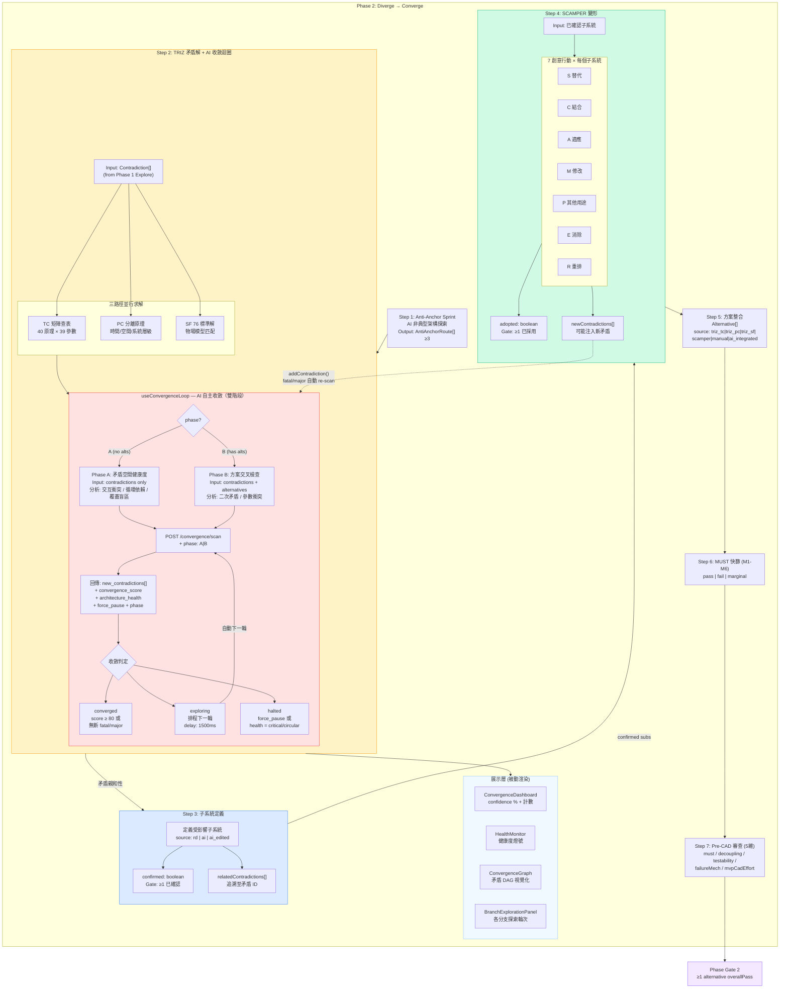
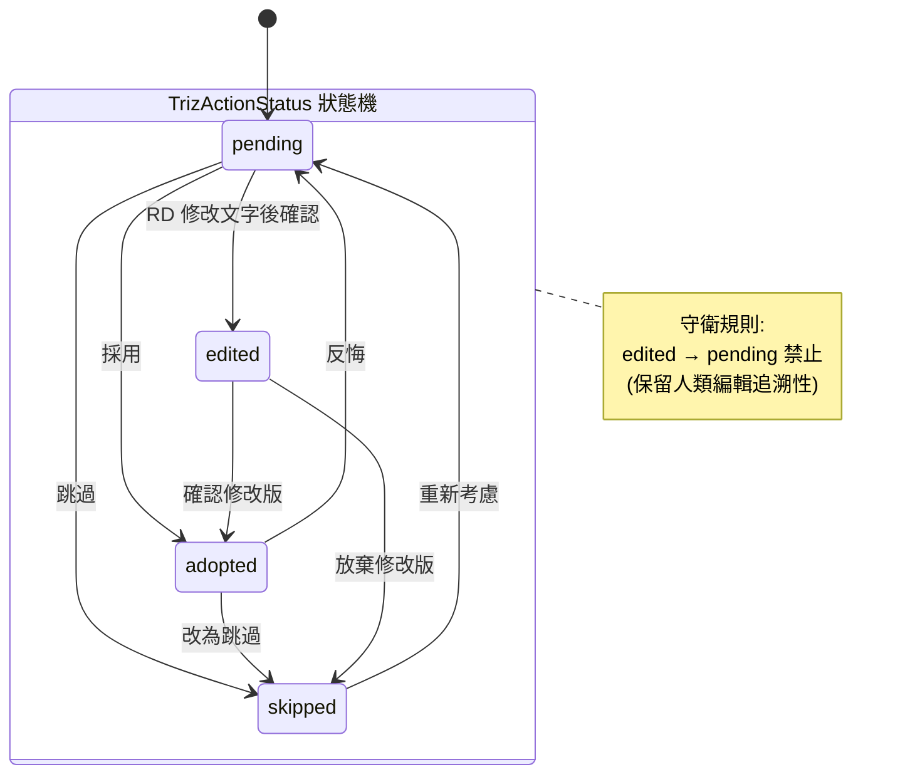
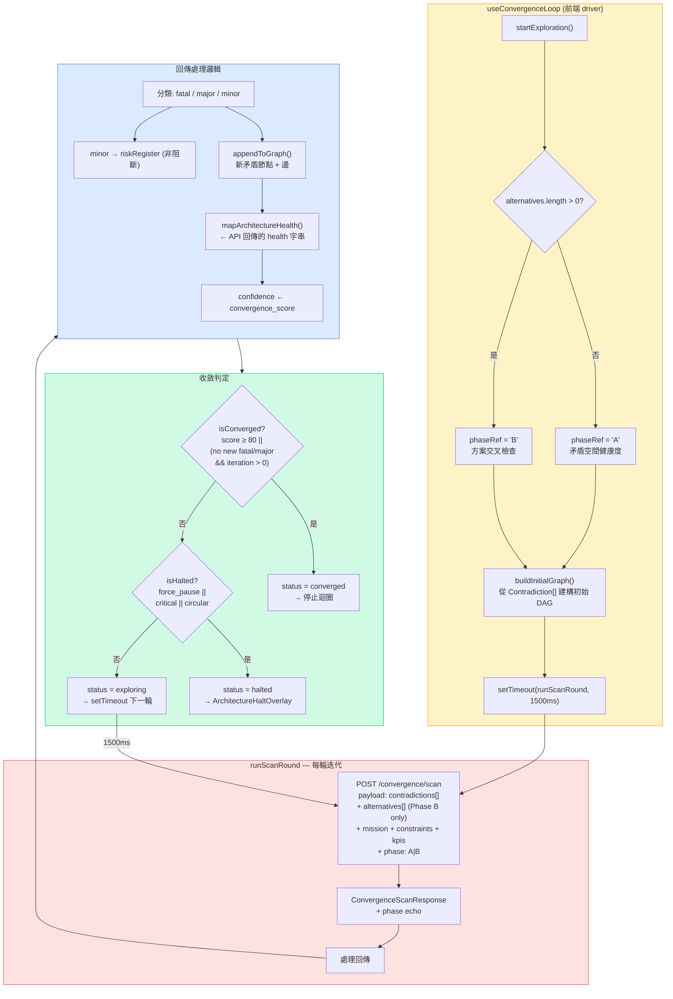
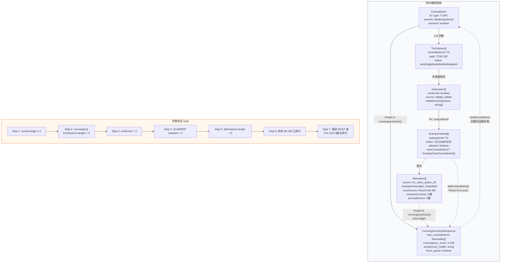
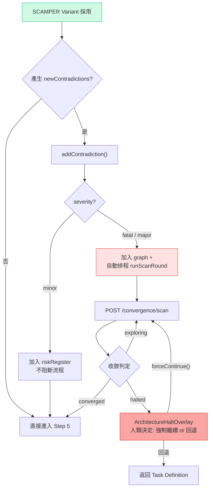

# TRIZ → SCAMPER 收斂管線：設計概念與流程圖

> **v4 (2026-03-24)**：收斂掃描拆為雙階段，解決 Step 2 依賴 Step 5 資料的設計矛盾。
> - **Phase A**（Step 2）：矛盾空間健康度分析 — 只需 contradictions，不需 alternatives
> - **Phase B**（Step 5 後自動觸發）：方案 × 矛盾完整交叉檢查 — 需要 alternatives
> - 自動轉換：Phase A converged + alternatives 出現 → 自動啟動 Phase B
> - 收斂公式：Phase A 側重 well-formed / circular / coverage；Phase B 側重 resolved / fatal / clean_alts
> - SCAMPER 回饋閉環：維持不變（此時 alternatives 已存在，自動走 Phase B）

---

## 1. 主流程總覽

**設計哲學**：Phase 2 是一條 **發散→收斂** 管線。前 4 步發散產出解法，後 3 步收斂篩選。收斂掃描分為兩階段：**Phase A**（Step 2，矛盾空間健康度）只需矛盾資料；**Phase B**（Step 5 後自動觸發）需要方案資料做完整交叉檢查。

### 設計決策說明

| 決策 | 說明 |
|------|------|
| 雙階段收斂 | Phase A（Step 2）只需矛盾，分析問題空間健康度；Phase B（Step 5 後）需要方案，做完整交叉檢查。自動偵測 `alternatives.length > 0` 決定 phase |
| 後端 AI 主導 | 前端 (`useConvergenceLoop`) 只是迴圈 driver，每輪呼叫 `/convergence/scan` API（帶 `phase` 參數），後端 AI 負責矛盾偵測、severity 分類、health 評估。前端不做任何矛盾分析邏輯 |
| 展示層與計算層分離 | `HealthMonitor`、`ConvergenceGraph` 是純 props-driven 展示元件，不含業務邏輯。所有計算在 hook 內完成 |
| SCAMPER → 收斂迴圈閉環 | SCAMPER 產生的 `newContradictions[]` 透過 `addContradiction()` 注入收斂迴圈，若 severity 為 fatal/major，自動排程 re-scan（此時 alternatives 已存在，自動走 Phase B） |
| Phase A → B 自動轉換 | `useEffect` 監聽：Phase A converged + alternatives 出現 → 自動呼叫 `startExploration()`，hook 偵測到 alternatives 存在後自動切換為 Phase B |

---

## 2. TRIZ 狀態機（含轉換守衛）

**設計意圖**：每條 TRIZ 解法有獨立的生命週期。`edited` 狀態保留「人類修正 AI 建議」的追溯性，因此禁止從 `edited` 退回 `pending`。

### 合法轉換矩陣

| from ＼ to | pending | adopted | skipped | edited |
|-----------|---------|---------|---------|--------|
| **pending** | - | V | V | V |
| **adopted** | V | - | V | - |
| **skipped** | V | - | - | - |
| **edited** | **X** | V | V | - |

---

## 3. AI 收斂迴圈詳圖

**設計意圖**：取代舊的前端 side-effect 串連模式。後端 AI 在單一 API 回應中完成矛盾掃描 + 健康評估 + 收斂判定，前端只負責驅動迭代和渲染結果。Phase A/B 由前端 hook 自動偵測，後端透過 `phase` 參數選擇對應 prompt。

### 人為介入點

| 動作 | 方法 | 效果 |
|------|------|------|
| 強制停止 | `forceHalt()` | 立即取消 timer + abort flag，status → halted |
| 強制繼續 | `forceContinue()` | health 降級為 warning，排程下一輪 scan |
| 重試分支 | `retryBranch(id)` | 該分支 status → exploring，排程下一輪 |
| 注入新矛盾 | `addContradiction()` | 加入 graph，若 fatal/major 自動觸發 re-scan |
| 覆寫 severity | `confirmSeverity()` | 手動修正 AI 判定的 severity |

---

## 4. 資料流向

---

## 5. SCAMPER → 收斂迴圈回饋（E2E 自動閉環）

**設計意圖**：SCAMPER 變形可能引入新矛盾。若 severity 為 fatal/major，系統自動觸發收斂迴圈 re-scan，不需人為介入。minor 記入 riskRegister 但不阻斷。

---

## 6. 完整狀態轉換表

| 階段 | 輸入 | 處理 | 輸出 | 連鎖效果 |
|------|------|------|------|----------|
| TRIZ 載入 | `Contradiction[]` | 按矛盾 ID 分組，三路徑並行生成解法 | `TrizSolution[].status = 'pending'` | — |
| TRIZ 狀態變更 | `pending → adopted/edited/skipped` | 狀態守衛驗證合法性後更新 | 狀態變更 persist 至 Supabase | — |
| 收斂迴圈啟動 | `startExploration()` | 自動偵測 phase（A or B）+ 建構初始 graph + 排程第一輪 scan | `status = exploring, phase = A\|B` | — |
| Phase A scan | `Contradiction[]` (no alternatives) | POST `/convergence/scan` phase=A (1500ms/輪) | 矛盾交互分析 + 覆蓋評估 | graph 更新、health 重算 |
| Phase B scan | `Contradiction[] + Alternative[]` | POST `/convergence/scan` phase=B (1500ms/輪) | 方案交叉檢查 + 二次矛盾偵測 | graph 更新、health 重算 |
| Phase A→B 轉換 | Phase A converged + alternatives 出現 | `useEffect` 自動呼叫 `startExploration()` | 重新啟動為 Phase B | 完整收斂分析 |
| Health 判定 | `architecture_health` 字串 | 映射為 HealthStatus | `healthy / warning / critical / circular` | critical/circular → halted |
| 收斂判定 | `convergence_score`, `new_contradictions` | `score ≥ 80 ∥ no new fatal/major` | `converged / exploring / halted` | converged → Step 2 complete |
| 子系統定義 | TRIZ 矛盾親和性 | RD/AI 定義 + 確認 | `Subsystem[confirmed]` | 解鎖 SCAMPER |
| SCAMPER 展開 | 已確認子系統 | 7 行動 × N 子系統 | `ScamperVariant[adopted]` | — |
| SCAMPER 新矛盾 | `newContradictions[]` | `addContradiction()` 注入收斂迴圈 | fatal/major → 自動 re-scan | 可能連鎖觸發新一輪收斂 |
| 方案整合 | adopted TRIZ + SCAMPER | 人工/AI 整合 | `Alternative[]` | 進入 MUST 篩選 |

---

## 7. Health 閾值定義

| 狀態 | 條件 | UI 表現 | 流程影響 |
|------|------|---------|----------|
| `healthy` | nodeCount < 4 且無循環 | 綠燈 | 正常通行 |
| `warning` | 4 ≤ nodeCount ≤ 5 且無循環 | 黃燈 | 提示檢視，不阻斷 |
| `critical` | nodeCount > 5 | 紅燈 | 收斂迴圈 halted，建議回退 |
| `circular` | 偵測到循環矛盾依賴 | 紅燈 | 收斂迴圈 halted，需架構重構 |

---

## 8. 關鍵元件對照

| 元件 | 職責 | 性質 |
|------|------|------|
| `useConvergenceLoop` | 收斂迴圈 driver：啟動、迭代、停止、注入矛盾。自動偵測 phase（A/B） | 狀態 hook（含業務邏輯） |
| `/convergence/scan` API | Phase A: 矛盾空間分析；Phase B: 方案交叉檢查。由 `phase` 參數切換 prompt | 後端 AI（控制權核心） |
| `ConvergenceDashboard` | 顯示 confidence %、fatal/major/minor 計數 | 純展示元件 |
| `BranchExplorationPanel` | 顯示各矛盾分支的探索輪次 | 純展示元件 |
| `HumanReviewPanel` | 收斂完成後的人類審查介面 | 純展示元件 |
| `ArchitectureHaltOverlay` | halted 時的 overlay：強制繼續 or 回退 | 互動元件 |
| `HealthMonitor` | 渲染 health 燈號 + critical 時的回退按鈕 | 純展示元件 |
| `ConvergenceGraph` | 渲染矛盾 DAG（可拖曳節點、severity 色彩） | 純展示元件 |
